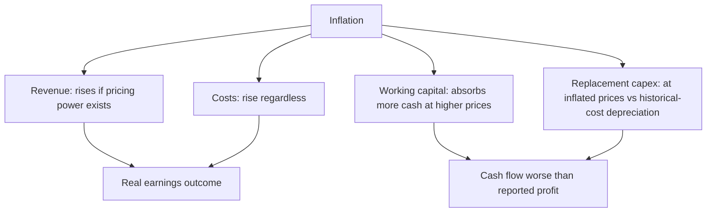

# Inflation and Corporate Earnings

## The Problem / Why this matters
Inflation is often described as good for equities, on the reasoning that companies own real assets and can raise prices. That is true for some companies and badly wrong for others, and the difference is determinable in advance. Inflation affects revenue, costs, working capital, capex requirements and reported returns simultaneously, and several of those effects are invisible in reported numbers — which is precisely why the reported numbers mislead during inflationary periods.

## Core Idea
Inflation helps companies with **pricing power and low capital intensity**, and hurts those without either — because the ability to reprice determines whether cost inflation is absorbed, and capital intensity determines how much extra investment is required simply to stand still.

## Why it works this way
Nominal revenue rises with inflation for a company that can reprice. But working capital and replacement capex also rise with inflation, absorbing cash. A company that must replace its asset base at inflated prices while depreciating at historical cost is reporting profits that overstate its real economic position, and it will discover this when replacement time arrives.

## Full technical content

### The three effects on the income statement

**1. Revenue.** Rises with inflation only to the extent the company can pass through — the pass-through chapter's analysis applies directly. Contracts, competitive intensity and brand strength determine this, and the pass-through lag determines when.

**2. Costs.** Rise regardless. Employee costs, energy, freight and materials all inflate, and some are contractually indexed.

**3. Depreciation.** Charged on historical cost, so it **understates** the real cost of asset consumption during inflation. Reported profit is therefore overstated relative to the economic reality, and the overstatement is largest for asset-heavy businesses with old asset bases — which the depreciation chapter identifies as flattering margins for a separate reason as well.

### The two effects on the balance sheet that matter more

**Working capital.** At higher prices, the same physical volume of inventory and the same days of receivables absorb more cash. **A company growing volumes at zero can still consume cash purely from inflation**, and this is the most commonly missed inflationary effect. The check: track working capital *days* rather than rupees, since days control for the price effect and reveal whether the underlying position is deteriorating.

**Replacement capex.** Assets bought years ago at historical cost must be replaced at current prices. A company depreciating ₹100cr annually may face ₹160cr of replacement capex. **Free cash flow after true maintenance capex is therefore much lower than reported profit suggests**, and a DCF using depreciation as a proxy for maintenance capex overstates value materially in an inflationary environment.

### Who benefits and who suffers

| Characteristic | Effect of inflation |
|---|---|
| **Strong pricing power** | Beneficial — costs pass through, revenue inflates |
| **Low capital intensity** | Beneficial — little replacement capex exposure |
| **Low working capital intensity** | Beneficial — less cash absorbed |
| **Long-term fixed-price contracts** | Harmful — costs rise, revenue does not |
| **High capital intensity with old assets** | Harmful — replacement at inflated prices |
| **Fixed-rate debt** | Beneficial — the real value of the debt erodes |
| **Regulated pricing** | Depends on whether the regulator allows pass-through, and with what lag |
| **Commodity producers** | Often beneficial — output prices inflate with the commodity |

**Fixed-rate debt is a genuine and under-appreciated inflation benefit.** A company with long-dated fixed-rate borrowings sees the real burden of that debt erode, transferring value from lenders to shareholders.

**The clearest losers** are companies with fixed-price long-term contracts and inflating input costs — EPC contractors without escalation clauses being the standard example, where the entire margin can be consumed.

### The effect on reported returns

Inflation distorts every return metric:
- **RoCE rises spuriously** because the numerator (profit) is measured in current prices while the denominator (capital employed at historical cost) is not. A company can show improving returns purely from inflation.
- **Asset turnover rises** for the same reason.
- **Book value understates** replacement value, so price-to-book appears higher than the economic reality.

**The correction:** compare returns to the company's own history with the inflation environment in mind, and cross-check with measures less affected — EBITDA to gross block, or returns computed on estimated replacement value. **Praising a company for improving RoCE during a high-inflation period without this check is a standard error.**

### Valuation in an inflationary environment

- **Nominal versus real consistency** is essential: a nominal discount rate must discount nominal cash flows. Mixing them is a large error and the cost-of-equity chapter flags it.
- **Terminal growth** should be nominal if cash flows are nominal, which means it should include an inflation component — but must still stay below long-run nominal GDP growth.
- **Multiples compress in high inflation.** Historically, equity multiples have been lower in high-inflation periods, reflecting both higher discount rates and greater uncertainty. Comparing a current multiple to a historical average spanning very different inflation regimes is a weak comparison.
- **Maintenance capex must be inflated**, not set equal to depreciation, in the terminal year. **Terminal capex equal to historical-cost depreciation in an inflationary environment implies a shrinking real asset base**, which is the same indefensible assumption flagged in the FCF chapter, arrived at from a different direction.

### Deflation and disinflation

The reverse cases, less discussed and analytically distinct:
- **Disinflation** — falling but positive inflation — is generally favourable, since input costs decelerate faster than output prices adjust downward, temporarily expanding margins. **Those margins are competed away**, which is the reverse-cycle warning from the pass-through chapter.
- **Outright deflation** is harmful: nominal revenues fall, real debt burdens rise, and customers defer purchases expecting lower prices.
- **Sector-specific deflation** — technology hardware, some pharmaceuticals under price control — requires continuous volume growth just to hold revenue flat, which is a structurally harder business than it appears.

### What to do in research

1. **Assess pass-through ability** from history, per the pass-through chapter.
2. **Track working capital days**, not rupees.
3. **Estimate true maintenance capex** at current prices rather than using depreciation.
4. **Check whether debt is fixed or floating**, since fixed-rate debt is an inflation asset.
5. **Adjust return metrics** mentally or explicitly for the historical-cost denominator distortion.
6. **Keep nominal and real consistent** throughout the valuation.
7. **State the inflation assumption** underlying the forecast, since it drives revenue, costs and capex simultaneously and readers should see it.

## Common mistakes
- Asserting inflation is **good for equities** without distinguishing pricing power and capital intensity.
- Tracking working capital in **rupees** rather than days during inflation.
- Using **depreciation as maintenance capex** in an inflationary environment.
- Praising a **spuriously improving RoCE** driven by the historical-cost denominator.
- Mixing **nominal and real** in the valuation.
- Comparing current multiples to historical averages spanning **different inflation regimes**.
- Missing that **fixed-rate debt** benefits shareholders during inflation.
- Extrapolating margins expanded by **disinflation**, which are competed away.

## Interview angle
"Is inflation good or bad for the companies you cover?" Answer with the two variables that determine it — pricing power and capital intensity — and give the mechanism for each. Pricing power decides whether cost inflation is absorbed or passed through, and the historical gross-margin-versus-input-cost relationship tells you which. Capital intensity decides how much extra investment is needed just to stand still: working capital absorbs more cash at higher prices even at zero volume growth, and replacement capex arrives at current prices while depreciation is charged on historical cost, so free cash flow is materially worse than reported profit implies. Add the measurement distortion that catches people out — RoCE rises spuriously during inflation because profit is in current prices while capital employed is at historical cost, so a company can look like it is improving when nothing has changed. Mention the beneficiaries that are usually overlooked: companies with long-dated fixed-rate debt, whose real burden erodes. And flag the valuation discipline: keep nominal cash flows with a nominal discount rate, and never set terminal maintenance capex equal to historical-cost depreciation, because that implies a shrinking real asset base.
