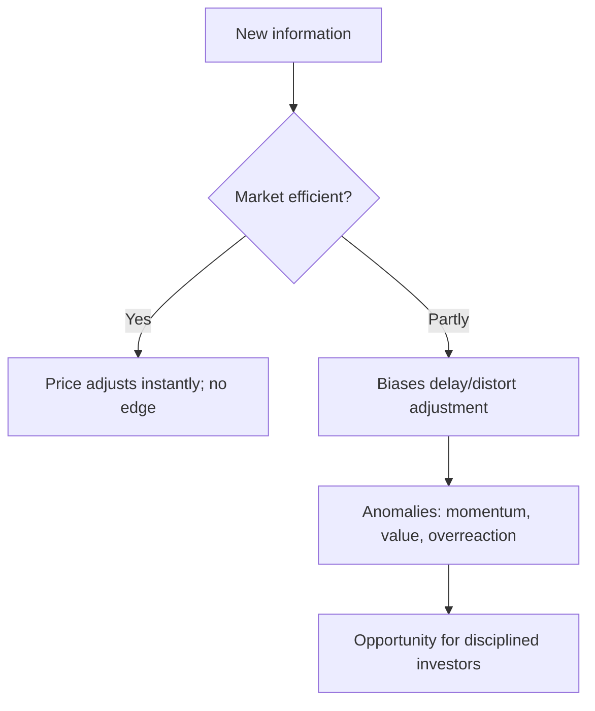

# Market Efficiency & Behavioral Finance

## The Problem / Why this matters
Can you beat the market? The answer shapes everything an investor does. The **Efficient Market Hypothesis (EMH)** says prices already reflect information, so consistently beating the market is nearly impossible — while **behavioral finance** documents the systematic biases that make markets *inefficient* enough to create opportunities. Every research and investing role sits in the tension between these two, and interviewers test whether you understand both.

## Core Idea
The **EMH** holds that asset prices reflect available information, so you can't consistently earn risk-adjusted excess returns. **Behavioral finance** counters that investors are systematically irrational — subject to biases that push prices away from fundamentals — creating anomalies a disciplined investor can exploit. Reality lies between: markets are *mostly* efficient but not perfectly.

## Why it works this way
If a piece of information predicted higher returns, rational investors would trade on it until the opportunity vanished — that's the efficiency argument. But real investors are human: they overreact, herd, anchor and fear losses, and those biases are *systematic* (not random), so they don't fully cancel out — leaving persistent, if hard-to-capture, mispricings.

## Full technical content

**The three forms of EMH:**
| Form | Prices reflect | Implication |
|---|---|---|
| **Weak** | All past prices/volume | Technical analysis shouldn't work |
| **Semi-strong** | All public information | Fundamental analysis on public data shouldn't give an edge |
| **Strong** | Even private/inside information | No one can beat the market, even insiders |

Evidence: markets are *broadly* semi-strong efficient (prices react fast to news), but **anomalies** persist that challenge it.

**Anomalies (evidence against strict EMH):**
- **Value effect** — cheap (low P/B, P/E) stocks historically outperform.
- **Momentum** — recent winners keep winning over 3–12 months.
- **Small-cap effect**, **low-volatility anomaly**, **post-earnings-announcement drift**, calendar effects.
These underpin factor investing (Fama-French).

**Behavioral biases (why markets misprice):**
| Bias | Effect |
|---|---|
| **Overconfidence** | Excess trading, underestimating risk |
| **Anchoring** | Fixating on a reference price |
| **Loss aversion** | Losses hurt ~2× gains; holding losers, selling winners (disposition effect) |
| **Herding** | Following the crowd → bubbles and crashes |
| **Recency bias** | Overweighting recent events |
| **Confirmation bias** | Seeking evidence that fits your view |
| **Mental accounting** | Treating money differently by source/label |
| **Overreaction / underreaction** | To news → reversals and drift |

**Bubbles and crashes** are the macro expression of these biases — herding and overconfidence inflate prices far above value, then fear collapses them.

**Implications for investors:**
- If markets were perfectly efficient → **index passively** (no edge to be had).
- Because they're not perfectly efficient → disciplined, unemotional investors can exploit others' biases (the behavioral edge), but it's hard and requires patience.
- Know your *own* biases — the first job is not to be the sucker.

## Worked examples

**Example 1 — semi-strong efficiency in action.** A company reports earnings 20% above expectations at 9:00 am; by 9:01 the stock has jumped to reflect it. A retail investor reading the news at noon can't profit from the surprise — it's already priced. That's semi-strong efficiency: public information is incorporated almost instantly.

**Example 2 — loss aversion / disposition effect.** An investor holds a stock down 30%, refusing to sell "until it comes back," while quickly booking a 10% gain elsewhere. Loss aversion makes them ride losers and cut winners — exactly backwards. Recognizing this bias (and using rules/stops) is the behavioral edge.

**Example 3 — herding bubble.** During a mania, prices detach from any fundamental value as investors buy because others are buying (herding) and extrapolate recent gains (recency). Fundamentals say "expensive," but the crowd pushes higher — until sentiment turns and it crashes. Bubbles are behavioral finance writ large.

## How it is tested in interviews
- **"What is the Efficient Market Hypothesis?"** — "Prices reflect available information, so you can't consistently earn risk-adjusted excess returns. Three forms: weak (past prices), semi-strong (public info), strong (private info)."
- **"If markets are semi-strong efficient, what stops working?"** — "Trading on public information/fundamental analysis of public data — it's already in the price. And technical analysis fails under even the weak form."
- **"Do you believe markets are efficient?"** — "Broadly semi-strong efficient — news is priced fast — but not perfectly; behavioral biases and documented anomalies (value, momentum) leave exploitable inefficiencies."
- **"Name a behavioral bias and its effect."** — Loss aversion → holding losers too long (disposition effect); herding → bubbles; anchoring → fixating on a reference price.
- **"If markets were perfectly efficient, how would you invest?"** — "Passively, via low-cost index funds — there'd be no edge to justify active fees."

## Traps & common mistakes
- Treating EMH as **all-or-nothing** — it's a spectrum; markets are mostly-but-not-perfectly efficient.
- Confusing the **three forms** (weak/semi-strong/strong).
- Assuming biases **cancel out** — they're systematic, not random.
- Believing anomalies are **free money** — they're real but hard and risky to capture.
- Ignoring your **own** biases.

## First-principles recap
- EMH: prices reflect information → hard to beat the market; forms are weak/semi-strong/strong.
- Behavioral finance: systematic biases push prices from value, creating anomalies.
- Reality: mostly efficient, not perfectly — news is priced fast, but inefficiencies persist.
- Anomalies (value, momentum) underpin factor investing.
- The behavioral edge is discipline; the first task is not to be biased yourself.

## Quick-reference
| Concept | Note |
|---|---|
| Weak EMH | Past prices priced → TA fails |
| Semi-strong | Public info priced → FA edge hard |
| Strong | Even private info priced |
| Anomalies | Value, momentum, small-cap, PEAD |
| Key biases | Loss aversion, herding, anchoring, overconfidence |
| If perfectly efficient | Index passively |
