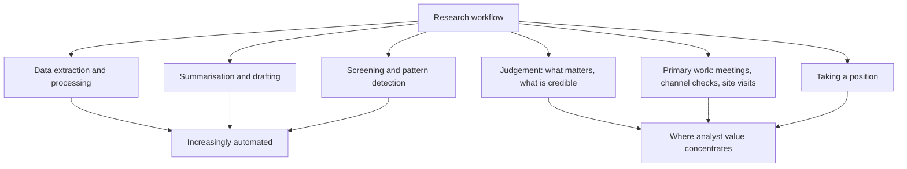

# AI and Automation in the Analyst Workflow

## The Problem / Why this matters
A substantial part of the traditional analyst job — extracting numbers from filings, summarising transcripts, building comparison tables, drafting routine updates — is now partly automatable. This changes what an analyst is paid for and what a candidate should be able to demonstrate. The useful posture is neither dismissal nor uncritical adoption, but a clear understanding of which tasks these tools genuinely improve and which they degrade, and what verification discipline they require.

## Core Idea
Automation compresses the **information-gathering and processing** part of research, which raises the relative value of the parts it cannot do: judgement about what matters, primary work, and taking a position with consequences.

## Why it works this way
These tools are strong at tasks with abundant training data and verifiable structure — extracting a number from a filing, summarising a document, writing code to process data. They are weak where the task requires weighing conflicting evidence, judging whether a management explanation is honest, or committing to a view that can be wrong. The value migrates toward the second category because the first is being commoditised.

## Full technical content

### Where these tools genuinely help

| Task | Benefit | Required verification |
|---|---|---|
| **Extracting figures from filings** | Large time saving on repetitive work | Spot-check against the primary document; errors are plausible-looking |
| **Summarising transcripts** | Faster triage of many companies | Read the full transcript for covered names; summaries lose nuance and tone |
| **Building peer comparison tables** | Fast assembly across a universe | Verify definitions are consistent across companies |
| **Screening and pattern detection** | Surfaces candidates across a large universe | Everything in the screening chapter applies — output is a shortlist, never a conclusion |
| **Drafting routine text** | Faster first drafts of standard sections | Every number and claim must be verified; the draft is a starting point |
| **Code for data processing** | Automates repetitive analysis | Test on known cases |
| **Translation of foreign filings** | Opens sources previously inaccessible | Material claims should be checked |

**The transcript point deserves emphasis.** A summary tells you what was said; it does not tell you what was *not* answered, how a question was deflected, or that management's tone changed when a particular topic arose. The disclosure-quality and management-assessment chapters depend on exactly those signals. **Use summaries to triage which transcripts to read, not to replace reading them for covered companies.**

### Where they degrade the work

- **Fabricated specifics.** These systems produce plausible-sounding numbers and citations that are wrong. In research, a fabricated figure in a published note is a serious professional failure — **every number that appears in output must be traced to a primary source.**
- **Consensus by construction.** Trained on the general corpus of financial writing, these tools reproduce the conventional framing of a sector. **Differentiated research is definitionally what the consensus does not say**, so a tool that reliably reproduces consensus is structurally incapable of producing the thing that has value.
- **False fluency.** Well-written text reads as more authoritative than it is, and a smooth summary of a weak analysis is more dangerous than a rough one.
- **Loss of the process that builds understanding.** Building a model by hand teaches the business; reading a generated model does not. For a junior analyst especially, automating the learning away is a real cost.
- **Recency limits.** Outputs may not reflect recent events, and in a fast-moving situation that is exactly when accuracy matters.

### The verification discipline

Non-negotiable practices for anything that reaches a published note:

1. **Every number traced to the primary filing.** No exceptions.
2. **Every factual claim verified**, not accepted because it sounds right.
3. **Read the source document** for anything material, rather than relying on a summary.
4. **Own the output.** The analyst's name is on the note; "the tool produced it" is not a defence to a client, a compliance officer, or a regulator.
5. **Know the firm's policy** on what may be entered into external tools — client information, unpublished research and any material non-public information must not be, and this is both a compliance and a confidentiality obligation.
6. **Keep the audit trail** so published numbers remain reproducible, as the data-integrity chapter requires.

### Where analyst value concentrates now

If information processing is commoditised, the differentiated work is:

- **Primary research.** Channel checks, site visits, conversations with former employees and industry participants — evidence that does not exist in any document.
- **Judgement about credibility.** Whether a management explanation is honest, whether a decline is cyclical or structural, whether a moat is durable. The synthesis chapter lists these as the things frameworks cannot resolve.
- **Knowing what matters.** Identifying which two of forty available metrics determine the outcome is a form of judgement built from experience, not from processing.
- **Taking a position.** A view with a target, a catalyst and falsification conditions, published under your name with consequences if wrong. **Nothing about automation changes who is accountable for that.**
- **Relationships.** Access to management, to industry participants and to clients.
- **Synthesis across domains** — connecting a regulatory change to a competitive shift to a valuation consequence.

### The market-structure question

Worth having a view on, since it is a common interview topic:
- **Systematic strategies** have absorbed much of the return available from processing public information quickly, which is why the factor chapter treats several published anomalies as having compressed after publication.
- **The remaining edge in fundamental research** is concentrated in information that is not in the data — primary work, judgement, and coverage of under-followed situations where less capital is deployed against the same information.
- **This reinforces the direction the breadth-and-dispersion chapter identifies:** spend effort where coverage is thin and where the analysis requires judgement rather than processing.

### An honest position for an interview

The credible answer avoids both extremes:
- **Not dismissive** — an analyst who refuses to use tools that save hours on data assembly is choosing to spend time on the lowest-value part of the job.
- **Not credulous** — an analyst who publishes unverified generated content will eventually publish something fabricated, and that ends careers.
- **The useful framing:** these tools compress the time from question to organised information; they do not decide what question to ask, whether the answer is credible, or what to do about it. **Those remain the job.**

## Common mistakes
- Publishing **unverified** generated numbers or claims.
- Relying on **transcript summaries** for covered companies instead of reading them.
- Expecting differentiated views from a tool that reproduces **consensus framing**.
- Entering **confidential or unpublished** material into external tools.
- Treating fluent output as **verified** output.
- Automating away the model-building that teaches a junior analyst the business.
- Assuming outputs reflect **recent** events.
- Positioning either as dismissive or credulous in an interview, rather than as disciplined.

## Interview angle
"How do you use AI tools in your research process?" Give the split rather than a position: they compress data extraction, transcript triage, peer table assembly and first drafts, which is genuine time saved on the lowest-value part of the job — but every number that reaches a note is traced to the primary filing, because these systems produce plausible-looking figures that are wrong, and a fabricated number in published research is a professional failure regardless of how it got there. Add the specific limitation that shows you have thought about it: a transcript summary tells you what was said but not what was deflected, what went unanswered, or that management's tone shifted on a particular topic — and those are exactly the signals management assessment depends on, so summaries triage which transcripts to read rather than replacing reading them. Then make the structural point: these tools are trained on the general corpus of financial writing, so they reproduce consensus framing by construction, and differentiated research is definitionally what consensus does not say — which means the value concentrates in primary work, judgement about credibility, and taking a position with consequences, none of which is automated.
