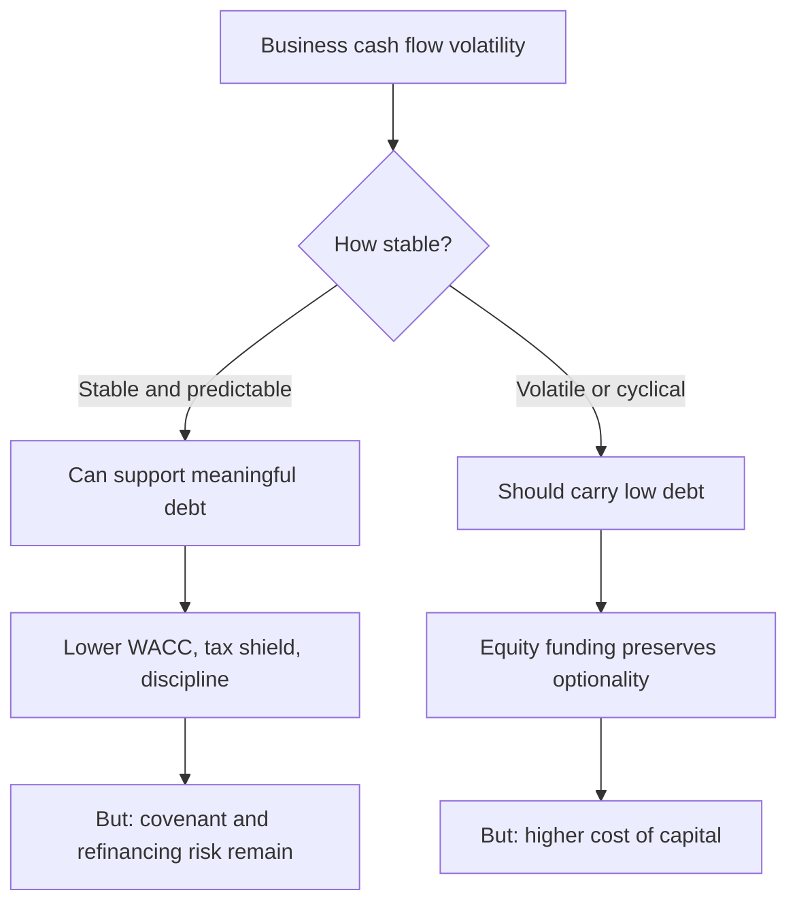

# Capital Structure and Financing Decisions

## The Problem / Why this matters
How a company funds itself determines its cost of capital, its resilience in a downturn, and how much of the business's returns reach equity holders. Analysts often treat capital structure as a given — reading the debt off the balance sheet and computing a WACC — rather than as a decision to be assessed. But financing choices are among the clearest evidence of management quality, and a company with the wrong structure for its business risk is carrying a specific, quantifiable vulnerability.

## Core Idea
The appropriate capital structure depends on the **stability and predictability of the business's cash flows**. Debt is cheap and disciplining for a stable business, and dangerous for a volatile one — and the volatility that matters is operating, which is why operating and financial leverage must be assessed together.

## Why it works this way
Debt requires fixed payments regardless of business performance. A company whose cash flows are stable can service those payments through a downturn; one whose cash flows swing widely cannot. The combined leverage relationship from the operating leverage chapter is the reason: high operating leverage already amplifies earnings swings, and adding financial leverage on top compounds them.

## Full technical content

### What determines the appropriate level

| Factor | Supports more debt | Supports less debt |
|---|---|---|
| **Cash flow stability** | Contracted, recurring, regulated | Cyclical, order-driven, commodity-linked |
| **Operating leverage** | Low fixed costs | High fixed costs |
| **Asset tangibility** | Tangible, financeable assets | Intangible, asset-light |
| **Growth and reinvestment needs** | Mature, low reinvestment | High growth requiring capital |
| **Industry norms and lender appetite** | Established lending markets | Sectors lenders avoid |
| **Tax position** | Full taxpayer benefiting from the shield | Losses or exemptions reducing the shield |

**The two most important are cash flow stability and operating leverage**, and they interact: a utility with contracted revenue and high fixed costs can carry substantial debt because the revenue is certain; a cement company with high fixed costs and volatile realisations cannot carry the same leverage safely, despite a similar asset profile.

### Assessing the current structure

The measures, and what each is for:

- **Net debt to EBITDA** — the headline leverage measure, comparable across companies. Read it against sector norms and against the company's own history through a cycle.
- **Interest coverage (EBIT ÷ interest)** — the servicing measure, and often more informative than the leverage ratio because it directly tests affordability.
- **Net debt to equity** — a balance-sheet measure, distorted by accounting book value.
- **Debt to enterprise value** — the market-based version, and the correct one for WACC.
- **Debt maturity profile** — refinancing risk concentrated in a single year is a specific, dated exposure.
- **Fixed versus floating** — determines rate sensitivity, per the interest-rate chapter.
- **Covenant headroom** — the binding constraint that turns a difficult period into a crisis.

**The stress test that matters:** apply your bear-case EBITDA to the current debt and check coverage and covenants. **A company comfortable at base case and in breach at bear case has a capital structure problem regardless of what today's ratios show**, and this test takes minutes.

### Covenants

Frequently disclosed in general terms and worth reading:
- **Typical covenants** include leverage ratios, interest coverage, and minimum net worth.
- **Breach consequences** — acceleration, higher pricing, or a waiver negotiation from a weak position.
- **The reflexivity** — a breach in a downturn arrives when refinancing is hardest, which is exactly the wrong time.
- **Watch for waivers already obtained**, disclosed in the notes, which indicate the company has already been close.

### The financing decision

When a company needs capital, the choice among sources is informative:

| Source | Signal and consequence |
|---|---|
| **Internal accruals** | No dilution, no leverage; constrained by cash generation |
| **Debt** | No dilution; raises fixed obligations and risk |
| **Rights issue** | Pro rata to existing holders — the fairest equity route, per the rights chapter |
| **QIP** | Fast, institutional, near market price; dilutive |
| **Preferential allotment** | To named parties; pricing versus the floor is the governance check |
| **Convertibles** | Deferred dilution, lower coupon; the dilution arrives in good outcomes |
| **Asset sale** | No dilution or leverage; depends on what is sold and at what price |

**The signalling content:** management generally issues equity when it considers the shares fully valued and prefers debt when it considers them cheap. A large equity raise is therefore not, on its own, a vote of confidence in the share price — though the signal is weaker for a rights issue, where existing holders are the buyers.

### What the structure says about management

- **A cyclical business carrying high leverage** through a cycle indicates either a misjudgement of the business's volatility or a deliberate bet, and both belong in the assessment.
- **Persistent under-leverage in a stable business** with excess cash is a capital allocation failure, since equity is expensive and shareholders could deploy the capital better — the point the other-income chapter makes about cash hoards.
- **Refinancing well ahead of maturity** demonstrates competence; leaving it to the last quarter does not.
- **Diversified funding sources** reduce dependence on any single lender or market.
- **A stated target structure that the company actually maintains** is a positive governance signal, and one that is easy to check.

### Modelling it

- **Model interest from the debt schedule**, with the fixed-floating split and maturities, rather than as a rate on average debt.
- **Model the refinancing** at a realistic current-market rate, which for a stressed issuer is far above the average rate on existing debt.
- **Check covenant compliance** in every forecast year and in the bear case.
- **Use the target capital structure in WACC** where the company is moving toward a stated policy, and say which you used.
- **Model equity raises explicitly** where the capital plan requires them, including the dilution — as the capex chapter notes, a growth plan that cannot be funded internally implies either a raise or a slowdown, and both should appear in the model.

That last point is where many models are quietly inconsistent: they assume growth requiring capital that the company cannot generate, without funding it anywhere.

## Common mistakes
- Treating capital structure as a **given** rather than as a decision to assess.
- Using **net debt to EBITDA** alone, without coverage and covenant headroom.
- Never running the **bear-case stress test** on covenants.
- Modelling interest as a rate on **average debt** when refinancing is due.
- Refinancing a stressed issuer at its **historical average** cost of debt.
- Ignoring **maturity concentration** as a dated risk.
- Reading an equity raise as a **confidence signal**.
- Modelling growth that requires capital the company cannot generate, without funding it.
- Treating persistent under-leverage with excess cash as conservative rather than as a capital allocation failure.

## Interview angle
"Is this company's balance sheet appropriately structured?" Start from the business rather than the ratios: the appropriate leverage depends on cash flow stability and operating leverage, and the two interact — a utility with contracted revenue can carry debt that a cement company with similar assets but volatile realisations cannot, because high operating leverage already amplifies earnings swings and financial leverage compounds them. Then give the test that settles it in minutes: apply your bear-case EBITDA to the existing debt and check interest coverage and covenant headroom, because a company comfortable at base case and in breach at bear case has a structural problem regardless of today's ratios — and the breach arrives precisely when refinancing is hardest. Add the maturity profile and the fixed-floating split, both disclosed, since a large tranche refinancing into a higher-rate environment is a dated, forecastable step-up. Finish with what the structure reveals about management: a cyclical business carrying high leverage through a cycle is a misjudgement or a deliberate bet, and persistent under-leverage with a large idle cash pile is a capital allocation failure rather than conservatism.
