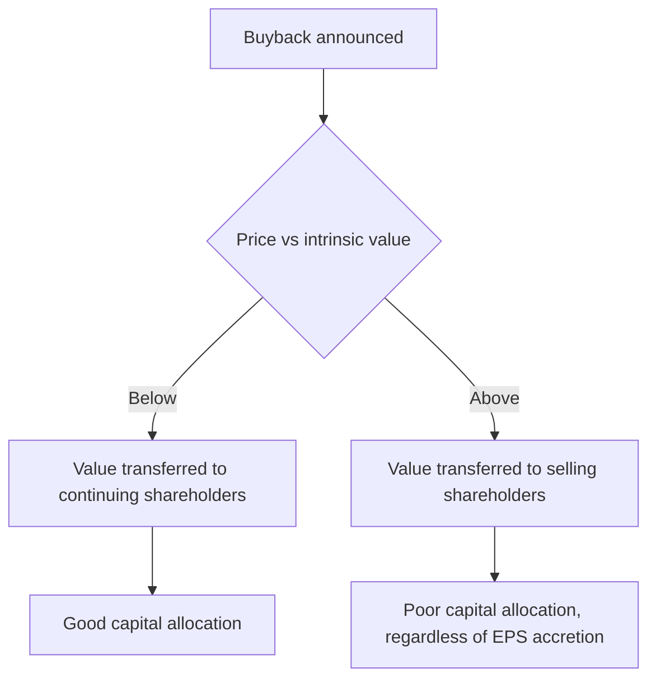

# Buyback Mechanics and Arithmetic

## The Problem / Why this matters
Buybacks are frequently announced as shareholder-friendly and received as unambiguously positive, but whether one creates value depends entirely on the price paid relative to intrinsic value. A buyback above fair value transfers wealth from continuing shareholders to selling ones — the exact opposite of what it is presented as. The arithmetic is simple, the tender mechanics have specific consequences for a shareholder deciding whether to participate, and both are commonly misunderstood.

## Core Idea
A buyback creates value **only when shares are repurchased below intrinsic value**. Above it, the company is a poor investor in its own stock and continuing shareholders bear the loss.

## Why it works this way
A buyback is the company buying an asset — its own shares. Like any purchase, it creates value if the price is below what the asset is worth and destroys value if above. The EPS accretion that accompanies almost every buyback is arithmetic and says nothing about whether value was created.

## Full technical content

### The two routes

| Route | Mechanics | Consequence for shareholders |
|---|---|---|
| **Tender offer** | Fixed price, usually at a premium; shareholders tender; acceptance is proportionate if oversubscribed | Requires a decision; the entitlement ratio matters |
| **Open market** | Company buys on the exchange over a period at prevailing prices | No shareholder action; may not complete in full |

**The tender offer requires the same acceptance-ratio arithmetic as an open offer.** If the buyback is for 8% of equity and every shareholder tenders, roughly 8% of each holding is accepted — so a shareholder tendering their full holding receives the buyback price on a small fraction and continues to hold the rest at whatever the stock trades at afterwards. **Reserved entitlement for small shareholders** raises the acceptance ratio for holdings below the prescribed threshold, which can make participation materially more attractive for them than for large holders — a specific detail worth knowing.

**Open market buybacks may not complete.** The announced amount is a maximum, not a commitment, and companies frequently spend less. Check the actual amount deployed against the announcement.

### The EPS arithmetic — and why it proves nothing

A buyback funded from cash reduces the share count and removes the interest that cash was earning.

**Worked example.** A company earns ₹500cr, has 100mn shares (EPS ₹50), and buys back 8mn shares at ₹800 for ₹640cr, funded from cash earning 6% pre-tax.

- Shares fall to 92mn.
- Earnings fall by the lost after-tax interest: ₹640cr × 6% × (1 − 25%) ≈ ₹29cr, so earnings become ₹471cr.
- **New EPS = 471 ÷ 92 = ₹51.2**, up 2.4%.

**EPS rose — but this tells you nothing about value.** The test is whether ₹800 was below intrinsic value. If fair value is ₹1,100, the buyback created value for continuing holders. If fair value is ₹600, it destroyed value, and it would have done so while still showing EPS accretion.

**The general rule:** a buyback funded by cash is EPS-accretive whenever the earnings yield on the shares exceeds the after-tax return on the cash — which is true almost always at normal interest rates. **EPS accretion is therefore automatic and carries no information.** Analysts and companies citing it as justification are citing arithmetic.

### When a buyback is good capital allocation

- **Shares trade below a well-supported estimate of intrinsic value.**
- **No better use exists** for the capital — no reinvestment opportunity above the cost of capital, per the ROIIC chapter.
- **The balance sheet can afford it** without impairing resilience or flexibility.
- **It is not funded by debt** in a business whose cash flows cannot support the leverage.

**The strongest signal is a company buying back during a period of weakness**, when the price is genuinely low and buying requires conviction. Buybacks announced after a strong run, at elevated prices, are the more common and less impressive pattern.

### When it is not

- **Buying above intrinsic value**, which transfers value away from continuing holders.
- **Offsetting dilution** from employee stock grants. **Compare buyback volume to grant volume**, per the ESOP chapter: a company buying back 1.5% while granting 1.6% is funding employee compensation with shareholder cash and reporting it as capital return.
- **Managing EPS to hit an incentive target**, which is worth checking against the disclosed remuneration metrics.
- **Debt-funded buybacks in a cyclical business**, which raise leverage into a downturn.
- **At the expense of value-creating investment**, where reinvestment opportunities above the cost of capital exist.

### Buyback versus dividend

The choice, and what drives it in practice:
- **Tax treatment** — the dominant practical driver, and it has shifted between regimes, so check the current position rather than relying on memory, per the taxation chapter.
- **Flexibility** — buybacks are discretionary and one-off; dividends carry an implicit commitment, since cutting one is a strong negative signal.
- **Signalling** — a buyback signals management believes the shares are undervalued; a dividend signals confidence in sustainable cash generation.
- **Shareholder choice** — a buyback lets each holder choose whether to participate; a dividend is paid to everyone.
- **Promoter participation** — where promoters tender in proportion, their stake is unchanged; where they do not, their stake rises without an open offer. **Check whether promoters are participating**, since a non-participating promoter increases control at the company's expense, which is a governance point worth raising factually.

### Assessing an announced buyback

1. **Compute the size** as a percentage of market capitalisation and of equity.
2. **Compare the buyback price to your fair value** — the central question.
3. **Compute the acceptance ratio** if it is a tender, including any small-shareholder reservation.
4. **Model the blended outcome** for a tendering shareholder: accepted portion at the buyback price, residual at the expected post-buyback price.
5. **Check the funding source** and the effect on the balance sheet.
6. **Compare to grant volume** to see whether it is genuine capital return.
7. **Check promoter participation.**
8. **State whether it creates or destroys value**, with the reason — which is the conclusion clients want and most notes omit.

## Common mistakes
- Citing **EPS accretion** as evidence a buyback creates value, when accretion is automatic.
- Not comparing the buyback price to **intrinsic value**, the only question that matters.
- Ignoring the **acceptance ratio** and the residual stub in a tender offer.
- Missing the **small-shareholder reservation**, which changes the calculation materially for small holders.
- Crediting a buyback that merely **offsets ESOP dilution** as capital return.
- Assuming an announced **open market** buyback will be fully executed.
- Overlooking **promoter non-participation** raising their stake.
- Ignoring debt funding in a cyclical business.

## Interview angle
"The company announces a buyback and the stock rises 4%. Good news?" Say that the only question that matters is the buyback price against intrinsic value, because a repurchase below fair value transfers value to continuing shareholders and one above it transfers value to the sellers — and note that EPS accretion, which the company will certainly cite, is automatic whenever the earnings yield exceeds the after-tax return on the cash being spent, so it carries no information at all. Then cover the mechanics for a shareholder deciding whether to tender: acceptance is proportionate if oversubscribed, so the realised outcome blends the buyback price on the accepted portion with the post-buyback market price on the residual, and the small-shareholder reservation can make participation much more attractive below the prescribed threshold. Add the two checks that separate genuine capital return from presentation — compare the buyback volume against the volume of employee stock grants, since a buyback that merely offsets dilution is funding compensation with shareholder cash, and check whether promoters are tendering, because a non-participating promoter increases control without making an open offer.
