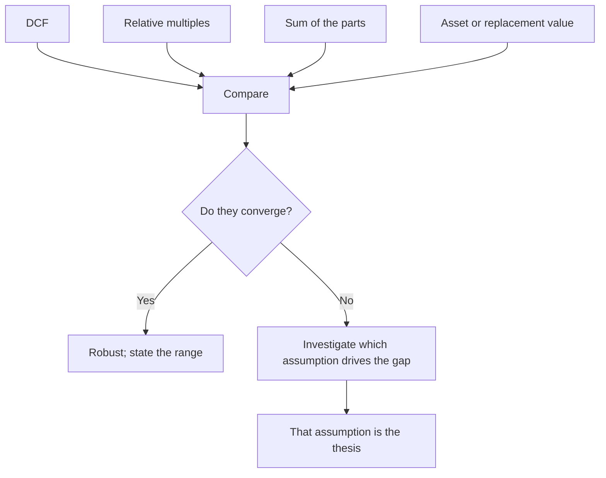

# Triangulating a Target Price

## The Problem / Why this matters
Every valuation method rests on assumptions that can be wrong, and each fails in a characteristic way — DCF is dominated by terminal value, multiples import the peer set's own mispricing, asset-based methods ignore earning power. A target price produced by a single method inherits that method's specific weakness undetected. Triangulation across methods is the standard defence, and the discipline is in what you do when the methods disagree.

## Core Idea
Value with **several independent methods and investigate the disagreements** — because where methods diverge, one of them is embedding an assumption that deserves examination, and finding it is where the analytical value is.

## Why it works this way
Different methods use different inputs. A DCF depends on long-run growth, margins and the discount rate; a multiple depends on the peer set and the earnings base. When they agree, the valuation is robust to the choice of method. When they disagree sharply, the inputs that differ are the ones driving the answer, and identifying them is more informative than averaging.

## Full technical content

### The methods and their characteristic failures

| Method | Fails when | Best used for |
|---|---|---|
| **DCF** | Terminal value dominates; long-horizon forecasts are unreliable | Stable, forecastable businesses; testing implied assumptions |
| **Relative multiples** | The peer set is itself mispriced; peers are not comparable | Sectors with deep, genuinely comparable peer sets |
| **Sum of the parts** | The discount to the sum never closes | Conglomerates and holding structures |
| **Asset/replacement value** | Ignores earning power; realisation is uncertain | Cyclical troughs, asset-heavy businesses, downside anchors |
| **Dividend discount** | Payout is discretionary | Financials, mature high-payout businesses |
| **Precedent transactions** | Embeds the specific buyer's synergies; cycle-peak deals | Control situations |

### Building the triangulation

1. **Run at least two genuinely independent methods.** Two multiples are not two methods — they share the same earnings base and differ only in the multiple applied.
2. **Use the method appropriate to the situation.** A cyclical at a trough should not be valued on trough P/E; a lender should not be valued on EV/EBITDA. Method choice is itself analysis.
3. **Compare the outputs.**
4. **Where they converge**, the valuation is robust and the range is narrow — say so, because that is useful information.
5. **Where they diverge**, find the specific assumption responsible. **This is the point of the exercise.**
6. **Weight explicitly** and state the weights and the reason, rather than averaging silently.

### Diagnosing a divergence

The common patterns and what each means:

- **DCF well above multiples** — the DCF assumes growth or margins that the market does not. Check terminal value as a proportion of total value; if it exceeds roughly three-quarters, the valuation is a terminal-assumption bet rather than a cash-flow analysis.
- **DCF well below multiples** — either the peer set is expensive, or the forecast is too conservative. Run the reverse-DCF: what growth does the current price imply, and is it plausible?
- **SOTP well above the market price** — the standing question is whether there is a mechanism to close it, per the demerger and holding-company chapters. Without one, the gap is a permanent feature.
- **Asset value above earnings-based value** — the assets are earning below their potential, which is either an opportunity requiring a catalyst or a permanent condition.

### The cross-checks that catch errors

Run these on every target before publishing:

- **Implied multiples at the target.** If your ₹950 target implies 41× forward earnings for a company that has never traded above 28×, either the argument for a re-rating must be explicit or the target is wrong.
- **Implied market share or TAM penetration**, which the growth-company chapter treats: a revenue forecast implying an implausible share of the addressable market is wrong regardless of how it was built.
- **Implied returns.** Does the forecast imply a RoCE the company has never achieved, or that exceeds anything in the industry?
- **Reverse-DCF at the current price** — what is the market assuming, and which of those assumptions do you disagree with? This reframes the target as a specific disagreement rather than an assertion.
- **Terminal value proportion**, as above.
- **Growth-reinvestment consistency** — the ROIIC chapter's check: growth must be supportable by the reinvestment rate and the return on it.
- **Sanity against history** — where does the target sit against the stock's own multiple range, and what justifies the position?

### Presenting the result

- **A range, not a point.** The cost-of-equity chapter's argument applies generally: false precision is less credible than an honest range.
- **Show each method's output** in a table, with the weight applied and the reason.
- **State the key sensitivity** — which single assumption moves the value most, and the value at plausible alternatives.
- **Give the bear-case value** explicitly, and the resulting risk-reward. **A target without a bear case is half an analysis**, since a recommendation is a comparison of upside to downside.
- **State the horizon** and the method, so a reader can substitute their own inputs.

### When methods cannot be reconciled

Sometimes the divergence is irreducible — a business genuinely straddling two regimes, or one whose future depends on a binary outcome. The honest treatments:
- **Scenario-weight** rather than average: value the outcomes separately with probabilities.
- **State the wide range** and say the situation is not resolvable to a point estimate.
- **Identify the evidence** that would resolve it, and put it on the monitorable list.

**Presenting a false point estimate to conceal genuine irreducible uncertainty is worse than presenting the uncertainty**, and clients making real decisions prefer the honest version.

## Common mistakes
- Using a **single method** and inheriting its characteristic weakness.
- Treating **two multiples** as two independent methods.
- **Averaging** divergent outputs instead of diagnosing the divergence.
- Not checking the **implied multiple** at the target against the stock's own history.
- Ignoring **terminal value** as a proportion of DCF value.
- Publishing a target with **no bear case** and therefore no risk-reward.
- Never running a **reverse-DCF** to establish what the market assumes.
- Producing a false point estimate where the uncertainty is genuinely wide.

## Interview angle
"Your DCF says ₹700 and the peer multiple says ₹450. What do you publish?" Not the average — the gap is the finding, so diagnose it. Check what proportion of the DCF value sits in terminal value, because above roughly three-quarters the valuation is a bet on terminal assumptions rather than a cash-flow analysis; check whether the DCF's implied growth and margins exceed anything the company or industry has achieved; and check whether the peer set is genuinely comparable or is itself depressed. Then run the reverse-DCF at the current price to establish exactly what the market is assuming and which specific assumption you disagree with, because that reframes the target as an identifiable disagreement rather than an assertion. Add the cross-checks you run before publishing any target: what multiple the target implies against the stock's own historical range, whether the revenue forecast implies a plausible market share, and whether the growth assumed is consistent with the reinvestment rate and the return on it. Finish on presentation — a range with the key sensitivity stated, and always a bear-case value, since a target without one gives no risk-reward and a recommendation is a comparison of upside to downside.
