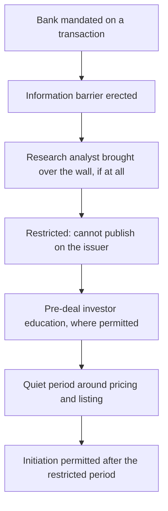

# Pre-Deal Research and Quiet Periods

## The Problem / Why this matters
When a bank underwrites an IPO, its research analysts operate under a distinct set of rules — separated from the deal team, restricted in what they may publish and when, and constrained in how they interact with the issuer and with investors. An analyst joining a firm with an equity capital markets business will encounter this immediately, and misunderstanding the boundaries is a compliance failure rather than a technical mistake. Understanding the process also explains why coverage of newly listed companies looks the way it does.

## Core Idea
Research is separated from underwriting by structural barriers, and around a transaction those barriers tighten into **defined restricted periods, controlled interactions and prescribed content standards** — because the conflict between selling a deal and giving an independent view is at its sharpest there.

## Why it works this way
The underwriting bank is paid by the issuer to sell securities. Its research analysts are supposed to advise investors independently. Absent structural separation, the commercial incentive would systematically bias published research on issuers the bank is raising money for — which is precisely what regulatory regimes were built to prevent after past episodes.

## Full technical content

### The structural separation

- **Information barriers** ("Chinese walls") separate research from investment banking, with controlled crossing procedures.
- **Reporting lines and compensation** for research must not be determined by banking revenue attributable to specific transactions.
- **A restricted list** is maintained where the firm possesses material non-public information; analysts may be prevented from publishing without being told why, which — as the insider-trading chapter notes — is a control working correctly.
- **Wall-crossing** is a documented, approved process. An analyst brought over the wall becomes an insider and is restricted from publishing until the information is public.

### The transaction timeline for research

| Stage | Research position |
|---|---|
| **Mandate awarded** | Issuer goes on the restricted list; existing coverage may be suspended |
| **Pre-deal investor education** (where permitted) | Analysts may meet investors under defined conditions and content standards |
| **Offer document filed and open** | Publication restrictions tightest |
| **Pricing and allotment** | Quiet period |
| **Post-listing restricted period** | No research publication for a defined period after listing |
| **Initiation** | Coverage may commence, subject to disclosure of the bank's role |

**The post-listing restricted period is why newly listed companies have thin coverage initially** — the very banks that know the company best are precluded from publishing for a period. This is the structural reason the recently-listed chapter flags a coverage gap, and it creates the space where independent analysis is most valuable.

### The specific rules an analyst must know

Rather than memorising periods that vary by jurisdiction and change, know the categories:

1. **Publication restrictions** — defined windows during which no research may be published on the issuer.
2. **Content standards** — where pre-deal material is permitted, it must be consistent with the offer document, not contain projections inconsistent with it, and be prepared to the same standard as ordinary research.
3. **Interaction rules** — analysts may not participate in soliciting the mandate, may not attend certain pitch meetings, and may not promise favourable coverage. **Promising coverage to win a mandate is among the most serious violations in this area.**
4. **Disclosure requirements** — subsequent research must disclose the bank's role in the transaction and any compensation received.
5. **Separation of roles** — analysts do not vet marketing materials, do not participate in pricing decisions, and do not act as part of the selling effort.

### Reading syndicate research as an investor

The other side of the same issue, and the practical point for anyone consuming research:

- **Syndicate research on a recently listed company is structurally conflicted.** The bank underwrote the issue and has an ongoing relationship. This does not make the analysis wrong, but it makes independence a live question.
- **Check the disclosure section**, which states the bank's role and compensation. It is boilerplate in form and substantive in content.
- **Consensus on a recently listed company is often entirely syndicate research**, which means the "consensus" is a set of views produced by parties with a shared commercial interest — a specific and important qualification when you are positioning against it.
- **The first non-syndicate initiation** is disproportionately informative for exactly this reason.

### For the analyst working in such a firm

- **Know when you are restricted** and check before publishing on any name where the firm may have a mandate.
- **Do not seek information about pending transactions** from banking colleagues — the barrier protects you as much as it constrains you.
- **Escalate immediately** if you receive transaction information inadvertently, per the insider-trading chapter's sequence.
- **Maintain the independence of the view.** Where you cover a company the firm has underwritten, the analysis must be the same as it would be otherwise. **A negative view on a recent client is uncomfortable and is exactly the situation the rules exist to protect.**
- **Document the basis** of your conclusions, so independence is demonstrable rather than merely asserted.

### The broader independence question

The ratings and incentives chapter covers the general pressures; the transaction context concentrates them:
- **Corporate access, banking relationships and client positioning** all push in the same direction around a deal.
- **The structural protections are real** and are enforced, but they constrain conduct rather than eliminate incentive.
- **The analyst's own record is the ultimate protection** — someone with a history of publishing genuinely negative views on issuers the firm has banked has credibility that no disclosure statement provides.

## Common mistakes
- Not checking the **restricted list** before publishing.
- Seeking transaction information from **banking colleagues**.
- Treating **syndicate research** on a new listing as neutral consensus.
- Ignoring the **disclosure section** of a research note.
- Assuming thin coverage of a new listing reflects lack of interest rather than **restricted periods**.
- Softening a view because the firm underwrote the issue.
- Participating in any way in **soliciting** a mandate.

## Interview angle
"What are the rules around research when your firm is underwriting an IPO?" Describe the structure rather than reciting periods: information barriers separate research from banking, the issuer goes on a restricted list, publication is prohibited during defined windows including a period after listing, and any permitted pre-deal material must be consistent with the offer document and prepared to normal research standards. Add the conduct rules that matter most — analysts do not participate in soliciting the mandate and must never promise favourable coverage, which is among the most serious violations in this area. Then show you understand the consequence from the investor's side: the post-listing restricted period is why newly listed companies have almost no coverage initially, and when coverage does appear it is often entirely from the underwriting syndicate — so what looks like consensus is a set of views held by parties with a shared commercial interest, which matters a great deal when you are positioning against it. The first genuinely independent initiation on a new listing is disproportionately informative for that reason.
