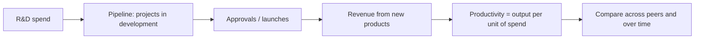

# R&D Productivity Analysis

## The Problem / Why this matters
R&D spending is an investment charged as an expense, which means a company investing heavily in future products reports lower current profit than an identical company that is not. Analysts frequently treat R&D as a cost to be minimised, which gets the analysis backwards for research-driven businesses. The correct question is not how much is spent but what the spending produces — and that is measurable, though it requires work most analysts skip.

## Core Idea
Assess R&D on **output per rupee of input** — products launched, approvals obtained, revenue from recent launches — rather than on the spending ratio, because the ratio measures effort and the output measures results.

## Why it works this way
R&D creates an intangible asset that accounting does not recognise when internally generated. The expense appears immediately; the revenue appears years later. A company cutting R&D therefore reports better margins now and worse revenue later, and a company increasing it does the reverse — so current margin is an actively misleading indicator for a research-driven business.

## Full technical content

### The productivity metrics

| Metric | Construction | Use |
|---|---|---|
| **R&D as % of revenue** | The input measure | Comparability across peers; says nothing about output |
| **Revenue from products launched in the last N years** | Disclosed by some companies | The clearest output measure |
| **Approvals or launches per unit of R&D spend** | Cumulative over a period | Productivity, sector-specific |
| **Cost per approval or per launch** | Cumulative spend ÷ outputs | Trend matters more than level |
| **Pipeline size and stage distribution** | Disclosed in pharma | Forward-looking |
| **Success rate by stage** | From history | Determines expected value of the pipeline |

**Measure over multi-year periods**, since spend and output are separated by years. Single-year comparisons of spend to output are meaningless.

### Sector applications

**Pharmaceuticals** — the most structured case:
- **Pipeline by stage**, with disclosed counts of filings and approvals.
- **First-to-file and exclusivity positions**, which carry disproportionate value.
- **Complex generics and speciality** development, which require more R&D but face less price erosion.
- **Success probabilities by stage** applied to pipeline value — a standard risk-adjusted NPV approach.
- **R&D productivity trend**: cost per approval rising across the industry over time is a well-documented pattern, so a company holding it flat is outperforming.

**Technology and software:**
- **Capitalisation policy** is the first check — a company capitalising development costs reports better margins than one expensing them, per the goodwill chapter, and the comparison must be normalised.
- **Revenue from products released in recent periods**, where disclosed.
- **Headcount in engineering** as an input proxy where spend is not broken out.

**Auto components, chemicals, industrials:**
- **Products qualified with customers**, which is the export-competitiveness chapter's moat measure.
- **Content per vehicle or per unit** rising, which indicates successful product development.
- **New product revenue share**, disclosed by some companies.

**Consumer:**
- R&D is typically small; **innovation shows in new SKUs and category creation** rather than in a research line.

### The capitalisation question

- **Internally generated R&D is generally expensed**, with development costs capitalisable under specific conditions.
- **Companies capitalising a large share** report higher current earnings and carry an intangible that must eventually be amortised or impaired.
- **The check:** compare capitalised development costs to cash spend, and compare the capitalisation policy to peers. **Where policies differ, margins are not comparable** and a normalisation is required.
- **Rising capitalisation without rising activity** is an earnings-quality flag.

### Valuing the pipeline

For pharma and similar businesses where the pipeline is a substantial part of value:
1. **Estimate peak sales** for each material candidate.
2. **Apply a probability of success** by stage, from published industry base rates and the company's own record.
3. **Discount** the risk-adjusted cash flows.
4. **Sum**, and present separately from the base business in a sum-of-the-parts.
5. **State the probabilities used**, since they drive the answer entirely and a reader may hold different views.

**The honest caveat:** pipeline valuation is highly sensitive to assumptions that cannot be verified, so present a range and identify which one or two candidates dominate the value. **A pipeline valuation where a single candidate is most of the value is a binary bet, and should be described as one.**

### The cutting trap

- **A company cutting R&D shows immediate margin improvement**, which screens well and reads as efficiency.
- **The revenue consequence arrives years later**, by which time the causal link is obscured.
- **Watch the trend in R&D as a percentage of revenue** for research-driven businesses — a sustained decline against peers is borrowing from the future, in the same way that cutting advertising borrows margin as the FMCG chapter notes.
- **Check whether "efficiency" claims are supported by output** — a company claiming better R&D productivity while approvals decline is claiming the opposite of what the data shows.

### Building it into the analysis

- **Track output metrics**, not just spend.
- **Normalise for capitalisation** before comparing margins across peers.
- **Value the pipeline separately** where material, with stated probabilities.
- **Watch for cuts** as an earnings-quality issue rather than an efficiency gain.
- **Assess whether the R&D is directed at defensible positions** — products with regulatory or qualification barriers — or at commodity offerings where the return is competed away.

That last question is the one that determines whether R&D spend creates durable value or simply keeps the company in place.

## Common mistakes
- Treating R&D as a **cost to minimise** in a research-driven business.
- Comparing **spend to output** in the same year.
- Comparing margins across peers with **different capitalisation policies**.
- Reading an R&D cut as **efficiency** rather than as deferred revenue loss.
- Valuing a pipeline **without stating** the success probabilities used.
- Presenting a pipeline valuation dominated by one candidate as a diversified value.
- Ignoring whether R&D targets **defensible** positions or commodity products.

## Interview angle
"This company spends 9% of revenue on R&D versus 5% for peers. Is that good or bad?" Say the input ratio measures effort, not results, so the question is what the spending produces — revenue from products launched in recent years, approvals or qualifications obtained per rupee spent, and how the cost per output has trended, all measured over multi-year periods since spend and output are separated by years. Add the accounting check before any margin comparison: if peers capitalise development costs and this company expenses them, the reported margin gap is partly policy rather than performance and needs normalising. Then flag the trap in the reverse direction — a company cutting R&D shows immediate margin improvement that screens as efficiency, while the revenue consequence arrives years later when the causal link is no longer obvious, so a sustained decline in R&D intensity against peers is borrowing from the future. Finish with the question that determines whether the spend is worth anything: is it directed at positions with regulatory or qualification barriers, or at products where any advantage gets competed away?
