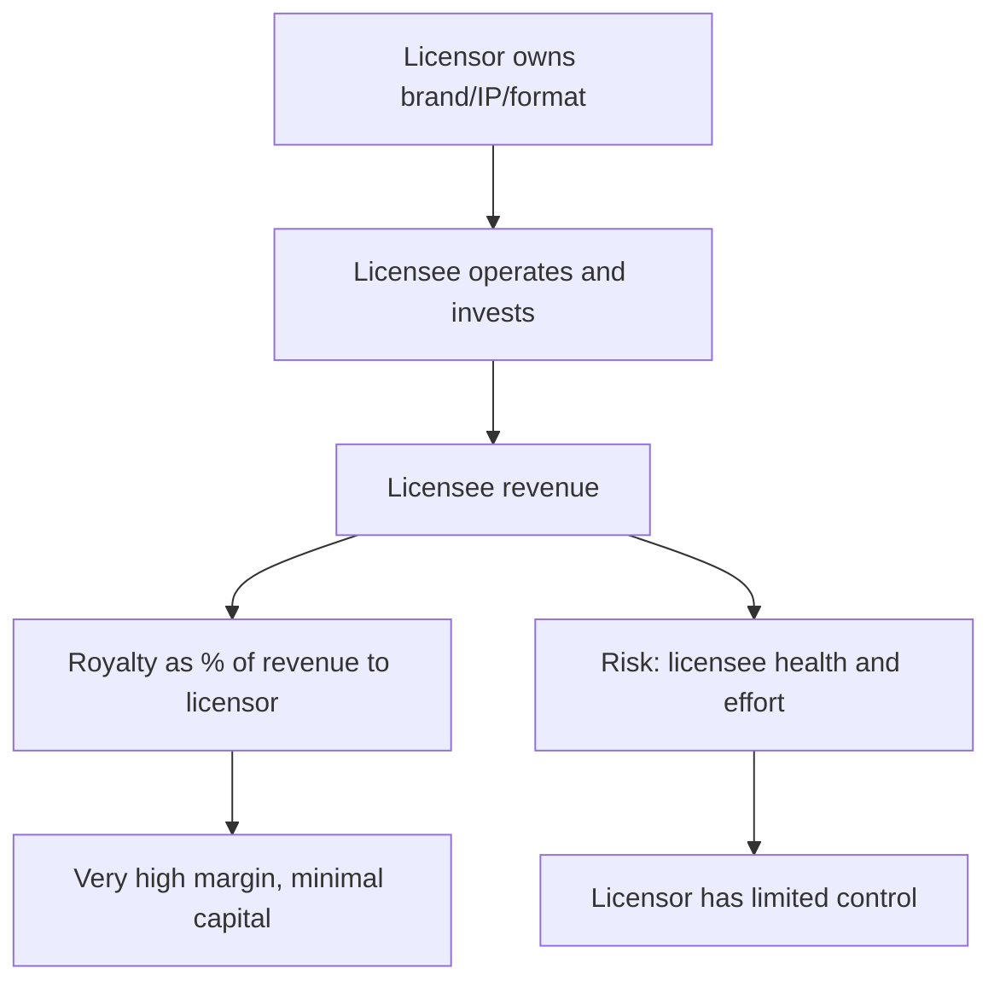

# Royalty, Franchise and Licensing Economics

## The Problem / Why this matters
Asset-light business models — collecting a royalty or franchise fee rather than owning the operating assets — produce very high returns on capital and are valued accordingly. But they also concentrate risk in the licensee's performance, which the licensor does not control, and the accounting can make a modest business look extraordinary. Separately, royalty *payments* to a parent or promoter entity are one of the recognised extraction mechanisms, so the same structure sits on both sides of the analysis.

## Core Idea
A royalty stream is worth what its **durability and the licensee's health** make it worth — the high margins are a consequence of the structure, not evidence of quality, and the analysis is about the durability of the underlying demand.

## Why it works this way
A royalty is a claim on someone else's revenue. Its economics look excellent because the licensor bears almost no cost — but the licensor also has almost no control over the revenue base, and if the licensee's business deteriorates, the royalty falls with it while the licensor has no operational lever to pull.

## Full technical content

### The structures

| Model | Description | Key risk |
|---|---|---|
| **Brand licensing** | Licensee sells under the licensor's brand for a fee | Brand dilution from poor licensee execution |
| **Franchising** | Licensee operates a defined format, paying a fee plus a revenue share | Franchisee profitability determines network growth |
| **Technology licensing** | Process or product IP licensed for royalties | Obsolescence; circumvention |
| **Company-owned vs franchised mix** | Retail and food service | Trade-off between control and capital |
| **Management contracts** | Operator runs an asset owned by another party | Fee tied to performance the operator only partly controls |

### Assessing a royalty stream

**1. What is the royalty base?** A percentage of the licensee's revenue, of a specific product line, or a fixed fee. Revenue-linked royalties inflate with the licensee's growth; fixed fees do not.

**2. Contract duration and renewal terms.** **This is the central question.** A royalty with three years remaining and no renewal certainty is worth far less than one with twenty. Check the disclosed contract tenor and the renewal history.

**3. Exclusivity and territory.** Exclusive rights in a growing territory are worth more than non-exclusive rights.

**4. Licensee concentration.** A single large licensee is a concentration risk equivalent to customer concentration, with the same existential character.

**5. Licensee financial health.** The royalty is only as good as the payer. **Assess the licensee directly where possible**, since the licensor's revenue depends on a business it does not control and often does not report on.

**6. Minimum guarantees.** Contracts frequently include minimums, which provide a floor and change the risk profile substantially — and their presence or absence should be established.

**7. Termination rights.** Who can terminate, on what notice, and what happens to the relationship afterwards.

### The franchising model specifically

For retail, food service and services:
- **Franchisee unit economics determine network growth.** If franchisees do not earn an adequate return, new openings stop and closures start — so the franchisee's payback period is the single most important operating metric, and it is frequently disclosed.
- **Company-owned versus franchised mix** trades control and margin against capital intensity. A shift toward franchising raises RoCE and lowers absolute margin, which is exactly the mix effect the margin-bridge chapter warns about misreading.
- **Same-store sales at franchised units** is the health measure; new-store growth alone can mask deteriorating unit economics.
- **Franchisee churn and closure rates** are the clearest warning signal and are sometimes disclosed.
- **Support obligations** — the licensor typically funds marketing, training and systems, so the model is less asset-light than the fee structure suggests.

### Valuing asset-light royalty businesses

- **Very high RoCE is structural**, not evidence of competitive advantage. The capital is deployed by someone else. **Do not credit the model with quality that belongs to the accounting structure.**
- **Value on cash flow durability**, which depends on contract length, renewal probability and the underlying demand for the licensed product.
- **DCF is usually appropriate** with an explicit contract horizon, and the terminal assumption must reflect renewal uncertainty rather than assuming perpetuity.
- **A perpetuity assumption on a contractual royalty is the standard error** — the contract has an end date, and assuming automatic renewal at unchanged terms is an assumption that should be stated and tested.
- **Multiples are often high** and can be justified where durability is genuine, but the multiple must be supported by the contract, not by the margin.

### The other side — royalty payments as extraction

The related-party chapter's mechanism, restated here because the analysis is the mirror image:
- A listed company paying a royalty to a promoter-owned brand entity transfers margin out of the listed entity.
- **Benchmark the rate against comparable arm's-length agreements** in the sector.
- **Check whether it rises with profit** and whether it falls in weak years.
- **Check whether shareholder approval was required and obtained**, and the voting outcome — proxy advisers frequently analyse these resolutions in detail.
- **Ask what the listed company receives** for the payment: a brand it built itself, or genuine ongoing IP from the licensor.

**Where a listed company pays a royalty for a brand it effectively created, that is extraction dressed as a licence**, and it should be restated out of earnings before valuing the business.

## Common mistakes
- Crediting a royalty model's **high RoCE** as evidence of competitive advantage rather than of structure.
- Assuming **perpetual renewal** of a contractual royalty.
- Ignoring **licensee financial health**, on which the entire revenue depends.
- Missing **licensee concentration** as an existential risk.
- Reading a shift toward **franchising** as margin deterioration without checking returns.
- Ignoring **franchisee unit economics**, which determine network growth.
- Overlooking the licensor's **support obligations**, which make the model less asset-light than it appears.
- Accepting a royalty paid to a promoter entity without **benchmarking the rate**.

## Interview angle
"A company earns 80% EBITDA margins on a licensing model. How do you value it?" Start by disclaiming the margin: it is high because someone else deploys the capital and bears the operating costs, so it is a structural feature rather than evidence of competitive advantage, and the same is true of the very high RoCE. The real question is durability — the contract's remaining tenor and renewal terms, whether the royalty is a share of revenue or a fixed fee, whether there are minimum guarantees providing a floor, and how concentrated the licensee base is. Add the assessment most people skip: the revenue depends entirely on a licensee's business the licensor does not control, so you assess that licensee's financial health directly. Then give the valuation discipline — a DCF over the explicit contract horizon with renewal uncertainty reflected in the terminal assumption, because assuming perpetual renewal at unchanged terms is the standard error in valuing contractual royalty streams. And note the mirror case worth flagging: where a listed company *pays* a royalty to a promoter-owned entity for a brand it effectively built itself, that is extraction and should be restated out of earnings.
