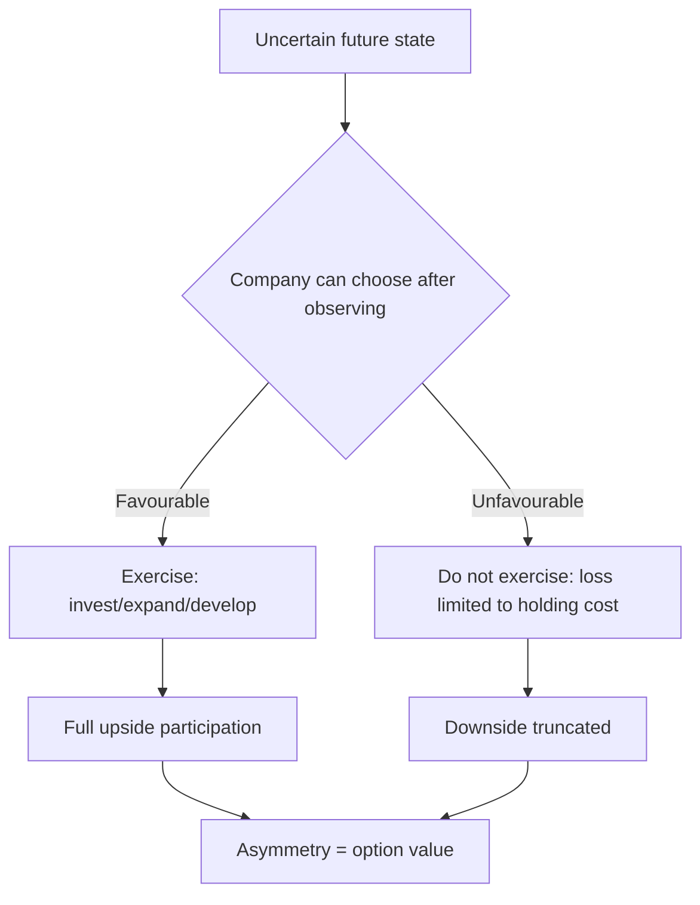

# Real Options and Valuing Optionality

## The Problem / Why this matters
Some assets have value that a discounted cash flow does not capture: an undeveloped mining lease, a land bank, a drug candidate, an option to expand a plant if demand materialises. A standard DCF values the expected outcome; it does not value the right to act only if conditions turn out favourably. That asymmetry — participate in the upside, decline the downside — has genuine value. Equally, "optionality" is one of the most abused words in equity research, deployed to justify valuations that no cash-flow analysis supports.

## Core Idea
Optionality is real and valuable where the company has a **genuine right to defer, expand or abandon, and where the outcome is uncertain** — but it requires an identifiable decision point, not merely an appealing possibility.

## Why it works this way
An option's value comes from asymmetry. If a company can invest ₹500cr later only if the market develops, its downside is capped at the cost of holding the right while its upside is the full project value. A DCF taking a probability-weighted average of "invest and it works" and "invest and it fails" misses that management will not invest in the second case — so the expected-value calculation understates the true position.

## Full technical content

### The types of real option

| Type | Example | What creates the value |
|---|---|---|
| **Option to defer** | Undeveloped mining lease or land bank | The right to wait for better prices |
| **Option to expand** | Land and clearances in place for phase 2 | The right to scale only if demand appears |
| **Option to abandon** | A project that can be halted | Downside truncation |
| **Option to switch** | A plant that can run on alternative feedstocks or make alternative products | Flexibility value in volatile input or output markets |
| **Growth option** | A platform enabling entry into adjacent markets | The right to enter without committing now |
| **Staged investment** | Pharma development by phase | Each stage buys the right to the next |

### When optionality is genuine

The tests, and all must be satisfied:

1. **A real right exists.** Ownership of the lease, the land, the licence, the technology. **Not a hope of obtaining one.**
2. **Genuine uncertainty** about the outcome. Where the outcome is known, there is no option value — only an NPV.
3. **A decision point** at which management can act on new information.
4. **The company can actually exercise** — capital available, capability present, no regulatory or contractual barrier.
5. **The right is exclusive or protected.** An "option" a hundred competitors also hold is not worth much.
6. **The holding cost is bounded** — lease rentals, land holding costs, maintenance of the licence. These are real and should be modelled.

**Where any of these fails, "optionality" is a narrative.** The most common failure is the first: describing a possibility the company has no exclusive right to pursue.

### Valuing it

**Approach 1 — Scenario with an exercise decision.** The most practical and transparent:
- Model the favourable state and the unfavourable state.
- **In the unfavourable state, assume the company does not invest**, so the loss is only the holding cost.
- Probability-weight.
- The difference between this and a naive expected-value DCF is the option value.

**Approach 2 — Formal option pricing.** Applying option-pricing logic with the underlying asset value, exercise cost, time to expiry and volatility. Theoretically appealing, practically fragile: the volatility input is unobservable for a real asset, and the model assumes tradeability that does not exist. **Use it for intuition about what drives the value, not for a number to publish.**

**Approach 3 — Comparable transactions.** What have similar undeveloped assets sold for? Often the most defensible for land banks and resource leases, because it is market evidence rather than model output.

### What drives the value

The option-pricing intuition is genuinely useful even without the formula:
- **Higher uncertainty raises option value**, which is counterintuitive but correct — more volatility means a greater chance of a very favourable state, while the downside is truncated.
- **Longer time to decision raises value**, since there is more opportunity for conditions to become favourable.
- **A lower exercise cost raises value.**
- **Holding costs reduce value** and should always be netted.

**The uncertainty point is worth stating in a note**, because it explains why an asset in a volatile market can be worth more than a discounted cash flow suggests.

### Presenting it honestly

- **Separate it from the core valuation.** "We value the operating business at ₹410 per share and the undeveloped acreage at ₹45 per share, giving a total of ₹455" is honest and lets a reader disagree with one part.
- **Probability-weight and state the probability.**
- **Identify the decision point and its date**, which converts optionality into a monitorable and, potentially, a catalyst.
- **Cap the contribution.** Where option value is a large share of the target, say so explicitly — it is a different kind of claim from operating cash flow and carries different risk.
- **Never let optionality carry the recommendation alone.** A Buy resting entirely on option value is a bet on a possibility, and it should be described in those terms.

### Where the concept is abused

Recognising the misuse is as important as understanding the concept:
- **"Optionality" as a substitute for analysis** — invoked when the numbers do not support the price.
- **Options the company has no right to** — a possible market entry it has not secured.
- **Options it cannot fund** — a company without the capital to exercise does not hold the option in any meaningful sense.
- **Options already priced** — where the market has long recognised the land bank, adding it to a peer-multiple valuation double-counts.
- **Ignoring holding costs**, which for land banks and leases can be substantial and compound over years.
- **Perpetual options** — most real options expire, and leases lapse.

**The discipline: if you cannot name the right, the decision point and the exercise cost, there is no option to value.**

## Common mistakes
- Invoking **optionality** without an identifiable right, decision point and exercise cost.
- Valuing an option the company **cannot fund**.
- Ignoring **holding costs** over long periods.
- Double-counting option value already reflected in a **peer multiple**.
- Using formal **option-pricing models** for publishable numbers on non-traded assets.
- Assuming options are **perpetual** when leases and licences expire.
- Letting option value carry the recommendation without saying so.

## Interview angle
"The company has a large land bank it has not developed. How do you value it?" Explain why a standard DCF understates it: the company can choose to develop only if conditions turn favourable, so the downside is limited to holding costs while the upside is the full project value, and that asymmetry has genuine value a probability-weighted DCF misses. Then give the practical method — model the favourable and unfavourable states, assume no investment in the unfavourable one so the loss is only the holding cost, probability-weight, and compare comparable transactions for similar undeveloped assets as the market-evidence cross-check. Say plainly that formal option-pricing models are useful for intuition but fragile for publication, since volatility on a non-traded asset is unobservable. Then give the tests that separate real optionality from the word being used as a substitute for analysis: does the company actually own the right, is there genuine uncertainty, is there a decision point, can it fund the exercise, and is the right exclusive — because an option a hundred competitors also hold is worth very little. Present it separately from the core valuation with the probability stated, and never let it carry the recommendation on its own.
