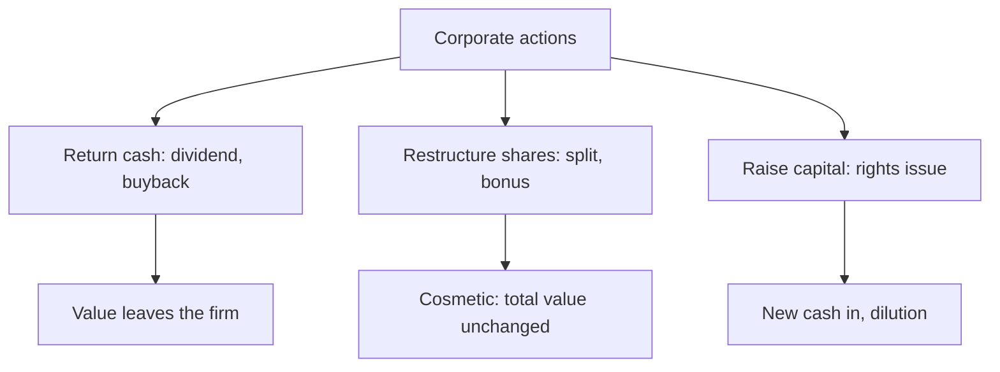

# Corporate Actions

## The Problem / Why this matters
Companies regularly do things that change their shares — pay dividends, split the stock, issue bonus or rights shares, buy back stock. These **corporate actions** change share counts, prices, and per-share metrics, and an analyst must adjust for them correctly (in models, historical price series, and valuation) — and know which ones create value and which merely rearrange it. Interviewers test whether you know that a split or bonus doesn't change value, and how a buyback flows through.

## Core Idea
A **corporate action** is an event initiated by a company that affects its securities and shareholders. Some return cash (dividends, buybacks); some change the share structure without changing total value (splits, bonus issues); some raise capital (rights issues). Knowing the mechanics and the value impact of each is essential.

## Why it works this way
Per-share numbers depend on the share count, so any action that changes shares changes per-share metrics — but often not total value. A split cuts the price and multiplies shares proportionally (same market cap); a dividend moves cash from the company to shareholders (value leaves the firm). Distinguishing *value-changing* from *cosmetic* actions is the key skill.

## Full technical content

**Dividends.** Cash paid per share from profits/reserves. Reduces cash and retained earnings. Key dates: **declaration, ex-dividend** (buy before ex-date to receive it), **record**, **payment**. The price typically drops by ~the dividend on the ex-date. **Dividend yield** = dividend/price.

**Stock split.** Divides each share into more shares at a proportionally lower price — e.g., a **1:1 split** (₹100 → two shares of ₹50). Market cap, and your total value, **unchanged**; only the share count and price change. Purpose: improve affordability and liquidity. (A **reverse split** consolidates shares into fewer, higher-priced ones.)

**Bonus / scrip issue.** Free additional shares to existing holders from reserves (e.g., **1:1 bonus** = one free share per share held). Like a split, it increases shares and cuts the price proportionally — **no change in total value** (reserves just move to share capital). Purely accounting/signaling.

**Rights issue.** Existing shareholders get the *right* to buy new shares, usually at a **discount**, in proportion to holdings (e.g., 1 new share per 4 held at a discount). Raises capital; those who don't subscribe are **diluted** (though the right itself has value and can be sold). The price adjusts to a **theoretical ex-rights price (TERP)** blending old and new.

**Buyback (share repurchase).** The company buys its own shares (tender or open-market) and cancels them. Reduces cash and equity, shrinks share count → **boosts EPS**. Returns cash like a dividend but more tax-efficiently/flexibly; signals shares are cheap. Doesn't create value by itself (depends on price paid vs value and alternative uses of cash).

| Action | Shares | Price/share | Total value | Cash impact |
|---|---|---|---|---|
| Dividend | Unchanged | Falls ~dividend | Falls (cash out) | Cash out |
| Split (1:1) | ×2 | ÷2 | Unchanged | None |
| Bonus (1:1) | ×2 | ÷2 | Unchanged | None |
| Rights | Up | TERP (blend) | Up by cash raised | Cash in |
| Buyback | Down | ~Unchanged | Falls (cash out) | Cash out |

**Analyst adjustments.** Adjust **historical prices** for splits/bonus (so charts aren't distorted), adjust **share counts** in models, and use **diluted** shares. Never compare a pre-split price to a post-split price without adjusting.

## Worked examples

**Example 1 — a split creates no value.** A stock at ₹1,000 does a 1:5 split → 5 shares at ₹200 each. An investor who held 10 shares (₹10,000) now holds 50 shares (₹10,000). Nothing changed except affordability. *A 2-for-1 or 5-for-1 split does not make you richer.*

**Example 2 — buyback and EPS.** A firm has net income ₹100 cr and 100 mn shares → EPS ₹10. It buys back 10 mn shares (cancelled) → 90 mn shares → EPS ₹100 cr / 90 mn = **₹11.1**. EPS rose ~11% with no change in profit — purely from a smaller share count. (Whether it *created value* depends on whether the shares were bought below intrinsic value.)

**Example 3 — rights issue TERP.** A stock at ₹200; a 1:4 rights issue at ₹100. For every 4 old shares (₹800) you buy 1 new at ₹100 → 5 shares for ₹900 → TERP = ₹180. The price "falls" from ₹200 to ₹180, but that's the dilution of the discounted new shares, not a loss for subscribers.

**Example 4 — a full dividend-date sequence, worked with actual dates.** A company declares a ₹15/share dividend on 5 June (**declaration date**). It sets 20 June as the **record date** — only shareholders on record that day receive the dividend. Given a T+1 settlement cycle, the **ex-dividend date** is set one business day before the record date, 19 June — an investor must buy the stock by 18 June (so the trade settles by 19 June) to appear on the register by the 20th record date. A trader who buys the stock on 19 June (the ex-date itself) does *not* receive the dividend, and the stock opens on the 19th trading roughly ₹15 lower than the prior close, reflecting the entitlement no longer attaching to a new buyer. **Payment date** — the actual date the ₹15 lands in shareholders' accounts — might be 5 July, several weeks after the ex-date. An analyst modelling total shareholder return must track all four dates correctly: using the wrong date (e.g. the payment date instead of the ex-date) to adjust a historical price series would misalign the mechanical price drop from the actual dividend entitlement.

**Example 5 — buyback method comparison: tender offer vs open-market.** A company wants to return ₹500 cr to shareholders via buyback and is choosing between two mechanisms. A **tender offer** buyback sets a fixed price (often at a premium to market, e.g. 20% above the current price) and a fixed quantity, with shareholders tendering shares proportionally if oversubscribed — pros: certainty of price and total outlay, and it signals strong management confidence (paying a visible premium); cons: slower (requires a formal offer process) and the premium paid may not represent good capital allocation if the stock wasn't genuinely undervalued by that much. An **open-market buyback** purchases shares gradually on the exchange over an extended window (up to a regulatory cap, e.g. a maximum % of daily volume) at prevailing market prices — pros: flexible, can be paused if the price rises above what management considers fair value, and avoids overpaying a large explicit premium; cons: slower to complete the full ₹500 cr, and provides a weaker signalling effect than a tender offer's explicit premium commitment. The choice itself is informative to an analyst: a company choosing a tender offer at a large premium is making a stronger public statement about undervaluation than one running a measured open-market programme.

## How it is tested in interviews
- **"Does a 2-for-1 stock split create value?"** — "No — twice the shares at half the price; total value and market cap are unchanged. It improves affordability and liquidity."
- **"How does a buyback affect EPS and the statements?"** — "Cash and equity fall; share count shrinks, so EPS rises. It returns cash like a dividend but more flexibly/tax-efficiently. It only creates value if shares are bought below intrinsic value."
- **"Split vs bonus issue?"** — "Both increase shares and cut the price proportionally with no value change; a split changes the face value, a bonus capitalizes reserves into share capital."
- **"What is a rights issue and TERP?"** — "Existing holders can buy new shares at a discount; the price settles at a theoretical ex-rights price blending old and new. Non-subscribers are diluted."
- **"Why adjust historical prices for a split?"** — "So the chart and returns aren't distorted by the mechanical price change."

## Traps & common mistakes
- Thinking a **split/bonus** makes shareholders richer — it's cosmetic.
- Confusing a **buyback's EPS boost** with value creation (depends on price paid).
- Forgetting **rights issues dilute** non-subscribers.
- Comparing pre- and post-split prices **without adjusting**.
- Missing the **ex-date** logic for dividends/entitlements.

## First-principles recap
- Corporate actions change shares, price, and per-share metrics — often not total value.
- **Splits and bonus issues are cosmetic** (value unchanged).
- **Dividends and buybacks** return cash (value leaves the firm); buybacks lift EPS.
- **Rights issues** raise capital and dilute non-subscribers (price → TERP).
- Always adjust historical prices and share counts for splits/bonus.

## Quick-reference
| Action | Value effect |
|---|---|
| Dividend | Cash out; price drops ex-date |
| Split / bonus | Cosmetic; total value unchanged |
| Buyback | Cash out; EPS up; value if bought cheap |
| Rights issue | Capital in; dilutes non-subscribers; TERP |
| Adjust for | Splits/bonus in prices & share counts |
