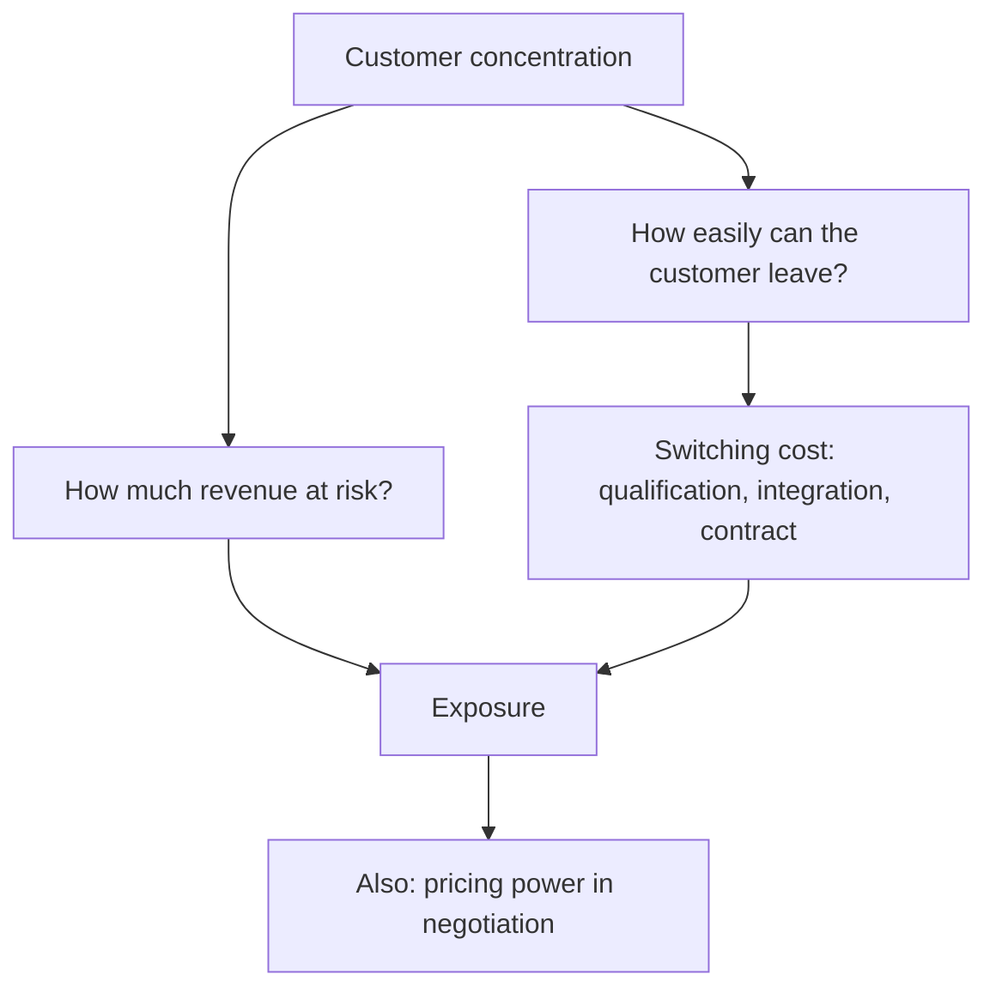

# Customer Concentration and Contract Risk

## The Problem / Why this matters
A company deriving 45% of revenue from three customers has a different risk profile from one serving thousands, even if every reported metric looks identical. Concentration is disclosed, quantifiable, and routinely under-weighted because it produces no visible problem until it produces a very large one. It also cuts both ways — a long relationship with a demanding global customer is evidence of a validated position, not only a risk.

## Core Idea
Concentration risk is determined by **switching costs and contract structure**, not by the concentration percentage alone — a customer who cannot easily leave is a different exposure from one who reorders each quarter by choice.

## Why it works this way
The damage from losing a customer is the revenue lost times the probability of losing them. High concentration raises the first term; low switching costs raise the second. A supplier embedded in a customer's product with a multi-year qualification behind it faces a small probability of a large loss; a commodity supplier on annual tenders faces a large probability of the same loss.

## Full technical content

### The disclosures and the tests

- **Revenue from the top customer, top five, top ten** — disclosed by many companies, or inferable from segment and geographic disclosure.
- **Trend over time** — rising concentration means growth is coming from existing customers, which is efficient but increases fragility.
- **Receivable concentration**, which is the credit dimension and appears in the financial instruments note.
- **Contract structure** — long-term agreements with committed volumes, versus purchase orders, versus annual tenders.
- **Switching cost evidence** — qualification cycles, integration into the customer's product, regulatory filings naming the supplier, tooling investment.

**The key question to answer explicitly in a note:** if the largest customer left, what would happen to revenue, to margin, and to fixed-cost absorption? Because losing a large customer removes revenue while leaving the cost base, the EBITDA impact is far larger than the revenue impact — the operating leverage chapter's arithmetic applied to a specific, identifiable risk.

### The two sides

**As a risk:**
- Existential where a single customer is a large share of revenue and can exit.
- **Pricing power sits with the customer**, so margins are structurally lower and price negotiations are annual events with real consequences.
- **Credit exposure** is concentrated too — one customer's distress is the supplier's crisis.
- **The customer may integrate backwards** or dual-source deliberately.

**As evidence of quality:**
- A decade-long relationship with a demanding customer is **validation that a competitor cannot replicate quickly**.
- **Qualification into a customer's product** is the moat the export-competitiveness chapter identifies.
- **Share of the customer's wallet growing** indicates performance, and is sometimes disclosed.

### What to do

1. **Quantify the exposure** — revenue, and the EBITDA impact after fixed-cost absorption.
2. **Assess switching cost** with specific evidence, not assertion.
3. **Assess the customer's own health** and strategy — read their filings, per the read-across chapter.
4. **Check contract tenor and renewal dates**, which are dated events.
5. **Model a loss scenario** in the bear case rather than mentioning concentration in a risk list.
6. **Apply a valuation discount** where the exposure is genuine, stated and justified.

## Common mistakes
- Listing concentration as a risk without **quantifying** the EBITDA impact.
- Treating all concentration as equal regardless of **switching costs**.
- Ignoring the **customer's** financial health and strategy.
- Missing rising concentration as a **trend**.
- Forgetting that losing a large customer strands **fixed costs**, so the margin impact exceeds the revenue impact.
- Ignoring the **credit** dimension of concentrated receivables.

## Interview angle
"Their top customer is 31% of revenue. How much does that worry you?" Say it depends on switching cost rather than on the percentage: a supplier qualified into a customer's product, with a multi-year validation behind it and regulatory filings naming it, faces a small probability of a large loss — while a commodity supplier on annual tenders faces the same loss at much higher probability. Then quantify rather than describe: if that customer left, revenue falls 31% but the fixed cost base does not, so the EBITDA impact is far larger, and that number belongs in the bear case rather than in a risk list. Add that you would read the customer's own filings for their health and strategy, check the contract tenor and renewal dates as scheduled events, and note the other side — a long relationship with a demanding customer is validation a competitor cannot replicate quickly, so concentration is simultaneously the risk and part of the moat.
