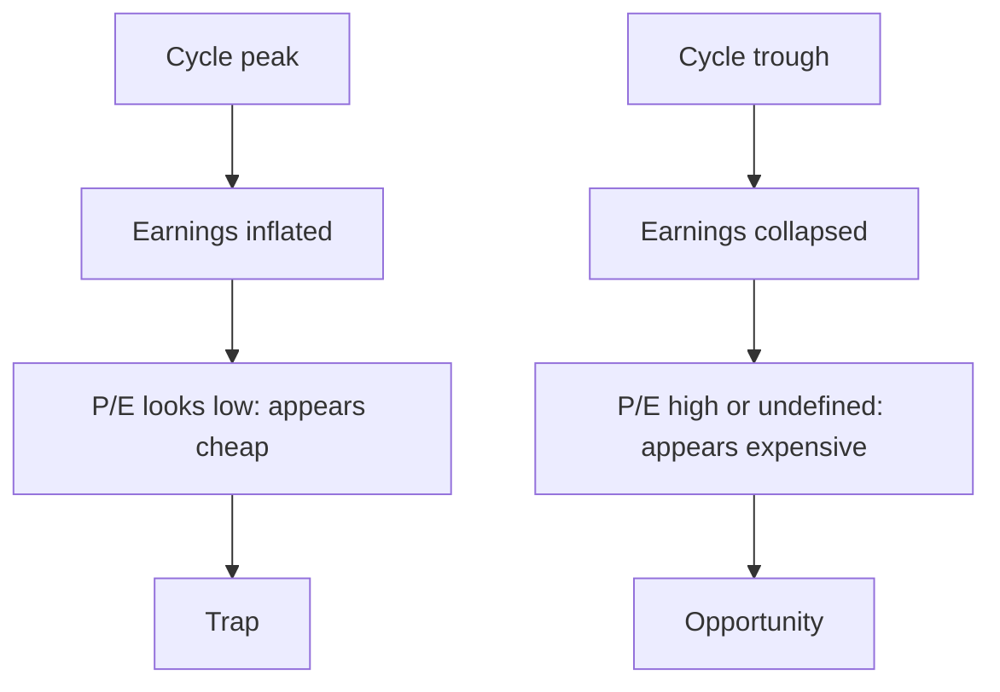

# Peak and Trough Valuation of Cyclicals

## The Problem / Why this matters
The most repeated error across these chapters is applying a P/E multiple to peak-cycle earnings. It appears in metals, cement, autos, chemicals, shipping and textiles, and it destroys capital reliably because the stock looks cheapest exactly when it is most expensive. The correct tools are different, well established, and consistently under-used — and knowing them is one of the clearest ways to demonstrate genuine analytical training.

## Core Idea
For cyclicals, **P/E is inverted**: it is lowest at the peak, when earnings are unsustainable, and highest or undefined at the trough, when the opportunity is greatest. Value on normalised earnings or on asset-based measures instead.

## Why it works this way
Cyclical earnings swing far more than cyclical share prices, because the market partly anticipates the cycle. At the peak, E is inflated and P is not, so P/E is low. At the trough, E collapses toward zero while P holds above liquidation value, so P/E explodes. The ratio therefore gives exactly the wrong signal at both ends.

## Full technical content

### The tools that work

| Method | How | Why it works |
|---|---|---|
| **Normalised earnings** | Apply mid-cycle margins to current capacity and volumes | Removes the cycle from the earnings base |
| **Price to book** | Against the company's own historical P/B range | Book value is far more stable than earnings |
| **EV per tonne / per unit of capacity** | Against replacement cost and past transactions | Anchors to asset value, cycle-independent |
| **EV/EBITDA on mid-cycle EBITDA** | Mid-cycle spread or realisation × capacity | Less distorted than P/E |
| **Replacement cost** | What it would cost to build the capacity today | The economic floor and the supply-response trigger |
| **Free cash flow yield through a full cycle** | Cumulative FCF over a cycle ÷ market cap | Captures the whole cycle rather than one point |

### Normalising properly

1. **Define the cycle length** from history — typically five to ten years, sector-dependent.
2. **Compute mid-cycle margins or spreads** across a full cycle, not a convenient window.
3. **Apply to current capacity**, since the asset base has grown.
4. **Adjust for structural change** — cost-curve position, integration, regulatory shifts — because a company that has genuinely improved deserves a higher normalised margin than its own history shows, and this judgement is where the analysis lives.
5. **Apply a mid-cycle multiple**, not a peak or trough one.

**The discipline that matters:** state the normalised assumption explicitly. A reader who disagrees with your mid-cycle spread can substitute theirs, which is far more useful than a target that conceals the assumption.

### Reading the cycle position

- **Industry utilisation** is the primary indicator — pricing power returns sharply above a threshold, as the cement and capacity chapters describe.
- **Announced industry capacity** determines future supply and is public. This is the single most valuable input, and it is the same discipline as the capex chapter applied at industry level.
- **Cost-curve position** determines who survives the trough; bottom-quartile producers set the marginal price.
- **Inventory in the chain** across the industry.
- **Where balance sheets sit** — a cycle turning with the industry levered is a much deeper trough.

### Buying troughs

- **The best returns come from buying near the trough**, when P/E is meaningless and the news is worst.
- **The requirement is balance sheet survival.** A cyclical with high leverage may not reach the recovery — the combined-leverage point from the operating leverage chapter, in its most consequential form.
- **P/B below historical trough levels** with an intact balance sheet is the classic setup.
- **Timing is genuinely hard**, so size for the possibility of being early and check that the company can survive the wait.

### Selling peaks

- **Low P/E at the peak is the sell signal, not the buy signal.**
- **Watch industry capacity announcements** — when everyone expands, the peak is being priced into future supply.
- **Watch margins against historical peaks**; margins far above any prior peak are unlikely to persist.
- **Watch the balance sheet improving rapidly**, which is what funds the next capex wave that destroys the returns.

## Common mistakes
- Applying **P/E to peak earnings** — the single most repeated error in these chapters.
- Rejecting a trough opportunity because **P/E is high**.
- Normalising over a **convenient window** rather than a full cycle.
- Applying mid-cycle margins to **historical** rather than current capacity.
- Ignoring **structural improvement**, and normalising a genuinely better company to its own worse history.
- Buying a trough without checking **balance sheet survival**.
- Ignoring **announced industry capacity**, which is public and determines the next cycle.

## Interview angle
"A steel company trades at 5× earnings. Cheap?" Almost certainly not — for cyclicals P/E is inverted, lowest at the peak when earnings are unsustainable and highest at the trough when the opportunity is greatest, because earnings swing far more than prices. Say what you use instead: normalised earnings, applying mid-cycle spreads computed over a full cycle to current capacity; price to book against the company's own historical range, since book is far more stable than earnings; and EV per tonne against replacement cost and past transactions. Then give the cycle-position read: industry utilisation, and above all announced industry capacity, which is public and tells you what supply arrives in two to four years — because if everyone is expanding into today's high returns, those returns will not exist when the capacity commissions. Finish with the trough discipline: the best returns come from buying when P/E is meaningless and the news is worst, but only if the balance sheet survives the wait, so leverage is the binding check.
