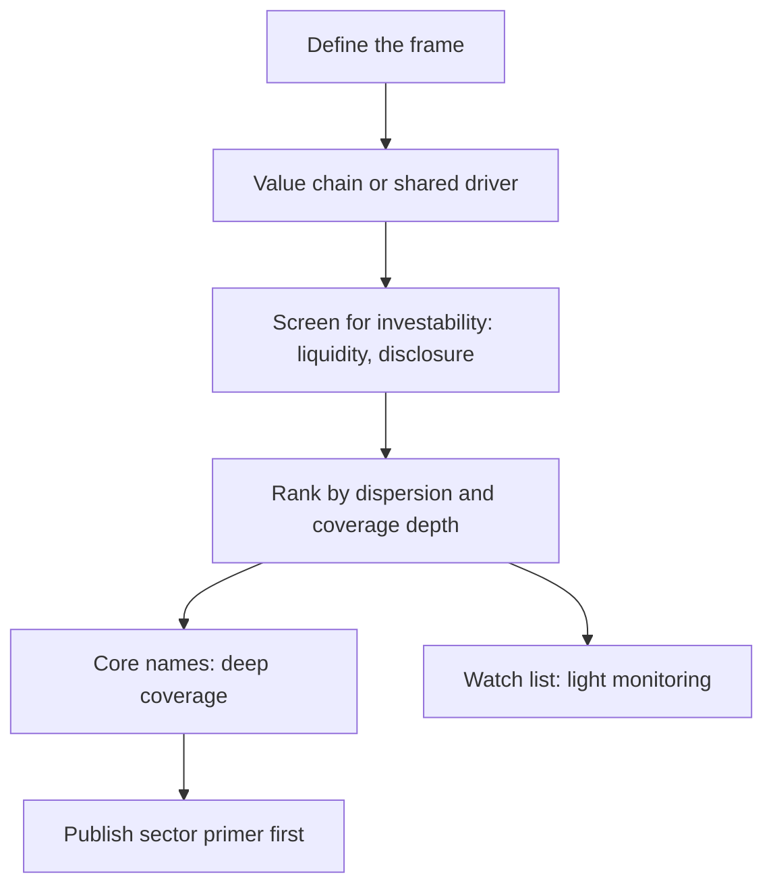

# Building a Coverage Universe from Scratch

## The Problem / Why this matters
An analyst is rarely told exactly which stocks to cover. Choosing the universe is a decision with large consequences: it determines what questions you can answer for clients, where your time goes, and whether your work has an audience. A universe assembled by market capitalisation alone produces a list of well-covered large caps where differentiation is hardest.

## Core Idea
Build the universe around **a coherent analytical frame** — a value chain, a shared driver, a client need — so that work on one name informs work on the others, rather than around an arbitrary size cut.

## Why it works this way
Research effort compounds within a coherent set. Understanding a sector's structure, cost curve and data sources applies to every company in it, and the read-across between them is a genuine information advantage. A universe of unrelated companies gives none of that leverage.

## Full technical content

### Selection criteria

| Criterion | Why |
|---|---|
| **Coherence** | Work on one name informs the others; read-across is available |
| **Client relevance** | Names clients hold or could hold at meaningful size |
| **Investability** | Liquidity sufficient for deployable positions, per the small-cap discipline |
| **Dispersion** | Where valuations differ widely, selection pays — the breadth chapter's point |
| **Coverage depth** | Thin coverage is where an information edge is available |
| **Disclosure quality** | Companies that disclose enough to analyse |

**The tension to resolve:** the most under-covered names are usually the least liquid, and the most liquid are the most covered. **The productive zone is mid-caps with adequate liquidity and thin coverage**, and it is worth being deliberate about targeting it.

### Structuring the universe

- **Core coverage** — full models, initiation notes, quarterly updates, active ratings. Realistically 10–18 names for one analyst.
- **Watch list** — monitored, no published rating, ready to initiate if something changes.
- **Read-across set** — companies you track for information about the core, including global peers and unlisted competitors, with no intention of covering them.

**The read-across set is the part most analysts neglect** and is where the systematic advantage of a coherent universe is realised.

### Sizing it

- **Too many names** means shallow work everywhere and no differentiation.
- **Too few** means limited client relevance and no read-across.
- **Depth beats breadth** for building a reputation: one genuinely differentiated call is worth more than twenty in-line ratings.

### Practical sequence

1. **Map the value chain** and list every listed participant, including suppliers and customers.
2. **Add global peers** for benchmarking and read-across.
3. **Apply investability filters.**
4. **Rank by dispersion and coverage depth** to identify where the effort pays.
5. **Choose the core**, and put the rest on the watch or read-across lists.
6. **Publish a sector primer first**, per the first-90-days chapter, then initiate.
7. **Review annually** — drop names where the work no longer pays, add where the situation has changed.

### When to add and drop

**Add** when a company is newly investable — post-IPO once the restricted period expires, post-demerger, after a liquidity improvement, or after a structural change that makes the historical record stale and the market's models wrong.

**Drop** when liquidity has fallen below deployable levels, when disclosure has deteriorated to the point that analysis is guesswork, or when the name no longer fits the frame. **Dropping coverage should be published, not silent** — clients holding the stock deserve to know it is no longer covered.

## Common mistakes
- Selecting by **market capitalisation** alone, producing a well-covered large-cap list.
- Building an **incoherent** universe with no read-across leverage.
- Covering too many names **shallowly**.
- Ignoring the **investability** filter, and covering names nobody can hold.
- Neglecting the **read-across set** of peers and global comparables.
- Never **reviewing** the universe.
- Dropping coverage silently.

## Interview angle
"You're given free rein to build a coverage list. How do you choose?" Build around a coherent frame — a value chain or a shared driver — so that understanding the sector's structure, cost curve and data sources applies to every name and read-across between them is available, rather than picking by market capitalisation, which produces a list of heavily covered large caps where differentiation is hardest. Then apply the filters that determine whether effort pays: investability first, since covering names nobody can hold at size is wasted work; then valuation dispersion, because selection earns little where every stock trades in a narrow band; then coverage depth, since a mid cap followed by two analysts is not priced with respect to public information the way a large cap followed by twenty-five is. Structure it as core coverage with full models, a watch list, and a read-across set of suppliers, customers, global peers and unlisted competitors you track for information rather than to cover — that last group is what most analysts neglect and is where the coherent universe actually pays off.
