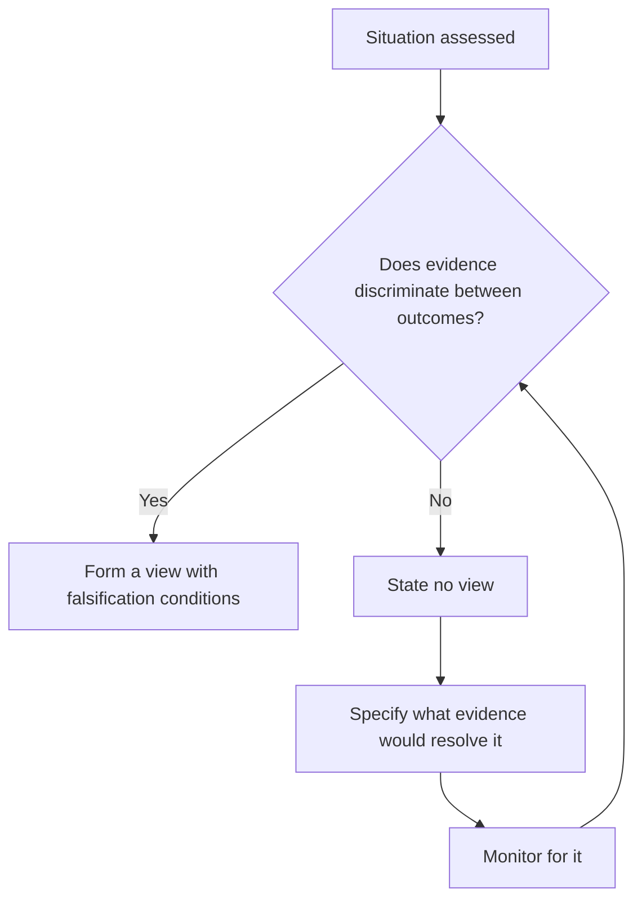

# When to Say "No View"

## The Problem / Why this matters
The pressure on an analyst is always to have a view. Clients ask, sales asks, the rating framework demands one. But some situations are genuinely unresolvable with available information, and manufacturing a view to fill the space is worse than declining — it misleads a client into acting on false confidence. Knowing when the honest answer is "I don't know, and here is why" is a mark of judgement, not of weakness.

## Core Idea
A view requires **evidence that discriminates between outcomes**. Where the available evidence does not, the professional answer is to say so, specify what would resolve it, and monitor for that evidence.

## Why it works this way
A recommendation is a claim that expected return justifies the risk. That claim requires a defensible estimate of both. Where the range of plausible outcomes is so wide that the expected return cannot be estimated meaningfully, the recommendation has no foundation — and dressing it up as a Hold with a mid-range target conceals the uncertainty rather than communicating it.

## Full technical content

### When "no view" is the honest answer

- **Binary outcomes you cannot handicap** — a pending regulatory or court decision that determines most of the value, where you have no basis for a probability.
- **Disclosure inadequate to analyse** — where the company does not disclose enough to build a defensible forecast, per the disclosure-quality chapter.
- **Governance concerns that invalidate the numbers** — where the related-party chapter's conclusion applies: if you cannot rely on the financial statements, no multiple is meaningful.
- **A business model in transition** where the destination is genuinely unclear.
- **Situations requiring information you cannot legally obtain**, where the only resolving evidence would be material non-public information.

### Distinguishing it from laziness

The critical distinction, since "no view" can be an excuse:
- **A justified "no view" is specific.** It names what is unresolvable, why the available evidence does not resolve it, and what evidence would.
- **An unjustified one is vague** — a general sense that the situation is difficult, which usually means the work has not been done.
- **The test:** can you state precisely what you would need to know? If yes, the position is defensible and the missing item goes on a monitorable list. If not, do more work.

### How to communicate it

- **Say it plainly** and early. Clients value directness far above manufactured confidence.
- **Give the analysis you do have** — the business, the structure, the range of outcomes, the valuation under each. Declining a rating is not declining to do work.
- **State the resolving evidence** and its likely date, which converts a non-view into a monitorable and sometimes a catalyst.
- **Give the range**, so clients holding the stock understand the exposure even without a rating.
- **Suspend rather than fabricate** where a firm's framework requires a rating — suspension is a recognised status and exists for this.

### The related discipline: sizing the uncertainty

Even where a view is possible, its confidence varies, and **signalling that honestly is what makes the high-conviction calls credible.** An analyst who presents every call at the same confidence level gives the sales desk and clients no basis for prioritising — which the morning meeting chapter identifies as directly reducing the value of the work.

### The professional value

- **Credibility compounds.** An analyst known for saying "I don't know" when true is believed when they say they do know.
- **The alternative is worse.** A manufactured view that is wrong costs a client money and costs the analyst credibility permanently.
- **It is rarer than it should be**, which is precisely why it signals judgement.

## Common mistakes
- Manufacturing a view to fill a rating slot.
- Using a **Hold with a mid-range target** to conceal genuine uncertainty.
- Presenting a **vague** "no view" that reflects insufficient work rather than genuine irreducibility.
- Failing to specify **what evidence would resolve** the uncertainty.
- Declining a rating and also declining to publish the analysis.
- Presenting every call at the **same confidence level**.

## Interview angle
"Have you ever not had a view on a stock you covered?" A good answer treats this as a discipline rather than a failure. Say that a recommendation is a claim that expected return justifies risk, and that claim needs evidence discriminating between outcomes — so where the value turns on a binary regulatory or court decision you have no basis to handicap, or where disclosure is inadequate to build a defensible forecast, or where governance concerns mean the financial statements cannot be relied on, the honest answer is that you cannot form a view. Then draw the line that keeps it from being an excuse: a justified "no view" is specific — it names exactly what is unresolvable and what evidence would resolve it, which turns it into a monitorable — whereas a vague sense that the situation is difficult usually means the work has not been done. Add that you would still publish the analysis, the range of outcomes and the valuation under each, so clients holding the stock understand their exposure. And note why it pays: an analyst known for saying "I don't know" when it is true is believed when they say they do know.
