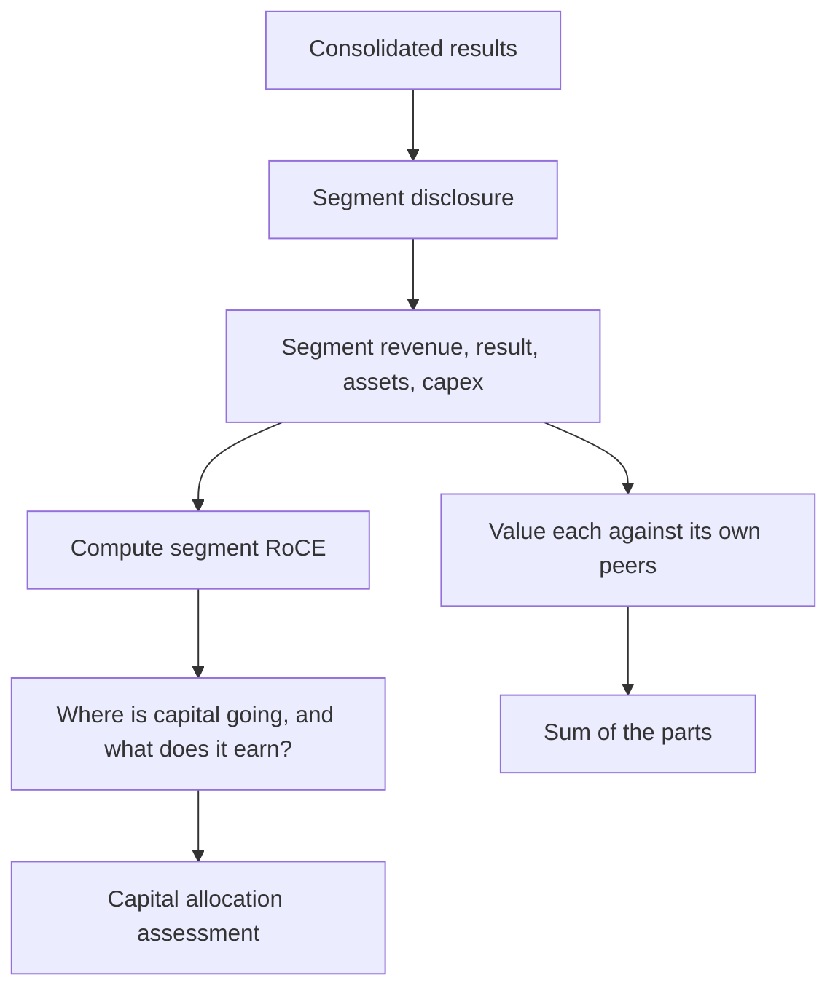

# Segment Reporting and Conglomerate Analysis

## The Problem / Why this matters
A company operating four different businesses reports one set of consolidated numbers, and every ratio computed from them is a weighted average of things that should not be averaged. Segment disclosure exists to solve this, but it is prepared on a management basis that varies by company, allocates shared costs by judgement, and can be redefined without restatement. Reading it properly is what makes a conglomerate analysable at all.

## Core Idea
Analyse a multi-business company **segment by segment**, valuing each against its own peer set — and treat the consolidated ratios as arithmetic artefacts rather than as descriptions of anything real.

## Why it works this way
A consolidated 14% margin on a company with a 30%-margin consumer business and a 4%-margin commodity business describes neither. The consolidated figure moves whenever mix moves, which the margin-bridge chapter identifies as one of the most misread effects, and it converges to nothing meaningful over time.

## Full technical content

### What segment disclosure contains

Reporting standards require disclosure by operating segment, generally as management reviews the business:
- **Segment revenue**, including inter-segment revenue.
- **Segment result** — usually EBIT-like, with the definition disclosed.
- **Segment assets and liabilities.**
- **Segment capex and depreciation.**
- **Reconciliation to consolidated figures**, including unallocated items.

**The unallocated line matters.** Corporate costs, treasury income and some finance costs sit outside the segments, and where the unallocated block is large, segment results overstate what each business would earn standalone — the same point the demerger chapter makes about carve-out financials.

### The analysis

**1. Segment RoCE.** Segment result divided by segment assets (or assets less liabilities) is the single most useful number in a conglomerate analysis. It answers where capital earns and where it does not, and it is computable directly from disclosure.

**2. Capital allocation by segment.** Compare each segment's share of capex to its share of profit and to its RoCE. **A segment receiving a large share of capex while earning below the cost of capital is the value-destruction pattern**, and it is visible years before consolidated returns deteriorate — this is the ROIIC chapter's point made segment-specific.

**3. Growth and margin by segment**, which reveals whether consolidated trends are broad or driven by one division.

**4. Inter-segment revenue**, which indicates vertical integration and, where large, means segment results depend on internal transfer pricing that management sets.

**5. Trend across years**, watching for redefinitions.

### The limitations to state

- **Management basis** means definitions vary between companies, so cross-company segment comparison is weaker than it looks.
- **Cost allocation is judgemental**, particularly for shared functions, distribution and corporate overhead.
- **Transfer pricing** between segments is internal and can shift profit between them.
- **Segments can be redefined**, breaking the historical series exactly as the restatement chapter describes — and prior periods are not always restated.
- **Aggregation** — standards permit combining segments with similar characteristics, which can conceal a struggling business inside a healthy one.

**When a company aggregates previously separate segments, ask why.** It is frequently the disclosure-quality warning signal: something inside the aggregate has deteriorated.

### Valuing a conglomerate

The sum-of-the-parts approach, with the disciplines the SOTP and holding-company chapters establish:
1. **Value each segment** on the multiple appropriate to its own peer set.
2. **Deduct unallocated corporate costs**, capitalised — these are real and are frequently omitted.
3. **Deduct net debt** and any structurally subordinated positions.
4. **Apply a holding-company or complexity discount** where warranted, stated and justified.
5. **Compare to the market price** and ask whether a mechanism exists to close any gap.

**Step 2 is the one most often skipped.** A conglomerate's corporate centre costs real money every year, and summing segment values without deducting the capitalised cost of running the centre overstates the company.

### The conglomerate discount

Covered in the demerger chapter from the unlocking side; here the valuation question:
- **The discount is usually real**, reflecting cross-subsidisation, opacity, divided management attention and the absence of a natural analyst home.
- **Whether it should close** depends on a mechanism — a demerger, a listing of a subsidiary, an asset sale — and without one it is a permanent feature.
- **Some conglomerates deserve no discount**: where capital is allocated well across businesses, the internal capital market is a genuine advantage, and segment RoCE data is how you demonstrate that.

## Common mistakes
- Computing **consolidated margins and returns** for a multi-business company and treating them as meaningful.
- Ignoring **unallocated costs** when summing segment values.
- Comparing **segment definitions** across companies as though standardised.
- Missing a **segment redefinition or aggregation**, and the reason for it.
- Overlooking **inter-segment transfer pricing** where integration is significant.
- Not computing **segment RoCE**, the most useful number available.
- Recommending on an SOTP gap with **no mechanism** to close it.

## Interview angle
"How do you analyse a company with four unrelated businesses?" Say that consolidated ratios are arithmetic artefacts — a blended margin describes none of the businesses and moves whenever mix moves — so the work is segment by segment. The single most useful number is segment RoCE, computed directly from disclosed segment result and segment assets, because it tells you where capital earns and where it does not. Then compare each segment's share of capex against its RoCE: a division absorbing a large share of investment while earning below the cost of capital is destroying value, and that is visible years before consolidated returns deteriorate. For valuation, sum the parts using each segment's own peer multiples, but deduct the capitalised cost of the corporate centre, which is real money and is the step most often skipped. Add the limitations honestly — segment definitions are on a management basis so cross-company comparison is weak, cost allocation is judgemental, and when a company aggregates previously separate segments it is worth asking what has deteriorated inside the aggregate.
