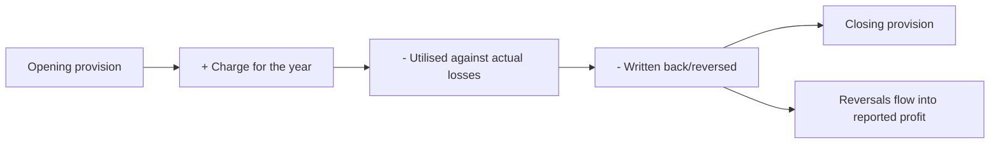

# Provisions, Write-offs and Earnings Smoothing

## The Problem / Why this matters
Provisions are estimates of future losses, and estimates are where discretion lives. A company can build provisions in good years and release them in bad ones, producing a smoother earnings series than the underlying business supports. Because the market pays a higher multiple for stable earnings, the incentive is direct — and the practice is legal, disclosed in aggregate, and detectable by anyone who reads the movement schedules.

## Core Idea
Track the **movement in each provision** — opening balance, charge, utilisation, reversal, closing balance — because the charge alone conceals whether reported profit was supported by releases of provisions made earlier.

## Why it works this way
A provision reduces profit when created and increases it when released. If the original provision was larger than needed, the excess flows back into a later period's earnings. Nothing improper need occur — estimates change legitimately — but the effect is to move profit between periods, and only the movement schedule reveals it.

## Full technical content

### The provisions to track

| Provision | Where discretion sits |
|---|---|
| **Doubtful debts / expected credit loss** | Assumptions about customer recoverability |
| **Inventory write-down** | Net realisable value estimates, per the inventory chapter |
| **Warranty** | Expected failure rates and costs |
| **Litigation** | Probability and quantum of adverse outcomes |
| **Restructuring** | Estimated cost of announced plans |
| **Impairment** | Goodwill, assets and investments — the goodwill chapter's territory |
| **Employee benefits** | Actuarial assumptions on discount rate, salary growth, attrition |

**Actuarial assumptions deserve specific attention** because they are disclosed, comparable to peers, and materially affect the liability. A discount rate above peers or a salary-growth assumption below them reduces the reported obligation with no economic difference.

### The tests

**1. Read the movement schedule** for each material provision. Standards require disclosure of opening balance, additions, utilisation, reversals and closing balance. **The reversal line is where the information is.**

**2. Compare provisions to the base they relate to.** Doubtful debt provision as a percentage of receivables, warranty provision as a percentage of relevant revenue, compared across time and against peers. A ratio falling while the business is not obviously improving is a release in progress.

**3. Watch the pattern.** Large provisions in a weak year followed by releases in subsequent years is the classic "big bath" — take the pain when the year is already bad and the base is reset lower, then release into future periods.

**4. Check timing against events.** Large provisions coinciding with a change of CEO or CFO fit the pattern the goodwill chapter describes: clear the deck, attribute it to the predecessor, lower the base for future comparison.

**5. Compare provisions to actual utilisation.** If provisions consistently exceed what is actually used, they were systematically over-estimated — which is either poor estimation or deliberate.

**6. Check disclosure of the assumptions**, and whether they have changed. A change in an actuarial assumption or an expected-credit-loss model is disclosable and moves the charge.

### What the pattern tells you

- **Consistent over-provisioning followed by releases** — earnings are being smoothed, and reported stability is partly manufactured. **The multiple the market pays for that stability is therefore unwarranted**, which is the analytical conclusion that matters.
- **Under-provisioning** — a coverage ratio falling while the underlying risk rises, which the banks and NBFC chapters treat as the primary asset-quality signal. This is the more dangerous direction, since the loss is still coming.
- **Volatile provisioning with no pattern** — usually genuine, reflecting a business with lumpy risks.

### Adjusting for it

- **Compute earnings excluding reversals** to see the underlying trend.
- **Normalise the provision charge** to a through-cycle level based on actual utilisation history.
- **Restate the earnings series** where smoothing is material, and show the restated volatility — which is frequently the most persuasive exhibit in such a note.
- **Adjust the multiple** if the earnings stability that justified it is an accounting artefact rather than a business characteristic.

### The lender case

For banks and NBFCs the issue is central rather than peripheral:
- **Provision coverage ratio** and its trend is the headline measure.
- **Stage-wise movement** under expected-credit-loss frameworks shows migration before it reaches the headline.
- **Write-offs versus recoveries** — as the banks chapter insists, check whether an improving gross NPA came from recoveries or from writing off the problem.
- **Countercyclical or floating provisions** built in good years are prudent, but their release in bad years flatters reported profit and should be identified separately.

### The honest framing

Provisioning judgement is genuinely difficult and most companies are not manipulating anything. **The analytical task is not to allege manipulation but to establish how much of reported profit came from operations and how much from estimate changes** — and to say so factually. That distinction keeps the analysis credible and is more useful to a client than an accusation.

## Common mistakes
- Reading the provision **charge** without the movement schedule.
- Missing **reversals** flowing into reported profit.
- Not comparing provisions to their **underlying base** over time.
- Ignoring **actuarial assumptions**, which are disclosed and comparable.
- Missing a **big bath** coinciding with a management change.
- Paying a stability multiple for earnings smoothed by **provisioning**.
- For lenders, missing that gross NPA improved through **write-offs** rather than recoveries.
- Alleging manipulation where the honest statement is about the composition of reported profit.

## Interview angle
"Profit grew 11% but you think the quality is poor. How would you show that?" Go to the provision movement schedules, which disclose opening balance, charge, utilisation and reversals separately — because the reversal line shows how much of this year's profit came from releasing provisions made in earlier years rather than from operations. Then compare each provision to its base over time: doubtful debt as a percentage of receivables, warranty as a percentage of revenue, and check whether a falling ratio is justified by any actual improvement. Look for the pattern that gives it away — a large charge in a weak year, often coinciding with a change of CEO or CFO, followed by releases into subsequent years, which resets the base low and flatters everything after. Say what you would publish: earnings excluding reversals, a provision charge normalised to actual utilisation history, and the restated earnings series showing the real volatility — because if the stability that justifies the multiple is an accounting artefact rather than a business characteristic, the multiple is unwarranted. And frame it factually as the composition of reported profit rather than as an allegation.
