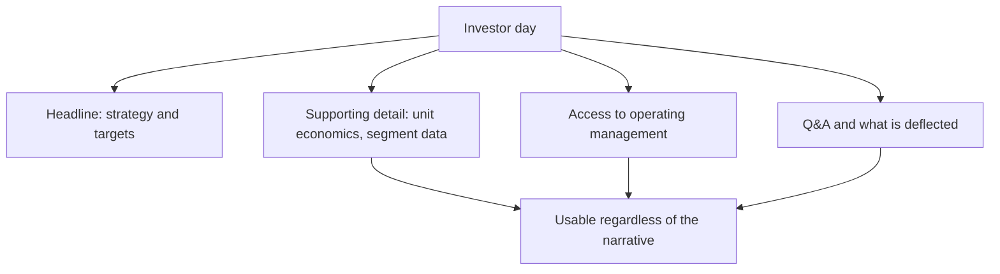

# The Analyst Day and Capital Markets Day

## The Problem / Why this matters
Companies periodically hold investor days where management presents strategy, targets and detailed business information over several hours. These events produce more disclosure than a year of quarterly calls, and they are also carefully staged marketing exercises. An analyst who attends without a plan absorbs the narrative; one who attends with specific questions extracts information that is not otherwise available and does not reappear.

## Core Idea
An investor day is the **highest-density disclosure event** in the calendar and simultaneously the most managed — so the value comes from preparation, from what is disclosed incidentally, and from access to operating executives below the CEO and CFO.

## Why it works this way
The company controls the agenda and the framing, so the headline messages are chosen. But the supporting detail — segment economics, unit metrics, cost structures, competitive positioning — is often disclosed for the first time in slides prepared to support the story, and that detail is usable independently of the story it was assembled to tell.

## Full technical content

### Preparing

- **Decide in advance what you need.** Two or three specific questions the model cannot resolve — a cost split, a capacity figure, a segment margin — are worth more than a general briefing.
- **Review the previous investor day's targets** and check delivery. **Asking about a target set three years ago and quietly dropped is the highest-value question available**, and few people prepare it.
- **Read peer investor days** for the metrics they disclose that this company does not.
- **Know the numbers cold**, so you can spot inconsistency in real time.

### What to extract

| Source | What it yields |
|---|---|
| **Slides** | New metrics, segment economics, unit-level data disclosed for the first time |
| **Operating executives** | Divisional heads speak more concretely than the CFO and are less rehearsed |
| **Q&A** | What is answered specifically versus deflected — the disclosure-quality signal |
| **Site or facility tours** | Physical evidence: utilisation, condition, activity levels |
| **Informal conversation** | Structural and industry context |
| **What is not covered** | A business given no airtime is usually the one not working |

**The omission signal is the most under-used.** An investor day agenda allocates time in proportion to what management wants discussed, so a division that receives five minutes out of six hours is being managed out of the conversation.

### The targets

Companies commonly announce multi-year targets at these events.

- **Record them precisely** — metric, level, and date.
- **Check what they assume** — market growth, share gain, margin expansion, and whether those assumptions are internally consistent.
- **Compare to history**: a company targeting 18% growth having delivered 7% for five years is asserting a discontinuity that requires a mechanism.
- **Check consistency with capital**: the ROIIC chapter's relationship — growth requires reinvestment, and a target implying growth the reinvestment plan cannot fund is not fundable.
- **Put the target on the monitorable list** with its date, so it can be checked later. **Companies rely on targets being forgotten**, and an analyst who tracks them systematically holds management accountable in a way that is genuinely valued by clients.

### The compliance boundary

The same rules as any management interaction, per the insider-trading chapter:
- Structural, historical and strategic questions are legitimate.
- **Current-period specifics before publication are not.**
- Information given to attendees must be publicly disclosed; **selective disclosure at an invitation-only event is a breach on the company's side**, and if something material and non-public is said, the correct response is to escalate rather than to trade or publish.
- Where an event is webcast and materials are filed, the disclosure is public and usable.

### Writing it up

- **Publish promptly**, since the value decays quickly.
- **Lead with what changed** — new disclosure, new targets, a shifted strategy — not with a summary of the agenda.
- **Separate the new information from the restated narrative.** Most of an investor day is restatement, and identifying the genuinely new items is the service.
- **State whether it changes your view**, and if not, say so plainly.
- **Record the targets** in the note so they are on the record for future accountability.

## Common mistakes
- Attending without **specific questions** and absorbing the narrative.
- Not checking **previous targets** against delivery.
- Missing the **omission signal** — the division given no airtime.
- Recording targets without checking whether they are **fundable**.
- Ignoring what was **deflected** in Q&A.
- Publishing a summary of the agenda rather than what changed.
- Failing to put announced targets on a **monitorable list** for later accountability.

## Interview angle
"You're going to a company's investor day. How do you prepare?" Two things above all: a short list of specific questions the model cannot resolve — a cost split, a segment margin, a capacity figure — and a review of the targets set at the previous investor day, checked against what was actually delivered, because asking about a three-year-old target that was quietly dropped is the highest-value question in the room and almost nobody prepares it. During the event, the value is in the supporting detail rather than the headline strategy: slides prepared to support a story frequently disclose unit economics and segment data for the first time, and that detail is usable regardless of the narrative it was assembled for. Access to divisional heads matters too, since they speak more concretely and are less rehearsed than the CFO. Add the omission signal — agenda time is allocated to what management wants discussed, so a business given five minutes out of six hours is the one not working. And when new targets are announced, record them precisely and check whether the growth is fundable from the stated reinvestment plan, then put them on a monitorable list, because companies rely on targets being forgotten.
