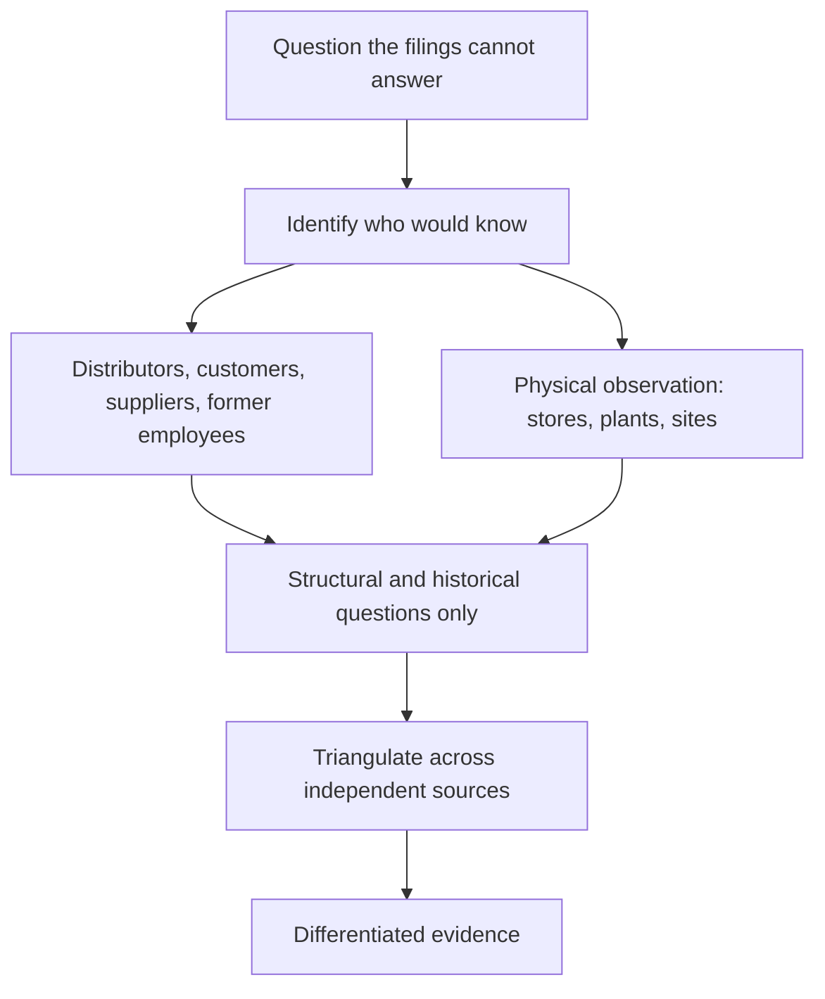

# Scuttlebutt and Primary Evidence

## The Problem / Why this matters
Every analyst has access to the same filings, the same transcripts and the same data terminals. Differentiation therefore has to come from evidence that is not in those sources — conversations with distributors, visits to stores and plants, discussions with former employees and industry participants. This work is unglamorous, time-consuming and legally bounded, and it is where the genuinely differentiated calls in these chapters' worked cases came from.

## Core Idea
Primary research produces **evidence nobody else has**, which is the only durable source of a differentiated view — and its value is highest where the published data is weakest.

## Why it works this way
Public information is priced quickly and, as the AI chapter notes, is being processed faster than ever. What cannot be processed is what has not been written down. A distributor's account of order patterns, a plant's visible activity level, a former employee's description of how a product actually performs — none of it appears in any filing, and all of it bears on the forecast.

## Full technical content

### The sources

| Source | What they know |
|---|---|
| **Distributors and dealers** | Order patterns, inventory, scheme intensity, relative brand pull |
| **Retailers** | Shelf space, off-take, consumer preference, price points |
| **Suppliers** | Order volumes, payment behaviour, capacity utilisation |
| **Customers** (B2B) | Product quality, pricing, switching considerations |
| **Former employees** | How the business actually works; structural and historical only |
| **Industry consultants and associations** | Market size, structure, technology trends |
| **Physical observation** | Store traffic, plant activity, construction progress, freight movement |

### The compliance boundary, restated

The insider-trading chapter's rules govern all of this:
- **Structural and historical questions are legitimate** — how the industry works, how distribution is organised, what changed over the last five years.
- **Current-period specifics about a covered company from its own employees, customers or suppliers are not.** A distributor's current-month sell-through for one company is close to the line; a company employee's account of the quarter to date is over it.
- **Former employees** should be asked about their period and about structure, not about current confidential information they may still hold.
- **Document what you asked and what you were told**, which is both the mosaic defence and good practice.

### Doing it well

**1. Start from a specific question.** "How is the company doing?" produces anecdote. "Has the trade scheme intensity in this category changed over the last two quarters, and for which brands?" produces evidence.

**2. Ask about the industry, not the company.** People speak more freely and more accurately about market conditions than about a specific company's performance, and industry answers are both more reliable and more clearly within bounds.

**3. Triangulate.** One distributor is an anecdote. Twelve distributors across regions, agreeing, is evidence. **State the sample size and its limitations in the note** — this is what separates credible primary work from a story.

**4. Seek disconfirming evidence.** Deliberately ask sources likely to contradict the thesis. The behavioural chapter's confirmation-bias warning applies most strongly here, because primary research is easy to steer.

**5. Ask about competitors too**, which gives relative information and is often more reliable than absolute claims.

**6. Record and date everything**, so the evidence can be revisited when the situation changes.

### Physical observation

Cheap, legal, and under-used:
- **Store visits** — shelf space allocation, stock availability, promotional intensity, price points, and how the brand is positioned relative to competitors.
- **Plant visits** — activity level, condition of equipment, inventory in the yard, whether expansion described in the annual report is actually under construction.
- **Site progress** for infrastructure and real estate, checkable against stated timelines.
- **Traffic and footfall** at retail and hospitality assets.

**A construction project described as "on schedule" that shows no activity on the ground is direct evidence**, and it is available to anyone willing to go and look.

### Where it matters most

- **Small and mid caps** with thin disclosure and no coverage, where public data is weakest.
- **Consumer businesses**, where the channel is observable.
- **Before a thesis-critical event** — a launch, a capacity commissioning, a demand inflection.
- **Testing a management claim** that cannot be verified from filings.
- **Negative theses**, where the evidentiary bar is higher, as the worked short case demonstrates.

### The limitations

- **Sample bias** — the sources willing to talk may not be representative.
- **Recall and exaggeration** in unstructured conversation.
- **Regional specificity** mistaken for national trends.
- **Cost and time**, which is why it must be directed at the questions that matter most rather than done generally.
- **It is evidence, not proof** — it should update a view, not replace the analysis.

## Common mistakes
- Asking **general** questions and collecting anecdote.
- Treating **one or two conversations** as evidence.
- Seeking only **confirming** sources.
- Crossing the line into **current-period specifics** about a covered company.
- Generalising **regional** findings nationally.
- Not stating **sample size and limitations** in the note.
- Never simply going to look at a store, plant or site.

## Interview angle
"How would you get an edge on a company everyone covers?" Say that public information is priced quickly, so the edge has to come from evidence that is not in the filings — and be concrete about how you would gather it. Start from a specific question the filings cannot answer, then identify who would know: distributors on order patterns and scheme intensity, retailers on shelf space and off-take, suppliers on order volumes, former employees on how the business actually works. Ask about industry conditions rather than about the company's current numbers, both because people answer more accurately and because it keeps you clearly inside the compliance boundary — current-period specifics from a covered company's own channel are over the line. Triangulate across enough independent sources that it is evidence rather than anecdote, and state the sample size and its limitations in the note, because that is what makes primary work credible rather than a story. And mention physical observation, which is cheap and legal and under-used: a capacity expansion described as on schedule that shows no activity on site is direct evidence available to anyone willing to go and look.
