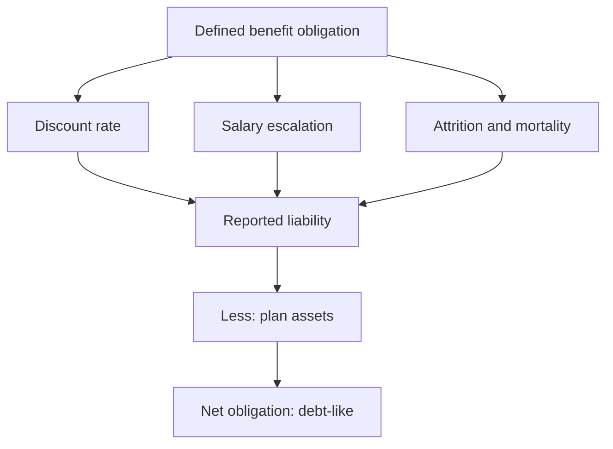

# Pension and Employee Benefit Obligations

## The Problem / Why this matters
Gratuity, provident fund and other post-employment obligations sit in a note most analysts skip, computed on actuarial assumptions the company selects. For labour-intensive businesses and older companies the obligation can be material relative to net worth, and it behaves like debt — a fixed future claim on cash. Two identical companies can report different liabilities purely from assumption choices that are disclosed and directly comparable.

## Core Idea
Post-employment obligations are **debt-like claims valued on disclosed assumptions** — so the liability should be assessed for adequacy, compared against peers on its assumptions, and considered in net debt where material.

## Why it works this way
A defined benefit obligation is the present value of future payments to employees. Its size depends on the discount rate, the assumed salary growth, attrition and mortality — all chosen by the company with actuarial advice. A higher discount rate or lower salary growth assumption reduces the reported liability without changing what will actually be paid.

## Full technical content

### What is disclosed

The employee benefits note discloses:
- **The defined benefit obligation** and its movement — service cost, interest cost, actuarial gains and losses, benefits paid.
- **Plan assets**, where funded, and their return.
- **The net liability or asset.**
- **The actuarial assumptions** — discount rate, salary escalation, attrition, mortality basis.
- **Sensitivity analysis** showing the effect of changes in the key assumptions.

**The sensitivity disclosure is the most useful item**, exactly as it is for goodwill impairment: it tells you how much the liability moves for a change in assumption, which is how you test whether the assumptions are aggressive.

### The assumption checks

| Assumption | Aggressive direction | How to check |
|---|---|---|
| **Discount rate** | Higher reduces the liability | Compare to the government bond yield of matching duration and to peers |
| **Salary escalation** | Lower reduces the liability | Compare to the company's own historical wage growth and to peers |
| **Attrition** | Higher attrition can reduce the liability where benefits vest with service | Compare to disclosed attrition rates |

**The discount rate versus salary escalation spread** is the quantity that matters most. A company assuming a wide spread — high discount rate, low salary growth — reports a materially smaller obligation than one assuming a narrow spread on the same workforce. Both are disclosed and directly comparable.

### Treating it in the analysis

- **Include the net obligation in net debt** where material. It is a fixed future claim on cash and behaves like debt for enterprise value purposes.
- **Check funded status.** An unfunded obligation must be met from future cash flow; a funded one has assets set against it, and the quality of those assets matters.
- **Watch actuarial gains and losses**, which flow through other comprehensive income under current standards rather than through profit — so a deteriorating obligation may not appear in reported earnings at all.
- **Model the cash contribution**, not the accounting charge, for cash flow purposes.

### Where it matters most

- **Labour-intensive businesses** — manufacturing, PSUs, older companies with long-tenured workforces.
- **Companies with declining employee bases**, where the obligation stays while the revenue supporting it falls.
- **PSUs**, where obligations can be large and where wage revisions are periodic and negotiated, producing step changes.
- **Acquisitions**, where an acquired entity's unfunded obligations are a real cost frequently underestimated in deal analysis.

### The Indian context

- **Gratuity** is statutory and accrues with service, so it grows with headcount and tenure.
- **Provident fund** contributions are largely defined contribution, but certain trust-managed schemes carry a defined benefit element with an interest-rate guarantee that is a genuine obligation.
- **Leave encashment** obligations accumulate and are disclosed similarly.
- **Wage revision cycles** in PSUs and some large manufacturers produce step changes in the obligation when settled, and the timing is usually known in advance.

## Common mistakes
- Skipping the employee benefits note entirely.
- Not comparing **discount rate and salary escalation** assumptions against peers.
- Ignoring the **sensitivity disclosure**, which tests assumption aggressiveness directly.
- Excluding a material net obligation from **net debt**.
- Missing that **actuarial losses** bypass reported profit through OCI.
- Modelling the accounting charge rather than the **cash contribution**.
- Overlooking obligations in **acquisition** analysis.

## Interview angle
"Does the pension note matter for an Indian industrial company?" Say yes where the workforce is large or long-tenured, and explain why: the defined benefit obligation is a fixed future claim on cash, so it belongs in net debt when material, and its size depends on assumptions the company selects — principally the discount rate and the salary escalation rate, both disclosed and directly comparable to peers. A company assuming a wide spread between them reports a materially smaller obligation on the same workforce, and the sensitivity disclosure in the note tells you exactly how much the liability moves per change in assumption, which is how you test whether the assumptions are aggressive. Add the point that catches people out: under current standards actuarial gains and losses go through other comprehensive income rather than profit, so an obligation deteriorating badly may not appear in reported earnings at all — you have to read the movement schedule. And for cash flow purposes, model the actual contribution rather than the accounting charge.
