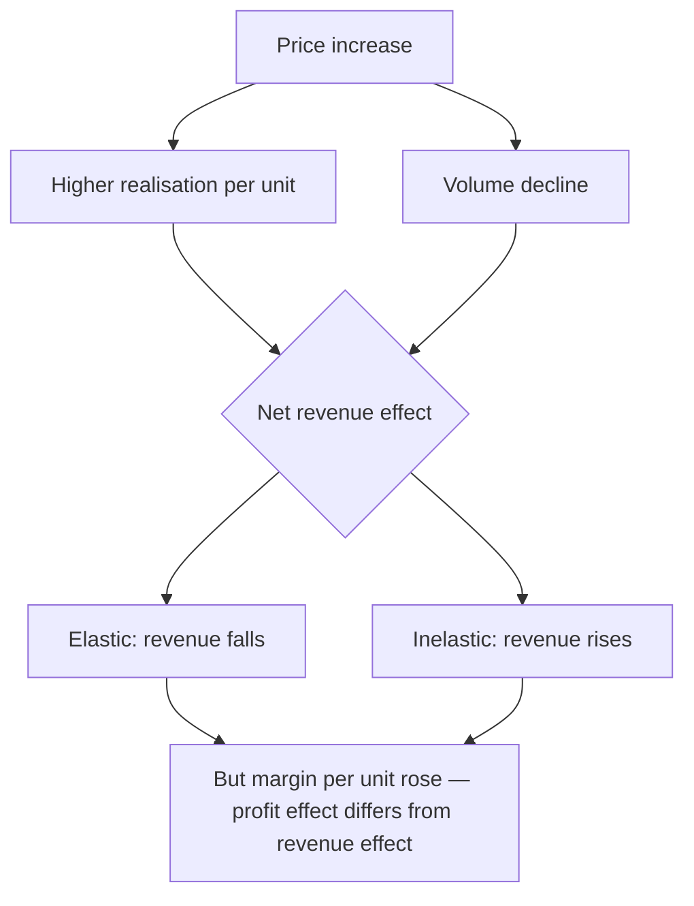

# Pricing Strategy and Elasticity

## The Problem / Why this matters
A price increase raises revenue per unit and reduces units sold. Whether the net effect is positive depends on elasticity, which is measurable from history for most consumer and industrial businesses and is almost never measured by analysts. Instead, price increases are modelled as pure revenue gains and price cuts as pure losses — both of which ignore the volume response that determines the outcome.

## Core Idea
Model price and volume as **linked, not independent** — a price change produces a volume response whose magnitude is estimable from the company's own history.

## Why it works this way
Demand curves slope downward. Where demand is elastic, a price increase loses more volume than it gains in realisation and revenue falls; where inelastic, revenue rises. The same logic runs in reverse for price cuts, which is why a promotional strategy can raise volumes and lower profit simultaneously.

## Full technical content

### Estimating elasticity from disclosure

Where a company discloses volume and value growth separately — as consumer companies commonly do — elasticity is directly estimable:

**Price change ≈ Value growth − Volume growth**

Then across several periods, relate the volume response to the price change. **The result is a rule you can apply forward:** "a 5% price increase in this category has historically cost 2% of volume, so revenue rises about 3%."

**The complications to handle:**
- **Mix** contaminates the calculation — premiumisation raises realisation without a price increase. Where mix data is available, separate it.
- **Competitive response** matters: an industry-wide increase produces a much smaller volume loss than a unilateral one, so classify each historical episode.
- **Category growth** must be netted out, since underlying growth masks the volume response.

### Profit versus revenue

The distinction that matters most and is routinely conflated:

A price increase raises margin per unit while losing volume. **Profit can rise even where revenue falls**, because the lost volume was the least profitable and the retained volume carries a higher margin. The operating leverage chapter's arithmetic applies in reverse — losing volume strands fixed costs, so the profit calculation must include that effect.

**The full computation:**
- New revenue = new price × new volume.
- New gross profit = (new price − variable cost) × new volume.
- New EBITDA = new gross profit − fixed costs (unchanged).

**Model all three**, because the revenue effect and the profit effect frequently point in opposite directions, and only the last one matters.

### Pricing strategy patterns

| Strategy | Where it works |
|---|---|
| **Premium pricing** | Strong brand, differentiated product, low elasticity |
| **Penetration pricing** | Building share in a growing category with scale economics ahead |
| **Price-pack architecture** | Smaller packs at accessible price points — the Indian consumer standard, and a way to raise per-unit realisation without a visible price increase |
| **Promotional intensity** | Short-term volume; erodes brand and trains consumers to wait |
| **Value engineering** | Reducing cost to hold price — the invisible margin lever |

**Price-pack architecture deserves emphasis in an Indian context.** Reducing grammage while holding the price point is a price increase that does not appear as one, and it is a standard tool in mass consumer categories. Analysts tracking only headline prices miss it entirely; the trace appears in realisation per kilogram or per litre where disclosed.

### Warning signs in pricing behaviour

- **Rising promotional intensity** to hold volume indicates weakening brand pull, and it appears as a gap between gross and net realisation or in higher trade spend.
- **Price cuts to defend share** signal a competitive problem, and in a fragmented industry they usually spread.
- **Volume growth with falling realisation** is buying share, which may be strategic or may be desperation — the disclosure and the trend distinguish them.
- **Down-trading** by consumers, which shows as volume holding with value falling, and is the classic signal of consumer stress.

### Industrial and B2B pricing

- **Contract structures** determine pass-through, per the input-cost chapter — formula-linked contracts pass through automatically, fixed-price contracts do not.
- **Elasticity is lower** where the product is a small share of the customer's cost and critical to their process.
- **Tender-based pricing** in commoditised segments compresses margins structurally.
- **Regulated pricing** removes the decision entirely, and the question becomes the regulator's, per the policy chapter.

## Common mistakes
- Modelling price and volume as **independent**.
- Not separating **mix** from genuine price change when estimating elasticity.
- Ignoring whether a historical price increase was **industry-wide or unilateral**.
- Confusing the **revenue** effect with the **profit** effect, which can point opposite ways.
- Missing **price-pack architecture** as an invisible price increase.
- Reading rising promotional intensity as marketing investment rather than as weakening brand pull.
- Ignoring the fixed-cost effect of lost volume.

## Interview angle
"The company is raising prices 6%. What happens to revenue?" Say it depends on elasticity and that you can estimate it from the company's own disclosure, since consumer companies report volume and value growth separately — the difference approximates the realisation change, and relating past volume responses to past price changes gives you a usable rule. Flag the two contaminants: mix, since premiumisation raises realisation without a price increase, and whether each historical increase was industry-wide or unilateral, because the volume loss is far smaller when everyone moves together. Then make the distinction that matters most — the revenue effect and the profit effect can point in opposite directions, because a price increase raises margin per unit while the lost volume was the least profitable, so you model revenue, gross profit and EBITDA separately and only the last one determines the answer. Add the Indian-specific point: much of the real pricing action happens through pack sizes rather than headline prices, so grammage reductions at constant price points are increases that only show up in realisation per kilogram.
