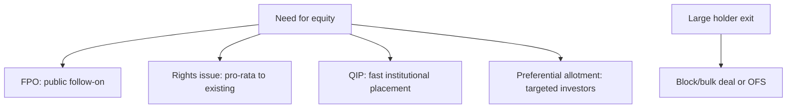

# Capital Raising: Follow-ons, Rights, QIPs & Block Deals

## The Problem / Why this matters
An IPO is a company's first equity raise, but listed companies raise equity again and again — to fund growth, cut debt, or let large holders exit. **Equity capital markets (ECM)** covers all these follow-on ways to issue or place equity: FPOs, rights issues, QIPs, preferential allotments, and block/bulk deals. Knowing each mechanism, when it's used, and its effect on existing shareholders is core to ECM, IB, and research roles.

## Core Idea
Beyond the IPO, listed firms raise or place equity through several routes, differing by **who can buy, how fast, and at what dilution**: broad public offers (FPO), pro-rata offers to existing holders (rights), fast institutional placements (QIP), targeted placements (preferential), and secondary sales of existing shares (blocks/OFS). Each balances speed, price, investor base, and dilution.

## Why it works this way
Different situations call for different tools: a company wanting a quick institutional raise uses a QIP (fast, no lengthy prospectus); one wanting to treat all shareholders fairly uses a rights issue; a large holder wanting to exit uses a block deal or OFS. The menu exists so issuers can optimize for speed, price, and the desired investor base.

## Full technical content

**Primary raises (new shares → company gets cash, dilution):**
| Route | Who buys | Speed | Notes |
|---|---|---|---|
| **FPO** | Public | Slow (prospectus) | A full follow-on public offer |
| **Rights issue** | Existing holders, pro-rata | Moderate | Usually at a discount; non-subscribers diluted; price → TERP |
| **QIP** | Qualified institutional buyers | **Fast** | India-specific; no lengthy prospectus; institutions only |
| **Preferential allotment** | Selected investors | Fast | Targeted (e.g., a strategic/PE investor); priced per SEBI formula |

**Secondary sales (existing shares → selling holder gets cash, no new capital, no dilution):**
| Route | What it is |
|---|---|
| **OFS (Offer for Sale)** | Promoters/large holders sell via an exchange mechanism |
| **Block deal** | A large negotiated trade (min size) in a special window at a pre-agreed price |
| **Bulk deal** | Large trades executed in the normal market (disclosed) |

**Key distinctions:**
- **Fresh issue vs secondary sale** — fresh issue raises capital for the company and dilutes; secondary sale just transfers existing shares (holder gets cash, no dilution).
- **Dilution** — new shares reduce existing holders' ownership % and EPS unless the capital earns above the cost of equity.
- **Pricing** — placements are usually at a small discount to market to attract buyers; rights at a larger discount; SEBI sets floor-price formulas for QIPs/preferential.
- **Signaling** — equity issuance can signal management thinks shares are fairly/over-valued (pecking-order); a raise to cut debt vs to fund high-return growth is read very differently.

**ECM's job.** Investment banks (ECM desks) advise on the route, timing, size, and pricing, and place the shares with investors — balancing the issuer's proceeds against a successful, well-received deal.

## Worked examples

**Example 1 — QIP for speed.** A company needs ₹1,500 cr quickly to fund expansion. Rather than a months-long FPO, it does a **QIP**: places new shares with institutions at a ~3% discount to the market over a couple of days. Fast, institutional, and dilutive — the company gets the cash without a full prospectus process.

**Example 2 — rights issue to deleverage.** A leveraged firm does a **1:2 rights issue** at a 30% discount to cut debt. Existing holders can maintain their stake by subscribing; those who don't are diluted but can sell their rights. The stock re-rates to TERP; the balance sheet strengthens.

**Example 3 — block deal exit (no dilution).** A PE fund holding 8% wants to exit. It sells the entire stake in a single **block deal** to institutions at a small discount in the block window. The *fund* receives the cash; the company issues no new shares, so there's **no dilution** — just a change of ownership. (Contrast with a QIP, which is new shares and dilutive.)

## How it is tested in interviews
- **"Ways a listed company can raise equity?"** — FPO, rights issue, QIP, preferential allotment (primary/dilutive); plus OFS/block deals for existing holders to sell (secondary, non-dilutive).
- **"What is a QIP and why use it?"** — "A Qualified Institutional Placement — a fast raise from institutions without a full prospectus; used when a company wants speed and an institutional base."
- **"Rights issue vs QIP?"** — "Rights is pro-rata to all existing holders (fair, at a discount, non-subscribers diluted); QIP is a quick placement to institutions only."
- **"Block deal vs QIP — is it dilutive?"** — "A block deal is a secondary sale of existing shares — the seller gets the cash, no dilution. A QIP is new shares — the company gets the cash, dilutive."
- **"Why might a raise move the stock down?"** — "Dilution, plus the signal that management may think shares are fully valued; the use of proceeds (debt reduction vs high-return growth) matters."

## Traps & common mistakes
- Confusing **primary** (new shares, company cash, dilution) with **secondary** (existing shares, holder cash, no dilution).
- Thinking a **block deal/OFS** raises capital for the company — it doesn't.
- Forgetting **rights issues dilute** non-subscribers and reset the price to TERP.
- Ignoring the **signaling** and use-of-proceeds read of a raise.

## First-principles recap
- Listed firms raise equity via FPO, rights, QIP, preferential (primary, dilutive) and sell via OFS/blocks (secondary, non-dilutive).
- **QIP** = fast institutional raise; **rights** = pro-rata to existing holders at a discount.
- Fresh issue → company cash + dilution; secondary sale → holder cash, no dilution.
- Placements price at a discount; SEBI sets floors.
- Read every raise for **dilution, signaling, and use of proceeds**.

## Quick-reference
| Route | Type | Cash to | Dilution |
|---|---|---|---|
| FPO | Primary | Company | Yes |
| Rights | Primary, pro-rata | Company | Yes (non-subscribers) |
| QIP | Primary, institutions | Company | Yes |
| Preferential | Primary, targeted | Company | Yes |
| OFS / block | Secondary | Selling holder | No |
