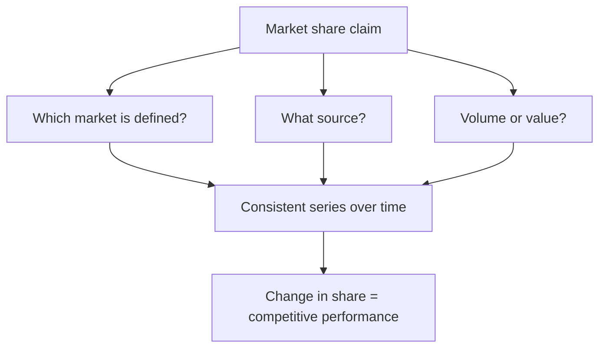

# Market Share Analysis and Competitive Tracking

## The Problem / Why this matters
Market share is the clearest available measure of competitive performance, because it strips out the industry conditions that affect everyone. A company growing 12% in a market growing 18% is losing, however good the growth looks in isolation. Yet share is frequently quoted from company presentations without checking the definition, the source, or the market being measured.

## Core Idea
Share must be measured against a **defined market with a stated source**, and the analytical content is in the *change* — because level tells you position and change tells you performance.

## Why it works this way
Every company defines its market to look favourable. A company with 8% of a broad category and 34% of a narrow sub-segment will quote the latter. Neither is wrong, but only a consistently defined series over time reveals whether the competitive position is improving or deteriorating.

## Full technical content

### Establishing a defensible measure

| Question | Why |
|---|---|
| **Which market?** | Broad category, sub-segment, price tier, geography — all give different answers |
| **Volume or value share?** | A premium player has higher value share than volume share; the gap is informative |
| **What source?** | Company estimate, industry association, retail audit, or computed from peers' disclosure |
| **Consistently defined over time?** | A redefinition that coincides with an improvement is a warning |

**The most reliable method for listed markets is computing share yourself** from the disclosed revenues of listed participants plus an estimate for the unlisted remainder. It is consistent by construction, and it does not depend on anyone's chosen definition.

**The value-versus-volume gap is genuinely informative:** a company with 12% volume share and 19% value share commands a price premium, and tracking whether that gap widens or narrows measures brand strength directly.

### Reading share movements

- **Share gain with stable pricing** is genuine competitive strength.
- **Share gain with falling realisation** is buying share, per the pricing chapter — assess whether it is a strategic land-grab with scale economics ahead or a defensive reaction.
- **Share loss with rising realisation** may be deliberate — exiting unprofitable segments improves returns while losing share, and this is frequently good management misread as decline.
- **Share stable in a growing market** is adequate; share stable in a shrinking one may be a structurally declining business.

**The critical follow-up:** share gains against whom? Taking share from a weak unlisted competitor is easier and less informative than taking it from a strong listed one.

### Sources beyond company claims

- **Peer disclosures** — sum the listed players' revenue for the same defined market.
- **Industry association data**, which is often the most objective and is published periodically.
- **Regulatory data** — telecom subscriber numbers, insurance premium data, mutual fund AUM, vehicle registrations. **Where a regulator publishes participant-level data, share is directly observable** and is among the cleanest competitive data available in any market.
- **Retail audit data**, where accessible, for consumer categories.
- **Import and export data** by product category.
- **Primary work** — distributor and retailer estimates of relative off-take, per the scuttlebutt chapter.

### Building a competitive tracker

The systematic version, which pays for itself over time:
1. **Define the market** and hold the definition constant.
2. **Track each participant's** revenue, volume, capacity, pricing and capex.
3. **Compute share** each period on the consistent basis.
4. **Track capacity share** alongside revenue share — capacity share leads revenue share, since it determines who can supply future growth.
5. **Track relative pricing**, which shows who is competing on price.
6. **Note entries and exits**, including unlisted and imported competition.

**Capacity share as a leading indicator is the most valuable element** and connects to the capex chapter: a competitor adding capacity is announcing an intention to take share, and it is public two to four years before it happens.

### Where share analysis misleads

- **Redefinition** of the market, particularly when it coincides with an improvement.
- **Ignoring the unlisted and unorganised segment**, which in many Indian categories is a large share and shifts between formal and informal players — a formalisation trend can produce share gains for every listed player simultaneously, which is real but is not competitive performance.
- **Share of a shrinking market** presented as success.
- **Share gains in low-margin segments** that dilute returns.
- **Confusing shipments with sell-out**, per the distribution chapter's primary-versus-secondary point.

That penultimate point matters: **share is not the objective, returns are.** A company gaining share while destroying returns on incremental capital is not winning, and the ROIIC chapter's measure is the check.

## Common mistakes
- Quoting a company's own **share claim** without checking the market definition and source.
- Comparing share figures from **different sources or definitions**.
- Missing a **redefinition** coinciding with an improvement.
- Ignoring the **value-versus-volume** gap.
- Reading share loss as failure where the company is **exiting unprofitable segments**.
- Attributing formalisation gains to **competitive** performance.
- Tracking revenue share without **capacity share**, which leads it.
- Treating share as the objective rather than returns.

## Interview angle
"The company says it gained 180bp of market share. How do you verify it?" Ask which market, from what source, and on volume or value — because every company defines the market to look favourable, and a share of a narrow sub-segment is a different claim from a share of the category. Say that the most defensible method is computing it yourself from the disclosed revenues of the listed participants plus an estimate for the unlisted remainder, since that is consistent by construction, and that regulatory data gives directly observable participant-level share in sectors like telecom, insurance and autos. Then interrogate the quality of the gain: share gained with stable pricing is genuine strength, share gained with falling realisation is bought and may not persist, and share taken from a weak unlisted competitor is less informative than share taken from a strong listed one. Add the leading indicator most people miss — capacity share leads revenue share, and a competitor's announced capacity addition tells you two to four years in advance who intends to take share. And close with the check that keeps it honest: share is not the objective, returns are, so a company gaining share while its incremental returns fall below the cost of capital is not winning.
