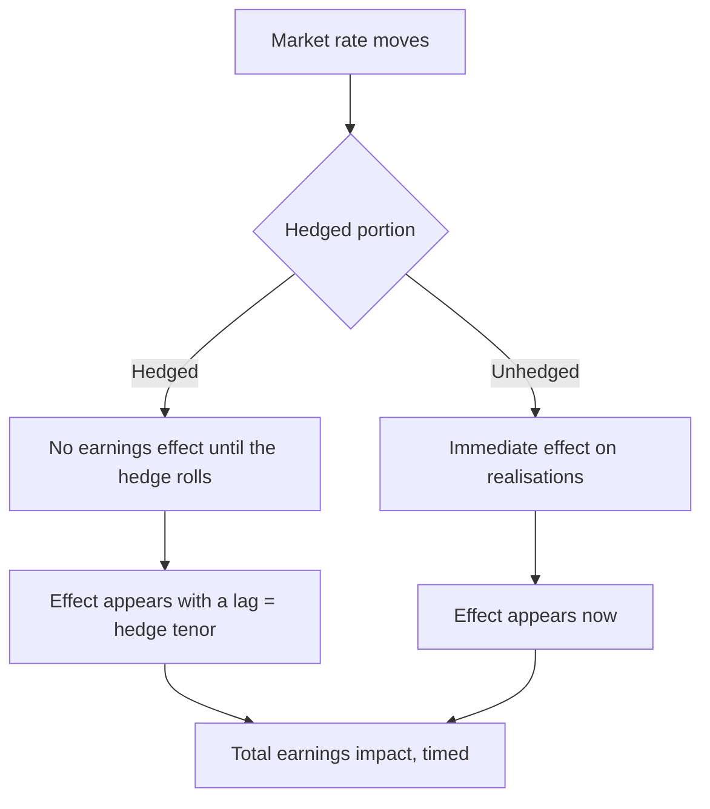

# Hedging Disclosures and Derivative Exposure

## The Problem / Why this matters
Companies hedge currency, commodity and interest-rate exposure, and the disclosures describing those hedges determine when a market move reaches reported earnings. Analysts who ignore them consistently mistime the earnings effect of a currency or commodity move. More seriously, companies occasionally take derivative positions exceeding their underlying exposure — which converts a risk-management function into a speculative one, and has produced large losses.

## Core Idea
Read the derivatives note to establish **what is hedged, how much, for how long, and with what instruments** — because the cover ratio and tenor determine timing, and the instrument type determines whether this is hedging or speculation.

## Why it works this way
A hedge fixes a price in advance. Until the hedge expires, the company realises the hedged rate rather than the market rate, so a favourable market move does not reach earnings and an unfavourable one does not either. The lag equals the hedge tenor, and the proportion affected equals one minus the cover ratio.

## Full technical content

### What the disclosures contain

The financial instruments note discloses:
- **Outstanding derivative contracts** by type and notional amount.
- **Maturity profile** of those contracts.
- **Hedged versus unhedged exposure**, often as a table by currency or commodity.
- **Hedge accounting designation** — cash flow hedge, fair value hedge, or not designated.
- **Sensitivity analysis** for unhedged exposures.
- **Mark-to-market position** on outstanding contracts.

### The four questions

**1. Cover ratio.** Hedged exposure as a proportion of expected exposure. This determines what fraction of a market move reaches earnings immediately.

**2. Tenor.** How far forward the hedges extend. **A company hedged twelve months out does not see today's spot rate in its realisations for a year** — the point the currency chapter makes, and the single most common source of mistimed forecasts.

**3. Average hedge rate versus spot.** Whether the company is currently realising better or worse than the market. A favourable hedge book is a temporary earnings benefit that expires, and modelling it as permanent overstates forward earnings.

**4. Instrument type.** Forwards and vanilla options are standard risk management. **Structured products, leveraged structures, or notionals exceeding the underlying exposure are a different matter entirely** — they are positions taken, not risks covered, and they have produced losses far exceeding the exposure they purported to hedge.

### Hedge accounting and where the effects appear

- **Designated cash flow hedges** — effective portion goes to other comprehensive income and is recycled to profit when the hedged transaction occurs, so reported earnings are smoother.
- **Not designated** — mark-to-market moves go straight through profit, producing volatility unrelated to operations.
- **The analytical consequence:** a company without hedge accounting designation shows earnings volatility that is an accounting artefact of its hedging, and normalising for it is appropriate — but say so.

**Check the split between realised and unrealised** derivative gains and losses. Unrealised marks reverse; realised ones do not.

### The red flags

- **Notional exceeding underlying exposure** — the position is larger than the risk, which means it is a bet.
- **Structured or exotic instruments** rather than plain forwards and vanilla options.
- **Derivative losses in a period when the underlying exposure moved favourably**, which indicates the hedge was not matched to the exposure.
- **Frequent changes in hedging policy**, suggesting the policy is being set opportunistically rather than by rule.
- **A stated policy the company does not follow**, which is checkable against the disclosed positions.
- **Hedging in currencies or commodities the company has no operating exposure to.**

**Where any of these appear, treat it as a governance and competence question**, not merely an accounting one — a manufacturing company running a speculative derivative book is telling you something about how it is managed.

### Building it into the model

1. **Establish the cover ratio and tenor** for each material exposure.
2. **Apply the market move only to the unhedged portion** for the current period.
3. **Model the hedge roll** — when existing hedges expire and new ones are placed at prevailing rates, the benefit or cost of a favourable book disappears.
4. **Separate realised from unrealised** effects.
5. **State the assumption** in the note, since it drives the timing of the earnings effect and readers with a different rate view need to adjust it.

## Common mistakes
- Modelling an **immediate** earnings effect from a currency or commodity move, ignoring hedge tenor.
- Assuming a favourable **average hedge rate** persists after the book rolls.
- Ignoring the distinction between **realised and unrealised** derivative results.
- Treating hedging-driven earnings volatility as **operational**.
- Missing **notional exceeding underlying exposure** as a speculation flag.
- Overlooking **structured products** in the notes.
- Not checking whether the company follows its own **stated policy**.

## Interview angle
"The rupee moved 5% this quarter. When does that show up in earnings?" Answer with the hedging disclosure: the cover ratio tells you what proportion of the exposure is already fixed and therefore unaffected, and the tenor tells you the lag — a company hedged twelve months forward will not see today's spot rate in its realisations for a year, which is why modelling an immediate effect consistently mistimes the forecast. Add the average hedge rate against spot, because a favourable hedge book is a temporary benefit that disappears when the contracts roll at prevailing rates, and treating it as permanent overstates forward earnings. Then flag what you check beyond timing: whether the instruments are plain forwards and vanilla options or something structured, and whether the notional exceeds the underlying exposure — because a position larger than the risk it purports to cover is a bet rather than a hedge, and a manufacturing company running a speculative derivative book is a governance and competence signal, not just an accounting one.
