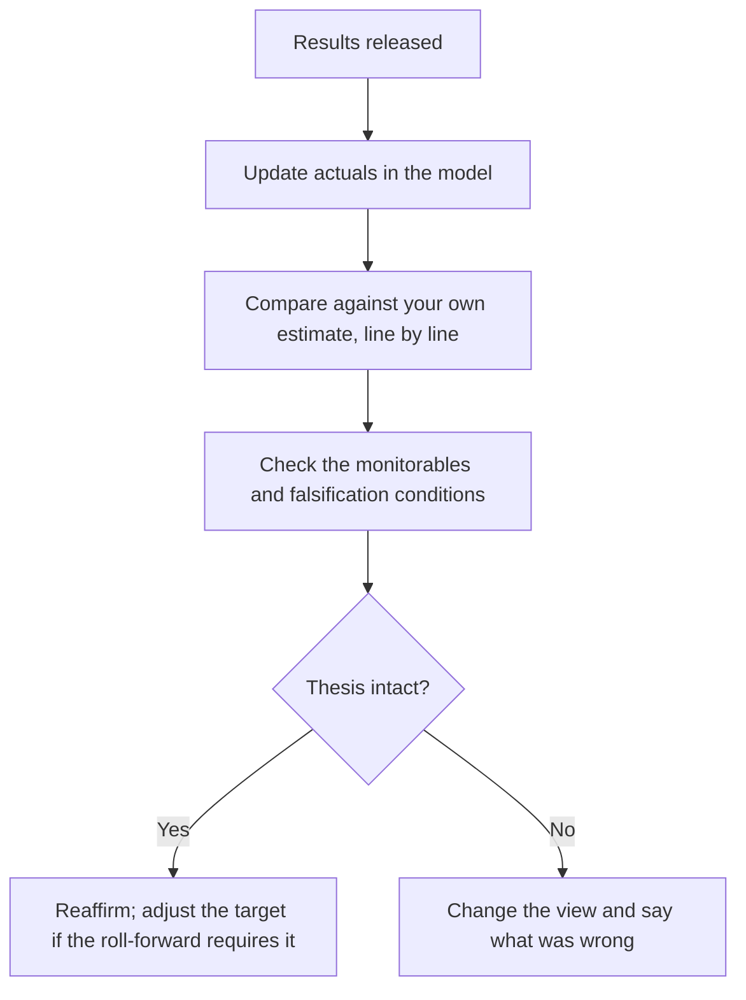

# Building the Quarterly Model Update

## The Problem / Why this matters
Results season compresses a quarter's analytical work into a few days across an entire coverage list. The temptation is to update the numbers and publish, which produces a note that reports what happened rather than what it means. A disciplined update routine handles the mechanics quickly and reserves the time for the part that carries value — whether the thesis is intact.

## Core Idea
A quarterly update is a **thesis check, not a data-entry exercise**. The numbers are the input; the output is a statement about whether the view holds.

## Why it works this way
Clients can read the results release themselves. What they cannot do is determine whether a 40bp margin miss is noise, a timing effect, or the first evidence that the thesis is wrong. That determination requires having stated in advance what would matter — which the preview chapter's falsification discipline provides.

## Full technical content

### The sequence

1. **Enter the actuals** — P&L, balance sheet and cash flow, not just the P&L. Most quality signals sit in the other two.
2. **Compare against your own estimate**, line by line, and record where you were wrong and why. **This is the input to the guidance-credibility and post-mortem records**, and it takes minutes if done every quarter and is impossible to reconstruct later.
3. **Build the margin bridge** for the quarter, per that chapter, so the change is decomposed rather than described.
4. **Check the balance-sheet monitorables** — inventory days, receivable days, debt, contingent liabilities, related-party balances.
5. **Read the transcript in full**, not a summary.
6. **Check the falsification conditions** stated in the initiation and the preview.
7. **Update the forecast** where the evidence requires it, distinguishing a genuine revision from noise.
8. **Recompute the target** and the risk-reward at the current price.
9. **Decide** — reaffirm, adjust, or change the rating.
10. **Publish promptly**, leading with the conclusion.

### What to check beyond the headline

| Item | Why |
|---|---|
| **Cash flow versus profit** | The integrity check; quarterly is noisy but the trend matters |
| **Working capital days** | Where deterioration appears first |
| **Segment detail** | Whether the aggregate conceals divergence |
| **Other income composition** | How much of PBT was non-operating |
| **Exceptional items** | And whether "exceptional" recurs |
| **Debt movement** | Against the stated plan |
| **Any change in disclosure** | A metric dropped or a segment aggregated, per the disclosure chapter |

**The disclosure-change check is the cheapest early warning in the routine** and takes seconds: compare this quarter's release to last quarter's and note anything that has stopped being reported.

### Distinguishing noise from signal

The judgement the whole exercise exists to support:
- **One quarter is rarely decisive.** Seasonality, timing and one-offs dominate short-period comparisons.
- **A trend across three quarters is signal.**
- **A falsification condition being met is decisive by construction** — which is why they are stated in advance.
- **The question to ask:** does this change my forecast for the year after next? Most quarterly variance does not, and saying so plainly is a service.

### Efficiency during the season

- **Standardise the model structure** across coverage so updating is mechanical.
- **Prepare previews in advance**, which front-loads the thinking, per the preview chapter.
- **Prioritise** — the largest positions and the most contentious calls first.
- **Publish a short note fast** and a fuller one later where warranted; speed matters on the day.
- **Do not skip the transcript** to save time. It is where the disclosure-quality and management signals are, and it is the part that cannot be automated.

## Common mistakes
- Updating the **P&L only**, ignoring the balance sheet and cash flow.
- Not comparing against your **own estimate**, losing the calibration record.
- Describing the margin change rather than **decomposing** it.
- Reading a **summary** instead of the transcript.
- Treating one quarter's variance as a **trend**.
- Not checking the **pre-stated falsification conditions**.
- Missing a **dropped metric** or aggregated segment.
- Publishing a summary of the results rather than a view.

## Interview angle
"Walk me through how you handle a results day." Describe a routine that separates mechanics from judgement: enter the actuals across all three statements rather than just the P&L, since the balance sheet and cash flow carry most of the quality signals; compare line by line against your own estimate and record where you were wrong, because that calibration record is impossible to reconstruct later; build the margin bridge so the change is decomposed rather than described; and read the full transcript rather than a summary, since what was deflected and what stopped being disclosed are signals a summary loses. Then the part that matters: check the falsification conditions you stated in advance, because that is what distinguishes a thesis break from ordinary quarterly noise. Add the test that keeps updates honest — does this change my forecast for the year after next? Most quarterly variance does not, and saying so plainly is more useful to a client than manufacturing significance.
