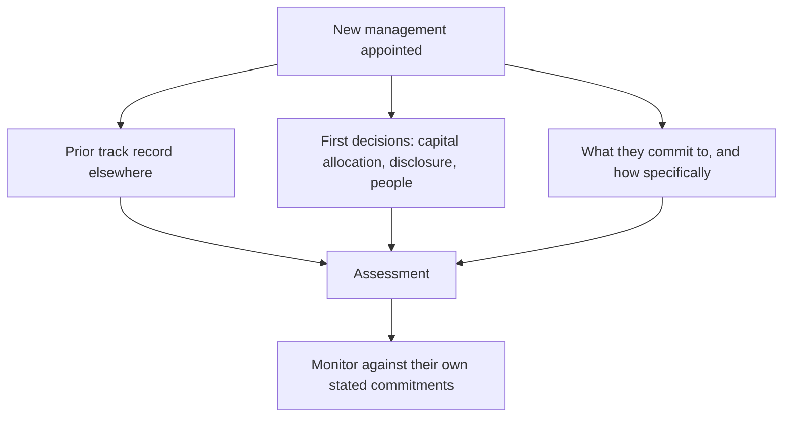

# Evaluating a New Management Team

## The Problem / Why this matters
A change of CEO or CFO is one of the more consequential events in a company's life and one of the hardest to assess, because the new team has no track record at this company and every incentive to present optimism. Yet the assessment must be made quickly — the market reprices on the announcement, and an analyst who waits two years for evidence has missed the decision point entirely.

## Core Idea
Assess a new team on their **prior record, their first capital allocation decisions, and the specificity of what they commit to** — because those are available immediately, while results are not.

## Why it works this way
Managers behave consistently across companies. What someone did at their previous employer — how they allocated capital, whether they delivered on targets, how they handled bad news — is the best available predictor of what they will do here, and it is fully public.

## Full technical content

### Assessing the prior record

Fully researchable from public sources:
- **What happened to the businesses they ran** — growth, returns on capital, and specifically returns on incremental capital during their tenure.
- **Whether they delivered on targets** set at the previous company, using the guidance-credibility method.
- **How they handled a downturn or a bad quarter** — disclosed promptly and explained, or minimised.
- **What they did with capital** — acquisitions and their outcomes, capex and its returns, distributions.
- **Whether they left voluntarily**, and what the previous employer said.
- **Their functional background**, which shapes what they optimise: a finance-trained CEO typically focuses on returns and capital discipline, an operations-trained one on cost and execution, a sales-trained one on growth. **None is better in general; the question is fit with what this company needs now.**

### The first hundred days

The early decisions are informative because they reveal priorities before results can:

| Decision | What it signals |
|---|---|
| **Impairments and provisions taken early** | Clearing the deck — read as information about the past, per the goodwill chapter |
| **Disclosure changes** | More disclosure signals confidence; less is a warning |
| **Capital allocation shifts** | Exiting a loss-making business, halting a questionable project |
| **Senior appointments** | Bringing former colleagues indicates a plan; wholesale replacement indicates a problem found |
| **Strategy articulation** | Specific and measurable, or aspirational |
| **Personal share purchase** | A costly, undiversifiable commitment — the strongest available signal |

**A big bath in the first year is expected and should be discounted appropriately.** It lowers the base for future comparison and attributes the loss to the predecessor, so subsequent improvement is partly arithmetic.

### The specificity test

The single most useful early assessment: **how specific are the commitments?**

- **Specific and dated** — "we will exit this segment by March, take the resulting charge in the second quarter, and reach 18% RoCE by FY29" creates accountability and can be checked.
- **Aspirational** — "we will drive sustainable profitable growth" commits to nothing and can never be shown to have failed.

**Record every specific commitment with its date**, and check them. A team that makes specific commitments and meets them establishes credibility quickly; one that makes them and misses them has told you something equally useful. The guidance chapter's method applies from the first quarter.

### Promoter and family transitions

The Indian-specific case, and often the more consequential:
- **Succession within a family** raises questions of competence and of whether other family members accept the outcome. **Family disputes have destroyed substantial value** in Indian listed companies, and the risk is highest where succession is unclear.
- **Professional management under a promoter** — the question is how much authority the CEO actually has, and whether the promoter defers on operational matters.
- **A promoter stepping back** while retaining control is a partial transition, and the analyst should establish who decides what.
- **Watch board changes** accompanying the transition, per the boards chapter, since a reconstituted board signals the new balance of power.

### What to do in the note

- **State the assessment explicitly** rather than describing the change.
- **Give the prior-record evidence**, which is the defensible part.
- **List the commitments made** with dates, so the note becomes the accountability record.
- **Set the monitorables** — what you will watch over the next four quarters.
- **Adjust the view where warranted**, and be willing to say the change is a genuine positive or negative rather than hedging.

**A management change is one of the few events where an analyst can form a differentiated view quickly**, because most of the market reacts to the announcement rather than researching the individual's actual record. That research takes a few hours and is available to anyone.

## Common mistakes
- Waiting for **results** to assess a new team when the prior record is available now.
- Ignoring **returns on incremental capital** during their previous tenure.
- Treating a first-year **big bath** as a fresh problem rather than as base-resetting.
- Accepting **aspirational** strategy language as a commitment.
- Not recording **specific commitments** with dates for later accountability.
- Overlooking who **actually decides** where a promoter remains involved.
- Missing **board changes** accompanying the transition.

## Interview angle
"A company you cover just appointed a new CEO. How do you assess them?" Say the evidence is available immediately even though results are not: research what happened at the businesses they previously ran — growth, returns on incremental capital during their tenure, whether targets set there were met, and how they handled a bad quarter, which tells you whether they disclose promptly or minimise. Add their functional background, since it shapes what they optimise, and the question is fit with what this company needs rather than which background is better. Then watch the first hundred days: impairments taken early are base-resetting and should be discounted, disclosure changes signal confidence or its absence, and a personal share purchase is a costly undiversifiable commitment and the strongest single signal available. Above all apply the specificity test — record every commitment they make with its date, because a dated, measurable target creates accountability while "sustainable profitable growth" commits to nothing. And note why this matters commercially: most of the market reacts to the announcement rather than researching the individual's actual record, so a few hours of public research produces a differentiated view.
