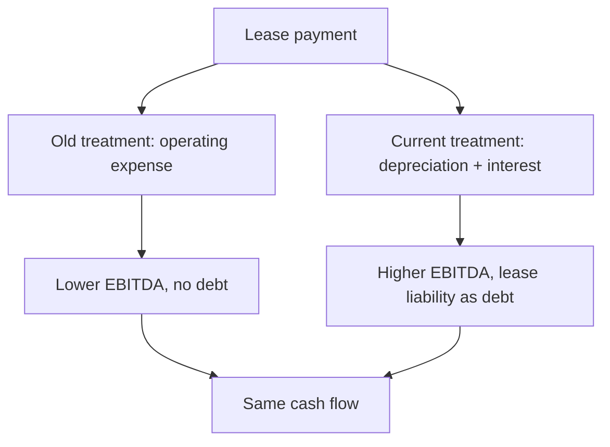

# Leases and Their Effect on Comparability

## The Problem / Why this matters
Whether a company owns or leases its assets changes almost every reported metric — EBITDA, debt, returns on capital — without changing the underlying economics of the business. Current accounting brings most leases onto the balance sheet, which improved comparability substantially, but differences remain, and the transition broke historical series in ways that still affect any multi-year analysis.

## Core Idea
Two companies with identical operations can report very different EBITDA and leverage depending on their lease-versus-own mix — so the comparison requires either capitalising consistently or using metrics unaffected by the choice.

## Why it works this way
An operating lease payment used to sit entirely in operating costs, reducing EBITDA and leaving no debt on the balance sheet. Under current standards the lease creates a right-of-use asset and a lease liability, and the payment splits into depreciation and interest — both below EBITDA. So the same cash payment moves from above EBITDA to below it, raising reported EBITDA and adding reported debt.

## Full technical content

### What changed and what it affects

| Metric | Effect of capitalising leases |
|---|---|
| **EBITDA** | Rises — the rent expense moves below the line |
| **EBIT** | Roughly similar, since depreciation replaces rent |
| **Net debt** | Rises by the lease liability |
| **EV/EBITDA** | Both numerator and denominator rise — the net effect depends on the multiple |
| **Capital employed** | Rises by the right-of-use asset |
| **RoCE** | Generally falls, since capital employed rises |
| **Interest coverage** | Falls, since interest rises |
| **Operating cash flow** | Rises — the principal portion moves to financing |

**That last point matters for the cash-versus-profit check:** capitalising leases increases reported operating cash flow without any economic change, so a company's CFO improvement across the transition year is partly an accounting artefact. The restatement chapter's discipline applies — the series is not comparable across the break.

### Where it matters most

- **Retail** — store leases are the primary asset, and lease-heavy retailers saw the largest changes.
- **Aviation** — aircraft leases are enormous, and lease-versus-own decisions vary widely between carriers.
- **Hotels** — managed, leased and owned models produce very different balance sheets for identical operations.
- **Telecom** — tower and fibre arrangements.
- **Logistics** — warehouses and fleet.

**In these sectors, comparing EBITDA multiples across companies with different ownership models without adjustment is meaningless**, and it is a common error.

### The remaining differences

Even under current standards:
- **Short-term and low-value leases** may be excluded, and where material this creates a gap.
- **Discount rate** used to compute the liability is an estimate, and a higher rate produces a smaller liability.
- **Lease term assumptions** — whether renewal options are assumed to be exercised — materially affect the liability and are judgemental.
- **Variable lease payments** based on revenue, common in retail, may be excluded from the liability while representing a real obligation.

**Revenue-linked rent in retail is worth specific attention**: it is economically a variable cost that provides downside protection, so a retailer on turnover rent has lower operating leverage than one on fixed rent — a genuine business difference that the accounting partly obscures.

### Making comparisons work

**Option 1 — Use metrics unaffected by the choice.** EBIT, net income, and free cash flow after all lease payments treat leasing and owning more consistently than EBITDA does.

**Option 2 — Capitalise consistently.** Where working with pre-transition history or with markets on different standards, capitalise operating leases at a consistent multiple of annual rent and adjust EBITDA and debt accordingly, stating the method.

**Option 3 — Compare lease-adjusted leverage.** Include lease liabilities in net debt for every company in the comparison set, which most data providers now do — but verify rather than assume.

### The economic question underneath

Beyond comparability, the lease-versus-own decision is a real one worth assessing:
- **Leasing preserves capital** and provides flexibility to exit — valuable in uncertain formats and locations.
- **Owning captures property appreciation** and avoids renewal risk, which in prime retail locations can be substantial.
- **Renewal risk is the leasing cost that appears nowhere** in the financials: a successful store's lease renewal can be repriced sharply upward by a landlord capturing the value the retailer created.
- **The right answer is business-specific**, and a company's stated rationale is worth examining.

## Common mistakes
- Comparing **EBITDA multiples** across companies with different lease-versus-own models.
- Computing growth rates **across the accounting transition** without restating.
- Reading the CFO improvement at transition as an **operational** gain.
- Ignoring **lease term and discount rate** assumptions, which are judgemental.
- Missing **variable lease payments** excluded from the liability.
- Overlooking that **turnover-linked rent** lowers operating leverage — a real business difference.
- Excluding lease liabilities from net debt in some comparison companies and not others.

## Interview angle
"Why can EBITDA mislead when comparing a retailer that owns its stores with one that leases them?" Explain the mechanics: under current standards a lease creates a right-of-use asset and a liability, and the rent payment splits into depreciation and interest, both below EBITDA — so the leasing company's EBITDA is higher and its reported debt is higher, for identical economics. That means EV/EBITDA moves both numerator and denominator, RoCE falls because capital employed rises, and operating cash flow rises because the principal portion sits in financing. Say how you would fix it: either use metrics less affected by the choice, such as EBIT or free cash flow after all lease payments, or capitalise consistently across the comparison set and state the method. Add the detail that shows real understanding — turnover-linked rent, common in Indian retail, is economically a variable cost that lowers operating leverage and provides downside protection, which is a genuine business difference the accounting partly obscures, and the renewal risk on a successful store's lease is a real cost that appears nowhere in the financials.
