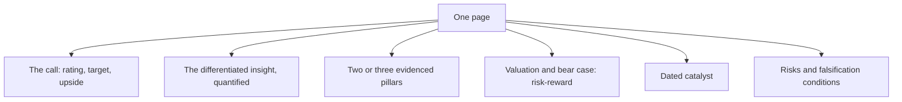

# Writing the Investment Thesis in One Page

## The Problem / Why this matters
A full initiation note runs to dozens of pages, and almost nobody reads all of it. The page that gets read is the first one, and increasingly the only artefact that circulates is a single-page summary. Compressing a thesis to one page is not a formatting exercise — it forces the analyst to determine what the argument actually is, and an argument that cannot survive the compression usually was not one.

## Core Idea
A one-page thesis contains **the claim, the evidence, the valuation, the catalyst, the risk and what would prove it wrong** — and nothing else. Everything removed in the compression was supporting material, not argument.

## Why it works this way
A reader deciding whether to act needs to know what you think, why, what it is worth, when the market will agree, what could go wrong, and how you will know if you are wrong. Those six items are the decision. Everything else — the sector history, the model detail, the methodology — supports them and belongs behind them.

## Full technical content

### The structure

**Line 1 — The call.** Rating, target price, current price, upside, and the time horizon. No preamble.

**Paragraph 1 — The differentiated insight.** One or two sentences stating what you believe that consensus does not, quantified against it. *"We forecast FY28 EBITDA 22% above consensus because the market is applying peak-cycle credit costs to a book that has already de-risked."* If you cannot write this sentence, you do not have a differentiated view — and the honest response is to say the stock is attractive on valuation with an in-line view, which is a legitimate position.

**Paragraph 2 — The evidence.** Two or three pillars, each one sentence, each with a specific fact. Not assertions.

**Paragraph 3 — Valuation.** Method, key assumption, target, and the bear case value. **The risk-reward ratio in numbers.** A recommendation without a bear case is not a recommendation.

**Paragraph 4 — The catalyst.** What forces the market to agree, and when. Dated.

**Paragraph 5 — Risks and falsification.** The two or three things that would break the thesis, stated so specifically that a reader could check them.

**A table** with the key financials and the valuation summary.

### The compression discipline

- **Cut methodology.** How you built the model belongs in the appendix.
- **Cut the sector primer.** It is a separate document.
- **Cut hedging language.** "We believe there may be potential for" says nothing.
- **Cut anything a reader already knows.** Restating consensus wastes the scarcest resource on the page.
- **Keep every number that supports a claim** and remove every number that does not.

**The test:** delete each sentence in turn and ask whether the reader's decision changes. If not, the sentence goes.

### What separates a strong one-pager

- **A quantified differentiated view**, not a description of a good company.
- **Specific evidence** rather than general characterisation. "Distribution reach of 1.1mn direct outlets versus 640,000 for the nearest competitor" beats "strong distribution."
- **An explicit bear case and risk-reward**, which most notes omit and every client wants.
- **A dated catalyst**, without which being right is not investable.
- **Falsification conditions**, which are rare and immediately signal a disciplined process.
- **Honesty about conviction level**, which the morning-meeting chapter identifies as what makes the desk trust your strong calls.

### The interview version

The same structure compressed further is the stock pitch, and the discipline transfers directly:
- **Ninety seconds**, the call first.
- The differentiated insight in one sentence.
- Two pillars with evidence.
- Valuation, bear case, risk-reward.
- Catalyst with a date.
- One risk, honestly stated.

**An analyst who can write the one-pager can give the pitch**, because they are the same act of compression. The reverse is not reliably true — fluent speaking can conceal a thesis that does not survive being written down.

## Common mistakes
- Leading with **context** rather than the call.
- Describing a **good company** instead of stating a differentiated view.
- **General characterisation** where a specific number is available.
- Omitting the **bear case**, so there is no risk-reward.
- No **dated catalyst**.
- **Hedging language** that commits to nothing.
- Restating **consensus** on a page where space is the constraint.
- Including methodology that belongs in an appendix.

## Interview angle
"Summarise your best idea on one page." The structure is the answer: rating, target, current price and upside in the first line; then one quantified sentence stating what you believe that consensus does not; two or three evidenced pillars with specific numbers rather than characterisations; the valuation with its key assumption alongside the bear case value and the risk-reward ratio; a dated catalyst; and the two or three conditions that would prove you wrong. Say that everything else — methodology, sector background, model detail — supports those six items and sits behind them. Add the test you apply while cutting: delete each sentence and ask whether the reader's decision changes, and if it does not, the sentence goes. And make the honest point about the compression itself — if you cannot write the differentiated-insight sentence, you do not have a differentiated view, and the right response is to say the stock is attractive on valuation with an in-line view rather than to manufacture a disagreement.
