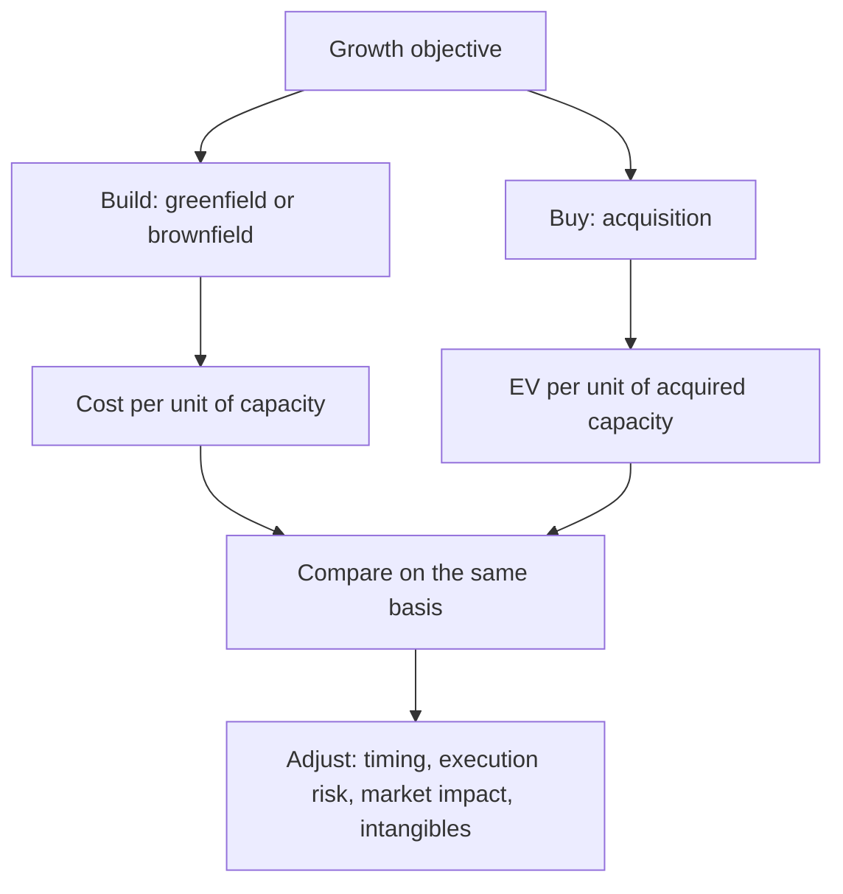

# Capacity Expansion versus Acquisition

## The Problem / Why this matters
A company wanting to grow can build or buy, and the choice has different returns, risks and timelines. Analysts assess each announcement in isolation — a capex programme on its project economics, an acquisition on its multiple — without asking the comparative question that management faced. Doing so misses whether the chosen route was the better one, which is the actual capital allocation judgement.

## Core Idea
Compare the two routes on the **same basis** — cost per unit of capacity or per rupee of EBITDA acquired, adjusted for timing, execution risk and what each route adds beyond capacity.

## Why it works this way
Building and buying produce the same thing — additional capacity or market position — at different prices, on different timelines, with different risks. The correct comparison is therefore price per unit of the same output, and where buying costs less than building, an acquisition is the cheaper route to the same place.

## Full technical content

### The comparison

| Factor | Building | Buying |
|---|---|---|
| **Cost per unit** | Construction cost, often with overruns | Acquisition EV per unit of capacity |
| **Timing** | Two to four years, plus ramp | Immediate |
| **Execution risk** | Cost and schedule overruns, commissioning | Integration risk |
| **Market impact** | Adds capacity to the industry, pressuring price | No net capacity addition |
| **What else you get** | Nothing beyond the asset | Customers, brands, distribution, people, licences |
| **What else you get that you don't want** | Nothing | Liabilities, culture, redundant assets |

**The market-impact point is the one analysts most often miss.** Building adds supply to the industry; buying does not. In a market near full utilisation, buying preserves the pricing environment while building erodes it — and the capex chapter's warning about everyone expanding simultaneously is precisely this effect at industry level.

**Replacement cost is the anchor.** Where acquisitions in a sector are transacting well below replacement cost, nobody rational builds — and that condition, which is observable, tells you the industry's capacity cycle has further to run before new supply is justified.

### Assessing an acquisition

Beyond the price-per-unit comparison:
1. **What is being paid** — EV, and EV per unit of capacity or per rupee of EBITDA.
2. **Against what alternative** — build cost for the same capacity, and current market multiples for similar assets.
3. **Synergies** — quantified, timed, and haircut, with cost synergies weighted far above revenue synergies, per the merger chapter.
4. **Integration cost and time**, which are usually understated.
5. **What is inherited** — contingent liabilities, environmental obligations, pending litigation, employee obligations per the pension chapter.
6. **How it is funded**, and the effect on the balance sheet.
7. **The acquirer's track record** with previous acquisitions — the goodwill chapter's RoCE-with-and-without comparison quantifies it.

### Assessing a build

Per the capex chapter, with the comparative addition:
- **Incremental RoCE** at mid-cycle prices, including working capital.
- **What industry capacity is being added simultaneously.**
- **Whether the same capacity could be bought cheaper**, which is the question management should have asked and which the analyst can ask on the call.

**"Why build rather than buy?" is a legitimate and revealing question**, and the quality of the answer is informative regardless of the decision.

### When each is right

**Building is preferable when:**
- Acquisition targets trade above replacement cost.
- The company wants specific technology, location or configuration.
- No suitable target exists.
- The industry has capacity headroom, so added supply does not damage pricing.
- The company has demonstrated project execution capability.

**Buying is preferable when:**
- Assets transact below replacement cost.
- Speed matters — a market is consolidating and waiting means losing position.
- The target brings something unbuildable: brand, distribution, regulatory approvals, qualified customer relationships.
- The industry is near full utilisation and adding supply would damage returns.
- Consolidation improves industry structure, which benefits the acquirer beyond the acquired assets.

**That final point is the strongest argument for acquisition in a fragmented industry**, and it is frequently understated in analysis: removing a competitor improves the pricing environment for the acquirer's existing capacity too, so the return on the acquisition exceeds the return on the acquired assets alone.

### What the choice reveals about management

- **Serial acquirers who never build** may lack project capability, or may be pursuing growth for its own sake.
- **Companies that always build** in a market where assets trade below replacement cost are destroying value by choice.
- **A company that has done both well** demonstrates genuine capital allocation capability.
- **Track the outcomes of both** in a table — announced cost and timeline versus actual for builds, and returns achieved versus promised for acquisitions. **This is a few hours of work from annual reports and is more predictive than any assessment of the current decision.**

## Common mistakes
- Assessing a capex programme or an acquisition **in isolation** from the alternative.
- Ignoring that **building adds industry supply** while buying does not.
- Not comparing acquisition price to **replacement cost**.
- Crediting **revenue synergies** at face value.
- Understating **integration cost and time**.
- Missing **inherited liabilities** in an acquisition.
- Ignoring the acquirer's **track record** with prior deals.
- Overlooking the industry-structure benefit of consolidation in a fragmented market.

## Interview angle
"A company announces an acquisition at 11× EBITDA. Is that expensive?" Compare it to the alternative rather than to a multiple benchmark: what would it cost to build the same capacity, expressed per unit, including realistic overruns and the two-to-four-year build plus ramp during which the capital earns nothing? If assets are transacting below replacement cost, buying is the rational route and the multiple alone does not settle it. Then add the industry-level point most answers miss — building adds supply and erodes the pricing environment for the acquirer's existing capacity, while buying does not, and in a fragmented industry near full utilisation, consolidation improves pricing for the assets the acquirer already owns, so the return exceeds the return on the acquired assets alone. Finish with the diligence items: synergies quantified and timed with cost weighted above revenue, integration cost which is usually understated, inherited liabilities including environmental and employee obligations, and above all the acquirer's own record on previous deals, which you can tabulate from annual reports and which predicts this deal better than any analysis of its terms.
