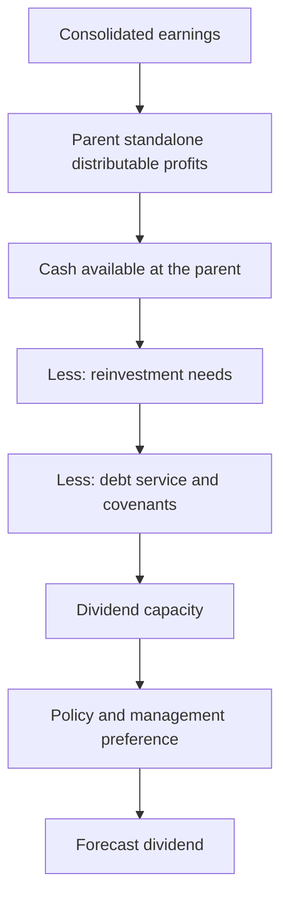

# Dividend Forecasting and Payout Policy

## The Problem / Why this matters
Dividend forecasts are frequently produced by applying the historical payout ratio to forecast earnings, which ignores the constraints that actually determine what a company can pay. Dividends come from the parent's distributable profits, require cash at the parent, and compete with reinvestment and debt service. For income-oriented clients the dividend forecast is the recommendation, so getting it wrong is not a detail.

## Core Idea
Forecast dividends from **capacity and policy**, not from a historical ratio — capacity meaning cash and distributable profits at the listed entity, policy meaning what management has committed to and demonstrated.

## Why it works this way
A payout ratio is an outcome, not a decision variable. The decision is made against available cash, reinvestment needs, debt covenants and a desire not to cut in future. A company with strong consolidated earnings but cash trapped in subsidiaries may be unable to pay regardless of the ratio its earnings would support — the consolidated-versus-standalone chapter's point applied to distributions.

## Full technical content

### The constraints

1. **Distributable profits at the standalone entity.** Dividends are declared by the listed company from its own accumulated profits, not from consolidated earnings. **Check standalone reserves and profits**, which is the binding legal constraint.
2. **Cash at the parent.** Consolidated cash may sit in subsidiaries subject to their own decisions, minority shareholders, regulation or repatriation tax.
3. **Dividends received from subsidiaries**, which is how cash actually reaches the parent in a holding structure — and which is a decision made at each subsidiary.
4. **Reinvestment requirements**, which take priority in a growing business.
5. **Debt covenants**, which frequently restrict distributions above thresholds.
6. **Regulatory constraints** for banks, NBFCs and insurers, where distribution is subject to capital adequacy and supervisory limits.

### Reading policy

- **A stated policy** — a target payout ratio or a progressive dividend commitment — is the strongest input, and whether the company has honoured it is checkable.
- **Demonstrated behaviour** matters more than the statement: a company that has maintained or raised its dividend through a downturn has revealed a preference.
- **The reluctance to cut** is real and important. Cutting a dividend is a strong negative signal, so managements maintain them beyond the point of comfort and then cut sharply — meaning the risk is not a gradual decline but a discontinuity.
- **Special dividends** are one-off by definition and should not be built into a run-rate, though a pattern of them is informative.
- **Buyback substitution**, per the buyback chapter, may be tax-driven rather than a change in distribution philosophy.

### Forecasting method

1. **Forecast consolidated earnings**, as usual.
2. **Estimate standalone profits and distributable reserves.**
3. **Estimate cash available at the parent**, including expected subsidiary dividends.
4. **Deduct committed reinvestment and debt service.**
5. **Apply the stated or demonstrated policy** to what remains.
6. **Sanity-check the payout ratio** as an output — if it implies a ratio far outside the company's history with no stated change, revisit.
7. **State the assumption**, since income-focused clients will want to substitute their own.

### The signals in dividend decisions

| Decision | Signal |
|---|---|
| **Initiating a dividend** | Confidence in sustainable cash generation; a maturing business |
| **Raising the payout meaningfully** | Reinvestment opportunities are diminishing, or capital discipline is improving |
| **Maintaining through a weak year** | Confidence, and a real cash commitment |
| **Cutting** | Strong negative — managements avoid it until forced |
| **Special dividend** | Surplus cash with no reinvestment use |
| **Large payout with high leverage** | Questionable; the cash would better serve deleveraging |

**A rising payout is not automatically positive.** It may reflect a company that has run out of things to invest in — which the ROIIC chapter frames correctly: returning capital is right when incremental returns are below the cost of capital, and a company doing so is allocating well, but the growth outlook has changed and the multiple should reflect that.

### The PSU case

Distinct enough to state separately, per the PSU chapter:
- **Government fiscal needs** influence dividend and buyback decisions at state-controlled companies.
- **Payout can be high and stable** for this reason, which is attractive for income but reflects the controlling shareholder's requirements rather than a capital allocation judgement.
- **The risk is that distributions continue when reinvestment would serve the business better**, which is a structural feature rather than a governance failure, and one an investor prices rather than protests.

### Yield-based valuation

- **Dividend yield** compared to the company's own history and to bond yields is a valuation cross-check, most useful for mature, high-payout businesses.
- **Dividend discount models** are appropriate where payout is stable and predictable, and are the standard approach for financials per those chapters.
- **A high yield can signal distress** rather than value — the market pricing in a cut. **Check dividend cover and cash capacity before treating a high yield as attractive**, because the yield is computed on a dividend that may not be paid again.

## Common mistakes
- Applying the **historical payout ratio** to forecast earnings without checking capacity.
- Forecasting from **consolidated** rather than standalone distributable profits.
- Ignoring **cash trapped** in subsidiaries.
- Missing **covenant restrictions** on distributions.
- Building **special dividends** into a run-rate.
- Reading a rising payout as unambiguously positive.
- Treating a **high yield** as value without checking whether the dividend is sustainable.
- Ignoring regulatory distribution limits for financial companies.

## Interview angle
"The stock yields 7%. Is that attractive?" First establish whether the dividend is payable again: dividends come from the listed entity's own distributable profits and require cash at the parent, so check standalone reserves rather than consolidated earnings, check whether consolidated cash is actually accessible or sits in subsidiaries with minorities or repatriation constraints, and check covenant restrictions on distributions. A high yield frequently means the market is pricing a cut, so dividend cover and cash capacity settle it. Then read the policy from behaviour rather than statements — a company that maintained its dividend through a downturn has revealed a real preference, and because cutting is such a strong negative signal, managements hold on past the point of comfort and then cut sharply, so the risk is a discontinuity rather than a gradual decline. Add the framing point: a rising payout is not automatically good news, because it often means reinvestment opportunities have run out — which is correct capital allocation when incremental returns are below the cost of capital, but it changes the growth outlook and the multiple should reflect that.
