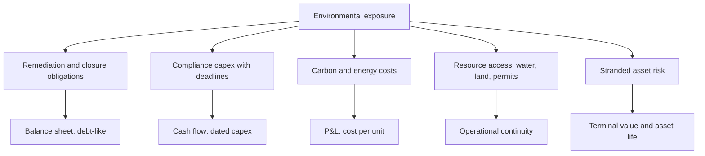

# Environmental Liabilities and Transition Risk

## The Problem / Why this matters
Environmental exposure reaches equity value through concrete, quantifiable channels — remediation obligations, compliance capex, carbon costs, water access, and the risk of stranded assets — rather than through a score. Analysts covering industrials, energy, mining and chemicals need to treat these as financial line items with dates, because that is what they are, and the ones that are already legislated are forecastable.

## Core Idea
Environmental exposure should be **quantified as cash flows and liabilities with dates**, not assessed as a rating — because a compliance deadline with a known capex requirement is a modellable item and a score is not.

## Why it works this way
An emission standard taking effect on a stated date requires specific equipment by that date. That is capex with a schedule. A remediation obligation is a liability. A carbon price is a cost per tonne applied to measurable emissions. Each has a number, and the number belongs in the model rather than in a qualitative section.

## Full technical content

### The quantifiable exposures

**1. Remediation and closure obligations.** Mine closure, site restoration and decommissioning are disclosed as provisions, computed on assumptions about cost and timing. **They are debt-like** — a fixed future claim on cash — and should be considered in net debt where material. The assumptions used are disclosed and comparable, exactly as with pension obligations.

**2. Compliance capex.** Emission norms, effluent standards and waste requirements come with deadlines. **Where a standard is legislated with a date, the capex is forecastable** — and the analytical questions are the amount, the timing, and whether it generates any return (usually not, which means it depresses RoCE without adding earnings).

**3. Carbon and energy cost.** Where carbon pricing applies or is credibly forthcoming, the exposure is emissions intensity times the price. **Emissions intensity relative to peers is the competitive measure** — a producer with lower intensity gains relative advantage as any price rises, and the disclosure is increasingly available.

**4. Resource access.** Water availability for thermal power, textiles and some chemicals; land and forest clearances for mining and infrastructure. These are operational continuity risks with specific, checkable status.

**5. Stranded asset risk.** Assets whose economic life may end before their accounting life — the analytical consequence being that terminal value assumptions and depreciation schedules may both be wrong. **This belongs in the DCF's terminal assumption, not in a risk paragraph.**

### The disclosures to read

- **Provisions note** for remediation, closure and environmental liabilities, with the movement schedule.
- **Contingent liabilities** for environmental penalties and pending proceedings.
- **Capital commitments**, which may include compliance projects.
- **The business responsibility and sustainability report**, which large Indian companies file and which contains emissions, energy, water and waste data in a standardised format — making cross-company comparison possible in a way it previously was not.
- **Regulatory filings and consent orders**, which disclose specific compliance requirements and deadlines.
- **The auditor's report and CARO**, for any environmental non-compliance disclosure.

**Standardised sustainability reporting has made emissions and resource intensity genuinely comparable across Indian companies**, which converts what was a qualitative discussion into a quantitative one. Using it is a practical edge while most analysts still treat the area qualitatively.

### Where it changes valuation

- **Deduct remediation and closure obligations** from equity value where material, as a debt-like item.
- **Model compliance capex** with its deadline, and note that it typically earns no return — so it reduces free cash flow and depresses returns on capital without adding earnings.
- **Model carbon cost** where applicable as a cost per unit of output, with sensitivity to the price.
- **Adjust asset lives** where stranding is plausible, which affects both depreciation and terminal value.
- **Consider the relative position**: within a sector facing the same regulation, the lowest-intensity producer gains share and pricing power as compliance costs rise. **Regulation that hurts an industry often helps its best-positioned participant** — the policy chapter's reframing from "is this bad for the sector" to "who survives it best."

### What to avoid

- **Scores without mechanisms.** A rating that does not translate to a cash flow or a liability adds nothing to a valuation.
- **Double-counting** — an environmental discount to the multiple plus modelled compliance capex counts the same exposure twice.
- **Treating disclosure quality as performance.** A company that reports extensively is not necessarily performing better; it is reporting better, and the two are frequently confused.
- **Ignoring the opportunity side** — companies supplying compliance solutions, efficiency equipment or lower-intensity alternatives benefit from the same regulation.

## Common mistakes
- Assessing environmental exposure as a **score** rather than as cash flows and liabilities.
- Excluding **closure and remediation obligations** from net debt.
- Not modelling **dated compliance capex**, which is forecastable once legislated.
- Assuming compliance capex generates a **return**.
- **Double-counting** through both a multiple discount and modelled costs.
- Confusing **disclosure quality** with environmental performance.
- Ignoring **relative emissions intensity** as a competitive variable.
- Leaving stranded-asset risk in a risk paragraph rather than in the terminal assumption.

## Interview angle
"How do you factor environmental risk into a valuation?" Say you convert it into cash flows and liabilities with dates rather than assigning a score. Closure and remediation obligations are disclosed provisions computed on stated assumptions and are debt-like, so they belong in net debt. Compliance capex is forecastable once a standard is legislated with a deadline, and the key analytical point is that it usually earns no return — so it depresses free cash flow and returns on capital without adding earnings. Carbon exposure is emissions intensity times price, and standardised sustainability reporting now makes intensity genuinely comparable across Indian companies, which turns this into a quantitative exercise while most analysts still treat it qualitatively. Add the two framings that matter: stranded-asset risk belongs in the DCF's terminal assumption and asset lives rather than in a risk paragraph, and within a sector facing identical regulation the lowest-intensity producer gains relative advantage — so the question is who survives the regulation best, not whether the sector is affected.
