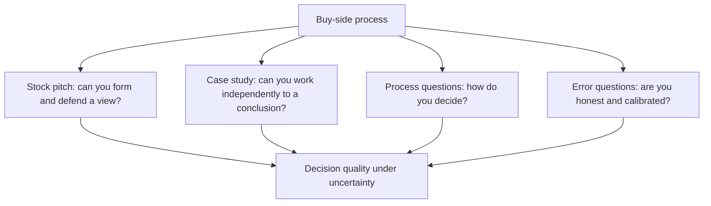

# The Buy-Side Interview and the Case Study

## The Problem / Why this matters
Buy-side interviews differ from sell-side ones in what they test. A sell-side process examines whether you can produce and communicate research; a buy-side process examines whether your judgement is worth allocating capital against. The formats differ accordingly — stock pitches, take-home case studies, and questions about process and error — and preparing for one as though it were the other is a common failure.

## Core Idea
The buy side is testing **decision quality under uncertainty**: whether you can form a view, size it, know what would change it, and be honest about being wrong.

## Why it works this way
A portfolio manager delegates capital to analysts. What matters is not whether the analysis is comprehensive but whether acting on it makes money — which requires a view, a sense of risk-reward, an understanding of when you are wrong, and the discipline to say so. Those are the things the process probes.

## Full technical content

### The stock pitch

The core of most buy-side processes, and the structure is the one-page thesis compressed:
- **The call first** — name, direction, target, upside, horizon.
- **The differentiated insight**, quantified against consensus.
- **Two or three evidenced pillars.**
- **Valuation, bear case, and the risk-reward ratio.**
- **A dated catalyst.**
- **Position size**, and why.
- **What would make you wrong.**

**What distinguishes a buy-side pitch from a sell-side one:**
- **Sizing matters.** "I would own this at 4% of the portfolio because the risk-reward is 3:1 and the liquidity supports it" is a portfolio answer; a rating is not.
- **The downside is examined harder** than the upside. Expect most of the questions to be about what could go wrong.
- **Liquidity and implementability** are real constraints, not footnotes.
- **They will push back.** The pushback is the test — not whether you concede, but whether you distinguish between a good objection that updates your view and a weak one you can answer with evidence.

### The case study

Frequently a take-home: a company, a set of filings, and a few days.

- **Answer the question asked.** If they ask whether to buy, the deliverable is a recommendation, not a company report.
- **Show your reasoning**, since they are evaluating process more than the answer. A defensible wrong answer with visible reasoning beats a right answer with none.
- **State assumptions explicitly** and make them easy to change — a model where the reader can flex the key input is a stronger artefact.
- **Include the bear case and risk-reward.** Its absence is the most common weakness.
- **Keep it tight.** A twelve-page case with a clear recommendation beats forty pages without one.
- **Build a clean model** — labelled, colour-coded, auditable, per the data-integrity chapter. They will open it.

### The process questions

These test how you work, and honest specificity beats polish:
- **"How do you generate ideas?"** — a repeatable process, per the screening and dispersion chapters, not "I read a lot."
- **"How do you decide position size?"** — risk-reward, conviction, liquidity, correlation with existing positions.
- **"When do you sell?"** — thesis achieved, thesis broken, or better use of capital. Having a sell discipline at all is a differentiator.
- **"How do you know when you're wrong?"** — falsification conditions stated in advance, which is the single strongest signal available in an interview.
- **"Tell me about a mistake."** The answer must contain a real error, a specific classification of what went wrong, and what changed in the process afterwards. **A "mistake" that is really a humblebrag is transparent and damaging.**

### What they are actually assessing

- **Do you have views**, or only analysis?
- **Is the reasoning sound**, independent of whether the conclusion is right?
- **Do you know what you don't know**, per the "no view" chapter?
- **Can you change your mind** when the evidence changes?
- **Is the process repeatable**, or was this one good idea?
- **Would they enjoy arguing with you** for years, which matters more than candidates expect on a small team.

### Preparation

- **Have two or three ideas ready**, at least one of which should be a short or an avoid — being able to argue the negative side is rarer and is noticed.
- **Know your numbers cold.** Being unable to state your own assumptions live is disqualifying.
- **Prepare the bear case harder than the bull case.**
- **Know the stock's recent history** — what it has done and why, since they will know.
- **Have a genuine mistake ready**, with the specific process change it produced.
- **Read the fund's positioning** where public, so the pitch is relevant to what they do.

## Common mistakes
- Pitching a **good company** rather than a differentiated view.
- No **position size** or liquidity consideration.
- A weaker **bear case** than bull case.
- Conceding immediately under pushback, or refusing to concede a good point.
- A case study that is a **company report** rather than a recommendation.
- A model the reader cannot **audit or flex**.
- A "mistake" answer that is a disguised strength.
- No **sell discipline** and no falsification conditions.

## Interview angle
"Why do you want the buy side?" The credible answer is about accountability: on the buy side the recommendation is the decision, the outcome is measurable, and you are judged on whether acting on your work made money rather than on distribution or votes — which is a harder and more honest feedback loop. If the follow-up is a pitch, lead with the call, give the quantified differentiated insight, two evidenced pillars, the valuation with an explicit bear case and the risk-reward ratio, a dated catalyst, and then the two things sell-side pitches usually omit: what position size you would take and why, given liquidity, and what specifically would tell you that you are wrong. Expect the questions to concentrate on the downside rather than the upside, and treat the pushback as the actual test — the thing being assessed is whether you distinguish an objection that should update your view from one you can answer with evidence, not whether you hold your ground.
