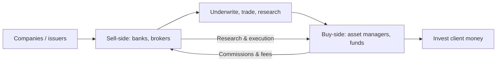

# Sell-Side vs Buy-Side

## The Problem / Why this matters
The finance industry splits into two worlds — the **sell-side** (banks and brokers who create, sell, and research products) and the **buy-side** (asset managers who invest client money). Every markets role sits on one side, they interact constantly, and interviewers frequently ask which you want and why. Understanding the distinction — who does what, how each makes money, and how research flows between them — is basic industry literacy.

## Core Idea
The **sell-side** creates and sells financial products and services (underwriting, trading, research) to clients and earns fees/commissions. The **buy-side** buys and holds investments on behalf of clients (funds) and earns management/performance fees on assets. Sell-side research is *published* to win business; buy-side research is *private* and drives the fund's own decisions.

## Why it works this way
The two exist because issuers and investors need different services. The sell-side intermediates — helping companies raise capital and helping investors execute and understand — monetized through transactions. The buy-side is the end investor of capital — monetized through investment performance on assets under management. Research flows from sell-side (marketing/service) to buy-side (decision input).

## Full technical content

**Sell-side (investment banks, brokerages):**
| Function | What it does |
|---|---|
| **Investment banking (ECM/DCM/M&A)** | Raise capital and advise on deals for companies |
| **Sales & trading** | Execute trades, make markets, provide liquidity |
| **Sell-side research** | Publish analysis and ratings on stocks/sectors to clients |
Earns: **underwriting fees, advisory fees, trading commissions, spreads.** Sell-side research is *distributed* to institutional clients to win their trading/banking business — it's a service, not a profit centre itself.

**Buy-side (asset managers):**
| Type | Description |
|---|---|
| **Mutual funds / AMCs** | Pooled long-only funds, benchmark-relative |
| **Hedge funds** | Flexible, absolute-return, can short/leverage |
| **Pension & insurance funds** | Long-term, liability-driven |
| **PE / VC** | Private investing |
| **PMS / AIFs** | Portfolio management for HNIs |
Earns: **management fees (% of AUM)** and often **performance fees** (e.g., 2-and-20 for hedge funds). Buy-side research is *internal* and confidential — it directly drives what the fund buys.

**How they interact:**
- Sell-side provides **execution** (trading), **capital-raising access** (IPO allocations), and **research** to the buy-side.
- Buy-side pays via **commissions** and consumes sell-side research as one input (increasingly unbundled post-MiFID II).
- The buy-side ultimately makes the investment decision; the sell-side facilitates.

**Research differences:**
| | Sell-side research | Buy-side research |
|---|---|---|
| Audience | Published to many clients | Internal to the fund |
| Purpose | Win business/commissions | Make the fund's own decisions |
| Coverage | Broad, many names | Focused on holdings/ideas |
| Incentive | Volume, access, relationships | Being *right* (performance) |

**Career framing.** Sell-side research/banking: broad coverage, client-facing, deal/idea flow. Buy-side: fewer names, deeper conviction, direct accountability for returns. Many move sell-side → buy-side over a career.

## Worked examples

**Example 1 — a research idea's journey.** A sell-side analyst publishes a Buy on Stock X with a note. It's distributed to hundreds of institutional clients. A buy-side PM reads it, does her *own* work, disagrees on one assumption, but likes the idea — and buys through the same bank's trading desk (paying commission). The sell-side earned the commission and strengthened the relationship; the buy-side made the actual decision.

**Example 2 — how each makes money.** A brokerage (sell-side) earns ₹5 cr in commissions from a fund's trading this year. The fund (buy-side) manages ₹5,000 cr and earns a 1% management fee = ₹50 cr, plus performance fees if it beats its benchmark. Different economics: transaction fees vs fees on assets and performance.

**Example 3 — incentive difference.** A sell-side analyst is rewarded for coverage, client access, and generating trading interest; a buy-side analyst is rewarded purely for whether the calls make money. This is why buy-side research is more focused and conviction-driven — being *right* is the only thing that pays.

**Example 4 — a worked management-fee-plus-performance-fee calculation.** A hedge fund manages ₹2,000 cr, charges a 1.5% management fee and a 20% performance fee above a hurdle rate of 8%. In a year the fund returns 22%. Management fee = 1.5% × 2,000 cr = ₹30 cr, charged regardless of performance. Performance fee applies only to the return *above* the 8% hurdle: excess return = 22% − 8% = 14%, on which the fund earns 20% = 14% × 20% = 2.8% of AUM = ₹56 cr. Total fund revenue this year: ₹30 cr + ₹56 cr = **₹86 cr**, versus an investor's net return after fees of roughly 22% − 1.5% − 2.8% ≈ **17.7%**. This concrete "2-and-20-with-a-hurdle" calculation is a standard technical question for anyone claiming buy-side/hedge-fund interest, and the hurdle-rate mechanic specifically (performance fees only above a minimum threshold, not on the whole return) is the detail most candidates get wrong by omitting it.

**Example 5 — how MiFID-II-style research unbundling changed sell-side economics in practice.** Before unbundling, a buy-side fund's trading commissions implicitly paid for both execution *and* the sell-side research bundled alongside it — a fund couldn't easily tell how much it was really paying for research specifically. Post-unbundling, funds must pay for research explicitly and separately from execution costs, forcing them to actively budget and justify research spend against its measured value. The practical effect on sell-side desks: consolidation toward fewer, higher-conviction analysts covering fewer names with more differentiated views, since broad, generic coverage that used to be "free" (bundled into commissions) no longer automatically earns its keep once a fund has to consciously decide whether a specific research relationship is worth paying for directly.

## How it is tested in interviews
- **"What's the difference between sell-side and buy-side?"** — "Sell-side (banks/brokers) creates and sells products — underwriting, trading, research — for fees and commissions. Buy-side (asset managers) invests client money for management and performance fees. Sell-side research is published to win business; buy-side research is private and drives the fund's decisions."
- **"How does each make money?"** — Sell-side: underwriting/advisory fees, trading commissions/spreads. Buy-side: % of AUM management fees plus performance fees.
- **"Do you want sell-side or buy-side, and why?"** — Have a genuine answer: sell-side for broad coverage and client/deal exposure; buy-side for deep conviction and direct accountability for returns.
- **"How do sell-side and buy-side research differ?"** — Audience (published vs internal), purpose (win business vs make money), and incentive (volume/access vs being right).

## Traps & common mistakes
- Mixing up which side **invests** (buy-side) vs **intermediates** (sell-side).
- Thinking sell-side research is the sell-side's **profit centre** — it's a service to win trading/banking.
- Not having a **genuine preference** with reasons when asked.
- Forgetting the buy-side does its **own** work and makes the final call.

## First-principles recap
- **Sell-side** intermediates (underwrite, trade, research) for fees/commissions.
- **Buy-side** invests client money for fees on assets and performance.
- Research flows sell-side → buy-side; the buy-side decides.
- Incentives differ: sell-side rewards access/volume; buy-side rewards being right.
- Careers often move sell-side → buy-side.

## Quick-reference
| | Sell-side | Buy-side |
|---|---|---|
| Role | Create/sell/execute/research | Invest client money |
| Examples | IBs, brokerages | Mutual/hedge/pension funds, PMS |
| Revenue | Fees, commissions, spreads | % AUM + performance fees |
| Research | Published, wins business | Internal, drives decisions |
| Reward | Access/volume | Performance (being right) |
