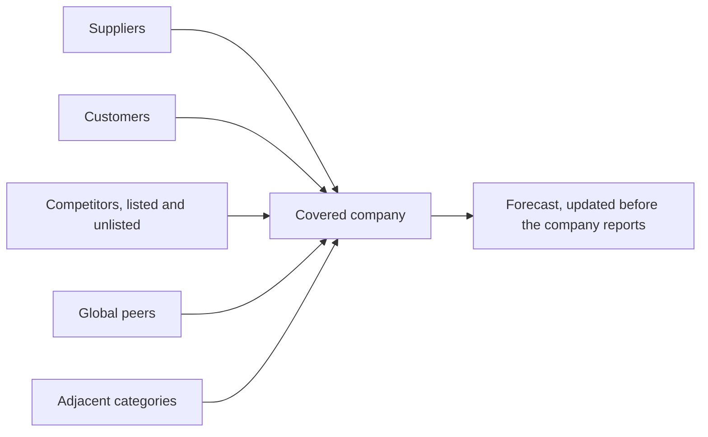

# Related Company and Supply Chain Mapping

## The Problem / Why this matters
A company does not exist in isolation. Its suppliers, customers, competitors and adjacent players all disclose information bearing on its prospects, and much of that disclosure arrives before the company's own. Building a systematic map of those relationships converts scattered filings into an early-warning system — and it is a one-time investment that pays for as long as you cover the name.

## Core Idea
Map every listed and disclosing entity connected to a covered company, and treat their disclosure calendar as **an information sequence** rather than a set of unrelated events.

## Why it works this way
Information about a shared end market reaches different companies at different times depending on their position in the chain and their reporting calendar. A supplier sees order changes before the customer reports revenue; a global peer on a calendar quarter reports the same conditions weeks earlier. The information is public — only the assembly is missing.

## Full technical content

### Building the map

For each covered company, list:
1. **Named suppliers and customers** from the annual report, offer documents and industry sources.
2. **Direct competitors**, listed and unlisted — unlisted companies file annual accounts that are frequently obtainable, per the read-across chapter.
3. **Global peers** in the same business.
4. **Adjacent players** sharing a channel, a customer base or an input.
5. **Joint venture partners** — who often disclose more about the JV than the Indian partner does, per the equity-method chapter.
6. **Group entities**, listed and unlisted, given the group-contagion risk the credit chapter identifies.

Then record for each: **reporting date, fiscal calendar, what they disclose that is relevant, and the strength of the relationship.**

### Making it operational

- **Order the results calendar** by date, so each report is read for what it implies about companies yet to report.
- **Weight by relevance** — a supplier deriving 40% of its revenue from your company is highly informative; one deriving 3% is not.
- **Note fiscal calendar differences**, which is where the timing advantage sits.
- **Record predictions and check them.** Over a few seasons this calibrates which relationships actually predict, converting intuition into a tested method.

### What to extract from each type

| Relationship | Signal |
|---|---|
| **Supplier** | Order volumes, capacity utilisation, payment behaviour, pricing |
| **Customer** | Production plans, capex, inventory position |
| **Listed competitor** | Industry demand, pricing environment, share movement |
| **Unlisted competitor** | Financials from filed accounts — often the only view available |
| **Global peer** | End-market conditions, technology and pricing trends, terminal-stage economics |
| **JV partner** | Detail on the JV the Indian partner does not give |
| **Group entity** | Funding stress that spreads across the group |

### Beyond company filings

- **Regulatory participant-level data** — telecom subscribers, insurance premiums, mutual fund AUM, vehicle registrations — gives directly observable competitive position, per the market-share chapter.
- **Industry association data**, which aggregates including unlisted players.
- **Customs, port and freight data**, which leads reported exports.
- **Rating agency reports** on unlisted group entities and competitors.
- **Tender and procurement portals** for government-linked businesses, which disclose awards before company announcements.

### The disciplines

- **Verify the relationship** exists from disclosure rather than assuming it.
- **Distinguish market-level from company-specific** signals — a competitor's growth may be share gain from your company, which is the opposite conclusion.
- **Account for inventory in the chain**, which decouples sell-in from sell-out and is the most common reason a read-across fails.
- **Update the map** as relationships change — customer concentration shifts, new competitors enter, JV structures change.

## Common mistakes
- Treating each company's results as an **isolated** event.
- Assuming supply or customer relationships without **verifying** them.
- Ignoring **fiscal calendar** differences, where the timing advantage is.
- Reading a competitor's growth as **market growth** rather than share taken from your company.
- Ignoring **channel inventory**, which breaks the timing of any read-across.
- Overlooking **unlisted competitors' filed accounts**.
- Never checking afterwards which relationships actually predicted.

## Interview angle
"How do you stay ahead of a company's results?" Describe the map: suppliers, customers, listed and unlisted competitors, global peers, JV partners and group entities, each with its reporting date and fiscal calendar recorded — because global peers reporting on calendar quarters frequently describe the same end-market conditions weeks before the Indian company reports, and that gap is a legal, public information advantage available to anyone who assembles it. Add the sources beyond filings: regulatory participant-level data where it exists gives directly observable market share, customs and freight data leads reported exports, and unlisted competitors file accounts that are often the only view of an important private player. Then give the disciplines that keep it reliable — verify the relationship from disclosure rather than assuming it, distinguish market-level signals from share shifts since a competitor's growth may be your company's loss, and watch channel inventory, which decouples sell-in from sell-out and is the most common reason a read-across is right in direction but wrong in timing.
