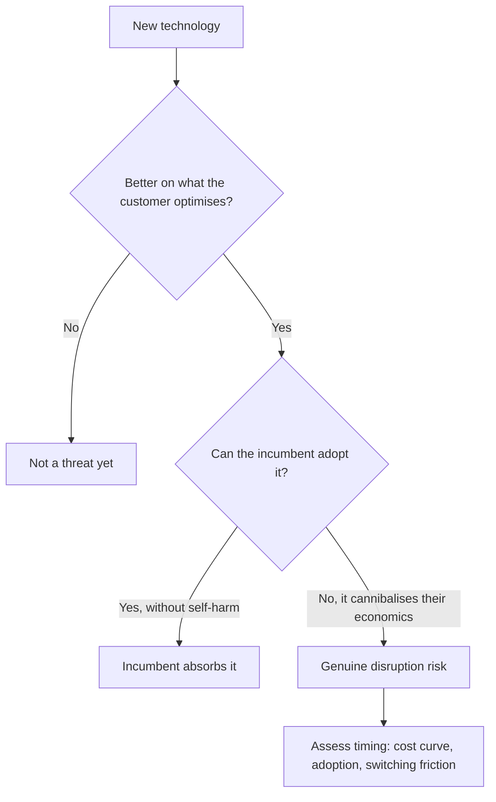

# Technology Disruption Assessment

## The Problem / Why this matters
Every sector faces claims that technology will transform it, and most of those claims are wrong or badly mistimed. Analysts face a two-sided error: dismissing a genuine disruption because the incumbent's numbers still look fine, or de-rating a durable business on a threat that never materialises. Both are expensive, and distinguishing them requires a framework rather than an instinct.

## Core Idea
A technology threat is real when it delivers **better economics for the customer on the dimension the customer actually optimises**, and when the incumbent cannot adopt it without destroying its own economics.

## Why it works this way
Customers switch for their own reasons, not because a technology is superior in the abstract. And incumbents defeat most threats simply by adopting them — the threats that succeed are those where adoption would cannibalise the incumbent's existing profit pool, creating a genuine dilemma rather than a decision.

## Full technical content

### The tests

**1. Customer economics.** Does the new approach deliver lower total cost, better performance, or better convenience on the dimension the customer weights most? **A technology superior on a dimension customers do not prioritise does not displace anything.**

**2. The incumbent's dilemma.** Can the incumbent adopt the technology without destroying its existing business? Where adoption is straightforward and non-cannibalising, incumbents usually win because they have the distribution, the brand and the customer relationships. Where adoption undermines the existing profit pool, the incumbent hesitates — and that hesitation is the opening.

**3. Cost curve trajectory.** Where a technology is currently more expensive, the question is the rate at which its cost is falling. A technology declining steeply on cost is a threat on a timeline; one that has plateaued above the incumbent's cost is not.

**4. Switching friction.** Qualification cycles, regulatory approval, integration into the customer's process, contractual lock-in — all of which delay adoption regardless of superiority, per the customer-concentration chapter's switching-cost analysis.

**5. Infrastructure and ecosystem dependence.** Some technologies require complementary infrastructure that constrains the timeline independently of the technology itself.

### Timing, which is where most analysis fails

**Being right about direction and wrong about timing is the standard failure**, and it destroys capital in both directions — shorting an incumbent five years early is as costly as ignoring the threat entirely.

Useful discipline:
- **Anchor to observable adoption data** — unit shipments, penetration rates, capacity being built — rather than to projections.
- **Use analogues from other markets** where the transition happened earlier, per the cross-market chapter, which gives an empirical adoption curve rather than an assumed one.
- **Identify the specific constraint** currently limiting adoption, and watch that rather than the technology.
- **Distinguish the inflection from the announcement.** Adoption curves are slow then fast, and the interesting question is what triggers the acceleration.

### What incumbents actually have

Frequently underweighted in disruption narratives:
- **Distribution and installed base**, which a new entrant must replicate at cost, per the distribution chapter.
- **Regulatory approvals and qualifications**, which take years.
- **Customer relationships and switching costs.**
- **Capital to acquire the disruptor**, which is often the resolution.
- **Time to respond**, since adoption curves are usually slower than narratives assume.

**The incumbent's most common response is acquisition**, which is why a disruption thesis should consider whether the threat is more likely to end in displacement or in a purchase.

### Assessing the exposed incumbent

- **What proportion of profit is exposed**, not what proportion of revenue — the exposed segment may be the most or least profitable, and that determines the damage.
- **Fixed-cost structure**, since losing volume strands costs, per the operating leverage chapter.
- **Asset life versus the transition timeline** — the stranded-asset question the environmental chapter frames, applied to technology.
- **The balance sheet's capacity to fund a transition**, which determines whether the company can respond at all.
- **Management's recognition** of the threat, which is visible in capital allocation rather than in commentary.

### Assessing the potential disruptor

- **Unit economics at current scale**, and what changes at larger scale.
- **Whether the advantage is durable** or is a temporary subsidy funded by capital.
- **Whether incumbents can replicate it** once it is proven.
- **Path to profitability**, per the growth-company chapter, with the reverse-DCF check on what the price implies.

### The honest position

- **Most disruption claims fail**, either because the economics do not work or because incumbents adopt.
- **A minority are real and transformative**, and missing one is the more expensive error in a long portfolio.
- **The analytically defensible stance** is to identify the specific evidence that would confirm or refute the threat and monitor it — which is the falsification discipline applied to a structural question rather than a company one.

## Common mistakes
- Assessing a technology on **abstract superiority** rather than on customer economics.
- Ignoring whether the **incumbent can simply adopt** it.
- Getting the direction right and the **timing** badly wrong.
- Using projections rather than **observable adoption data**.
- Measuring exposure by **revenue** rather than by profit.
- Underweighting the incumbent's **distribution, approvals and capital**.
- Ignoring that the likely resolution is often **acquisition**.
- Treating a capital-subsidised disruptor's unit economics as durable.

## Interview angle
"A new technology threatens a company you cover. How do you assess it?" Apply two tests before anything else: does it deliver better economics on the dimension the customer actually optimises — because superiority on a dimension customers do not weight displaces nothing — and can the incumbent adopt it without destroying its own profit pool, because where adoption is straightforward incumbents usually win on distribution and relationships, and the threats that succeed are precisely those where adopting is self-harm. Then handle timing, which is where most analysis fails: anchor to observable adoption data such as unit shipments and capacity being built rather than projections, use analogues from markets where the transition happened earlier to get an empirical adoption curve, and identify the specific constraint currently limiting adoption so you can monitor that rather than the technology. Add the exposure measurement point — what matters is the share of *profit* exposed, not revenue, plus the fixed-cost structure, since lost volume strands costs. And note the resolution most disruption theses ignore: the incumbent frequently buys the disruptor.
