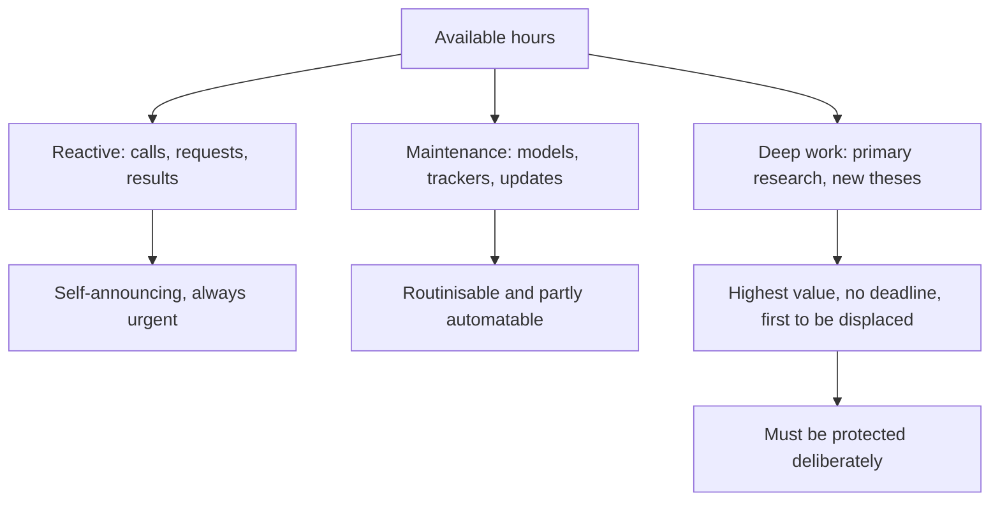

# Analyst Productivity and Time Allocation

## The Problem / Why this matters
An analyst's output is bounded by hours, and the demands are effectively unlimited — results seasons, client calls, model maintenance, management meetings, morning meetings, note writing. Without deliberate allocation, time flows to whatever is most urgent, which is rarely what is most valuable. The difference between a productive analyst and an overwhelmed one is usually structure rather than effort.

## Core Idea
Allocate time by **expected value of the work**, not by urgency — protecting blocks for the deep analysis and primary research that produce differentiated views, because those are the activities that get displaced by everything else.

## Why it works this way
Urgent work is externally generated and self-announcing: a client call, a results release, a request from sales. Valuable work — building a competitive tracker, doing channel checks, rebuilding a model properly — is self-generated and has no deadline, so it loses every scheduling contest unless deliberately protected.

## Full technical content

### The categories

| Activity | Character | Approach |
|---|---|---|
| **Results and updates** | Predictable, seasonal, high volume | Routinise; standardise models; prepare previews in advance |
| **Client interaction** | Reactive but valuable | Respond fast during market hours; batch where possible |
| **Model and tracker maintenance** | Recurring, partly automatable | Automate the mechanical parts, per the AI chapter |
| **Primary research** | High value, no deadline | **Schedule it explicitly**, or it does not happen |
| **New idea generation** | Highest value, entirely self-directed | Protect recurring blocks |
| **Administration and compliance** | Non-negotiable | Batch and minimise |

### The structural approach

**1. Standardise everything repeatable.** A common model template across coverage makes results updates mechanical. A standing checklist for annual reports, per the audit-report chapter's sequence, means nothing is missed and nothing is re-derived.

**2. Automate the mechanical.** Data extraction, peer table assembly and tracker updates are the tasks where automation genuinely helps — with the verification discipline the AI chapter requires.

**3. Front-load the seasonal.** Previews written before results season converts peak-load thinking into off-peak thinking, per the preview chapter.

**4. Protect deep-work blocks.** Half a day a week for primary research or a new thesis, scheduled and defended. **This is the single highest-return scheduling decision available**, because it is the only category that produces differentiated views and the only one nobody will ask for.

**5. Batch reactive work** where the market allows — though speed during market hours is genuinely valuable and should not be batched away.

**6. Prioritise by position and contention.** The largest client positions and the most contentious calls first, always.

### Where the time actually goes wrong

- **Over-maintaining models** for names where the thesis is settled and nothing has changed.
- **Covering too many names**, per the coverage-universe chapter, which produces shallow work everywhere.
- **Chasing every data point** rather than the ones that move the thesis.
- **Writing long notes** that fewer people read than a short one would, per the one-page chapter.
- **Reacting to daily price moves** rather than working on the view.
- **Not saying no** to low-value requests, which is a skill.

### The compounding investments

Work that pays back over years rather than in the current quarter, and is therefore systematically under-done:
- **The sector primer**, per the first-90-days chapter.
- **The competitive tracker** and the read-across map.
- **The guidance credibility record** for each covered company.
- **The past-project outcome table** for capital allocation assessment.
- **The personal accuracy record and post-mortems.**
- **Relationships** with management, industry participants and clients.

**Each takes hours and is useful for years.** An analyst who builds them in the first six months on a sector operates with an advantage that never depreciates, and one who never builds them re-derives the same information repeatedly.

### The honest constraint

Time allocation cannot solve for a coverage list that is too large or a firm that demands volume over depth. Where those constraints bind, the useful response is to be explicit about the trade-off rather than to attempt everything shallowly — **depth on the names that matter beats uniform shallowness**, and choosing where to be deep is itself the allocation decision.

## Common mistakes
- Letting **urgency** determine allocation.
- Not protecting **deep-work blocks**, which are always first to be displaced.
- Over-maintaining models where nothing has changed.
- Covering **too many names** to do any of them well.
- Writing long notes that fewer people read.
- Skipping the **compounding investments** because they have no deadline.
- Attempting uniform coverage rather than choosing where to be deep.

## Interview angle
"How do you manage your time during results season?" Give structure rather than effort: standardise model templates across coverage so updates are mechanical, write previews before the season so the thinking happens off-peak, prioritise by client position size and by which calls are most contentious, and publish short and fast on the day with a fuller note later where warranted. Then make the point that generalises beyond results season — urgent work is externally generated and announces itself, while the work that actually produces differentiated views has no deadline and loses every scheduling contest unless deliberately protected, so a defended block each week for primary research or a new thesis is the highest-return scheduling decision available. Add the compounding investments most analysts skip because they have no due date: the competitive tracker, the read-across map, a guidance credibility record for each company, and a table of past project outcomes for capital allocation. Each takes a few hours and stays useful for years.
