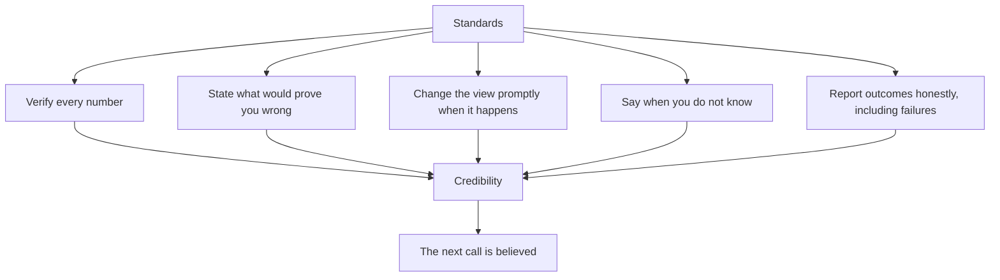

# Closing Note — The Standards That Define the Work

## The Problem / Why this matters
The preceding chapters describe methods, sectors, mechanics and craft. What they do not state directly is the set of standards that make the difference between an analyst whose work is trusted and one whose work is merely produced. Those standards are behavioural rather than technical, they are visible to everyone who reads the output, and they compound over a career.

## Core Idea
Analytical credibility is built by **a small number of repeated behaviours** — being explicit about what would prove you wrong, changing your view promptly when it happens, saying plainly when you do not know, and never publishing a number you have not verified.

## Why it works this way
A client cannot evaluate every piece of analysis on its merits; they evaluate the analyst. Over time, an analyst's record on the behaviours above is far more informative about the reliability of the next call than the internal logic of any single note. Those behaviours are therefore the actual product.

## Full technical content

### The five standards

**1. Verify every number.** Every figure that reaches a note traces to a primary filing. This is non-negotiable, and it applies equally to numbers from data providers, from generated summaries, and from a colleague's model. **A fabricated or unchecked number in published research is a professional failure regardless of how it arrived there.**

**2. State what would prove you wrong.** Falsification conditions, published with the call. They prevent confirmation bias during the research, force honesty during the holding period, and make post-mortems meaningful. An analyst who cannot say what would change their mind has a position rather than a thesis.

**3. Change the view promptly.** When a falsification condition is met, change the rating and say plainly what was wrong. The cost of a delayed downgrade is borne by clients holding the position. Do not frame the change as though it had always been anticipated.

**4. Say when you do not know.** Where the evidence does not discriminate between outcomes, say so and specify what would resolve it. Manufactured confidence misleads a client into acting on a view that has no foundation.

**5. Report outcomes honestly.** Track your own accuracy, conduct post-mortems, and review last year's calls in this year's outlook. The discomfort is the point — it is what makes the process improve and what makes the record credible.

### What these standards cost

Worth acknowledging plainly, because the pressures are real:
- **Publishing a Sell** costs corporate access and displeases holders.
- **Changing a view** exposes the earlier one as wrong.
- **Saying "no view"** creates the impression of indecision in a culture that rewards conviction.
- **Reviewing your own errors** in public is uncomfortable.
- **Verifying everything** is slower than not verifying.

Each cost is immediate and concentrated; each benefit is delayed and diffuse — the same asymmetry the ratings chapter identifies as the source of the industry's systematic distortions. **Recognising that the pressures are structural rather than personal is what makes them resistible.**

### What they produce

- **The rare Sell is believed**, because you have published them before.
- **A high-conviction call is acted on**, because you have distinguished conviction levels honestly.
- **A changed view is read as discipline** rather than inconsistency.
- **Clients bring you their questions**, because the answers have been reliable.
- **The record survives individual bad calls**, because the process is visible.

### The frame that ties it together

The synthesis chapter listed five habits that generalise across sectors: decompose before concluding, check cash against profit, compare against the right benchmark, know what the market believes and why, and state what would prove you wrong. Those are the analytical foundation. The standards in this chapter are their behavioural counterpart — the habits determine whether the analysis is sound, and the standards determine whether it is trusted.

**Both are learnable, neither is common, and the combination is what the job actually rewards.**

### A final practical note

Nothing in these chapters removes the need for judgement. The frameworks narrow the space in which judgement operates — they tell you which questions to ask, which numbers to check, which comparisons are meaningful — but the decisions that matter most remain irreducibly judgemental: whether a decline is cyclical or structural, whether a moat is durable, whether management is honest, whether you are early or wrong.

Those improve with cycles observed, mistakes examined, and views held publicly and revised honestly. That is why research is an apprenticeship, and why the standards above matter more than any technique in this book: **they are what turn experience into judgement rather than into accumulated confidence.**

## Common mistakes
- Publishing an **unverified** number.
- Holding a view with **no falsification condition**.
- **Delaying** a downgrade to avoid admitting error.
- Manufacturing a view where the honest answer is uncertainty.
- Never conducting **post-mortems**.
- Presenting every call at the **same conviction level**.
- Treating the structural pressures as personal weakness rather than as predictable and resistible.

## Interview angle
"What kind of analyst do you want to be?" Answer with standards rather than ambitions: someone who verifies every number against the primary filing, states in advance what would prove the thesis wrong, changes the view promptly when that happens and says plainly what was wrong, admits uncertainty where the evidence does not discriminate, and reviews their own calls honestly including the failures. Then show you understand why those are hard — each one costs something immediately and concentrated, whether that is corporate access, the appearance of consistency, or simply time, while the benefit is delayed and diffuse. That asymmetry is structural rather than personal, which is exactly why it can be resisted deliberately. Close on what it produces: an analyst known for those behaviours is believed when they take a strong view, and that credibility is the only thing in this job that compounds.
