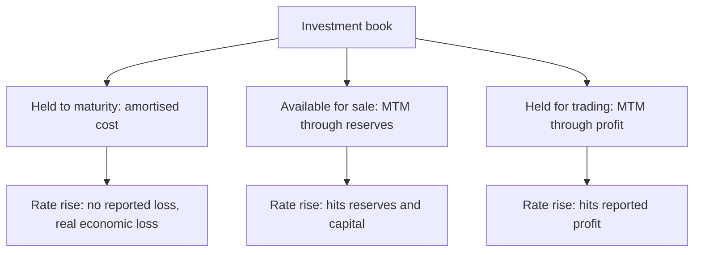

# Bank Treasury and Investment Book Analysis

## The Problem / Why this matters
A bank's investment book — largely government securities held to meet statutory requirements — can be a substantial share of its balance sheet, and its accounting classification determines whether interest-rate movements reach reported earnings or bypass them. Analysts focused on the loan book miss a source of earnings volatility that in some periods dominates the result, and miss a genuine risk that has caused bank failures elsewhere.

## Core Idea
The investment book's **classification determines where rate moves appear** — some categories mark to market through profit, others through reserves, and others not at all — so identical rate exposure produces very different reported outcomes.

## Why it works this way
Accounting for investments depends on intent and business model. Securities intended to be held to maturity are carried at amortised cost, so a rate rise produces no reported loss even though the economic value has fallen. Securities held for trading are marked through profit. The economics are the same; the reported earnings are not.

## Full technical content

### The categories and their effects

| Category | Measurement | Where a rate move appears |
|---|---|---|
| **Held to maturity** | Amortised cost | Nowhere, until sold or reclassified |
| **Available for sale** | Fair value | Reserves and regulatory capital |
| **Held for trading** | Fair value | Reported profit |

**The held-to-maturity category is where the hidden exposure sits.** A large book carried at amortised cost with unrealised losses represents real economic loss that has not been recognised — and the disclosure of fair value versus carrying value is available in the notes. **Computing the unrealised loss and comparing it to net worth is a check that takes minutes and is rarely done.**

The risk becomes acute if the bank is ever forced to sell those securities for liquidity, which crystallises the loss — the mechanism by which unrecognised interest-rate risk has become a solvency event in banking crises.

### The analysis

1. **Size the book** as a proportion of assets, and its split across categories.
2. **Compute unrealised gains or losses** on the amortised-cost portion from the disclosed fair values.
3. **Express the unrealised loss against net worth and against regulatory capital.**
4. **Check the duration** of the book, which determines sensitivity to a further rate move.
5. **Watch reclassifications** between categories, which are disclosable and are frequently a way to avoid recognising losses.
6. **Separate treasury gains from core earnings** — a bank reporting strong profit driven by bond trading gains in a falling-rate period has not improved its core franchise, and those gains reverse.

### Where it matters in the Indian context

- **Statutory liquidity requirements** mean Indian banks hold substantial government securities by obligation, so the book is large by construction.
- **Treasury income can dominate results** in periods of large rate moves, in both directions.
- **Regulatory rules on classification and provisioning** for the investment book are specific and have changed over time, so check the current framework rather than relying on memory.
- **Public sector banks** have historically held larger books relative to their loan books.

### Integrating with the rest of the bank analysis

The banks chapter's core measures — net interest margin, slippages, provision coverage — describe the lending franchise. The treasury book is a separate exposure, and the two should be assessed separately:
- **Core operating profit excluding treasury** is the measure of the franchise.
- **Treasury gains and losses** are a rate-cycle item.
- **A bank whose earnings growth is treasury-driven** in a falling-rate period faces a headwind when rates rise, and the market frequently extrapolates the good period.

## Common mistakes
- Ignoring the investment book and analysing only the **loan book**.
- Missing **unrecognised losses** in the amortised-cost portion.
- Not expressing unrealised losses against **net worth and capital**.
- Treating **treasury gains** as core earnings.
- Missing **reclassifications** between categories.
- Ignoring **duration**, which determines sensitivity to further moves.

## Interview angle
"A bank reported 22% profit growth. What do you check?" Split treasury from the core franchise, because a large share of Indian banks' balance sheets is government securities held for statutory reasons, and in a falling-rate period bond gains can drive most of the reported growth without any improvement in lending. Then check the other direction — the held-to-maturity portion is carried at amortised cost, so a rate rise produces no reported loss even though the economic loss is real, and the notes disclose fair value against carrying value, which lets you compute the unrealised loss and express it against net worth and regulatory capital in a few minutes. That matters because the exposure only crystallises if the bank is forced to sell for liquidity, which is precisely how unrecognised interest-rate risk has become a solvency event elsewhere. Add that you would watch for reclassifications between categories, which are disclosable and are often a way to avoid recognising a loss.
