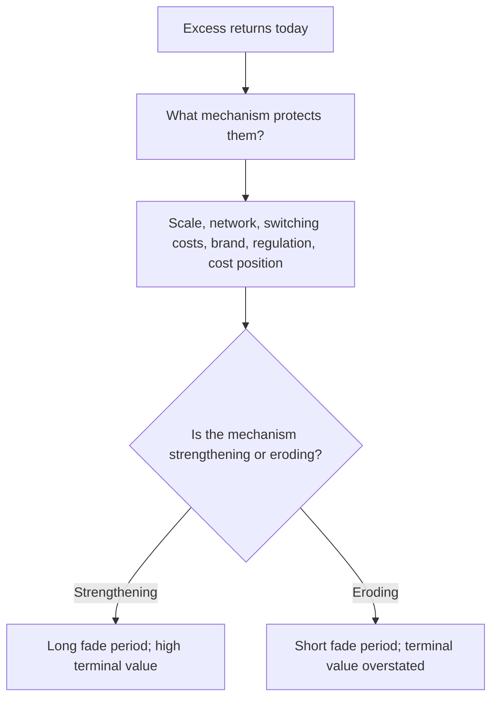

# Franchise Value and Durability Assessment

## The Problem / Why this matters
A DCF's terminal value typically represents most of the calculated value, and that terminal value assumes the business still exists and still earns above its cost of capital decades from now. That assumption is rarely examined. Assessing durability — whether a competitive position survives — is therefore the assumption that drives most of the valuation, and it is the one most often left implicit.

## Core Idea
Durability is the question of whether **excess returns persist**, and it depends on the specific mechanism protecting them and on whether that mechanism is strengthening or eroding.

## Why it works this way
Competition drives returns toward the cost of capital. A business earning above it is doing so because something prevents competitors from replicating it. The valuation question is therefore not whether returns are high today but how long the barrier holds — and barriers have identifiable mechanisms that can be assessed rather than asserted.

## Full technical content

### The mechanisms, and how to test each

| Mechanism | Test |
|---|---|
| **Scale economics** | Does unit cost genuinely fall with volume, and is the leader's cost advantage measurable? |
| **Network effects** | Does each additional user increase value to others — and can users multi-home? |
| **Switching costs** | What does it actually cost the customer in money, time and risk to change? |
| **Brand** | Does it command a measurable price premium, sustained over time? |
| **Regulatory or licence protection** | Is the barrier durable, and is the regulator's stance stable? |
| **Cost position** | Is it structural — resource access, location, integration — or merely current? |
| **Distribution** | Can a competitor replicate the reach, and at what cost and time? |

**The multi-homing question settles most network-effect claims**, as the platform chapter notes: if users can and do use several competing services, the network effect is weak regardless of user numbers.

**Brand claims should be tested against a price premium**, not against awareness. A brand that cannot command a higher price is a marketing asset, not an economic moat.

### The direction test

More informative than the level:
- **Is the barrier getting stronger?** Rising scale advantage, deepening switching costs, growing installed base.
- **Or eroding?** New channels bypassing distribution — the e-commerce effect the distribution chapter identifies — technology reducing scale advantages, regulation opening the market, or a competitor building an equivalent position.

**A high-return business with an eroding moat deserves a much lower terminal value than its current returns suggest**, and this is precisely the situation where a DCF built on current economics is most misleading.

### The fade assumption

The practical expression of durability in a model:
- **Excess returns fade** toward the cost of capital over some period.
- **The fade period is the durability assumption**, and it should be explicit rather than buried.
- **A model assuming excess returns in perpetuity** is asserting that competition never works, which requires justification.
- **Test the sensitivity**: what happens to fair value if returns fade over ten years rather than twenty? Where the answer is large, durability is the thesis and should be stated as such.

### Evidence of durability

- **Sustained high RoCE through a full cycle**, including a downturn — the strongest available evidence.
- **Pricing power demonstrated**, per the pass-through chapter: gross margin expanding over multiple years alongside stable volumes.
- **Market share stable or rising** over a long period against credible competitors.
- **New entrants having tried and failed**, which is direct evidence the barrier works.
- **Customer retention**, where measurable.

### Evidence of erosion

- **Returns declining despite stable revenue**, which indicates competition on price.
- **Rising promotional intensity** to hold share.
- **New entrants gaining traction** rather than failing.
- **Channel shift** to routes where the incumbent's advantage does not apply.
- **Regulatory change** opening a protected position.
- **Customers integrating backwards** or dual-sourcing deliberately.

### Where this connects

This is the same question the sector chapters raise repeatedly — whether a decline is cyclical or structural — asked prospectively rather than retrospectively. And it is the one the synthesis chapter identifies as irreducibly judgemental: **whether a moat is genuinely durable or has merely held so far cannot be settled by any framework.** What the framework does is force the mechanism to be named and its direction assessed, which is more than most analysis manages.

## Common mistakes
- Leaving **terminal value durability** implicit when it drives most of the valuation.
- Asserting a moat without naming the **mechanism**.
- Accepting **network effects** without the multi-homing test.
- Treating **brand awareness** as a moat without a price premium.
- Assessing the **level** of returns rather than the direction of the barrier.
- Assuming excess returns **in perpetuity**.
- Not testing the **fade-period sensitivity** where it dominates the answer.

## Interview angle
"How do you know if a competitive advantage is durable?" Say that the question is what specific mechanism prevents competitors from replicating the returns, and then test it: scale advantage means unit cost genuinely falls with volume and the gap is measurable; network effects only hold if users cannot multi-home; brand is only a moat if it commands a sustained price premium rather than awareness; and cost position must be structural — resource access, location, integration — rather than merely current. Then make the point that matters more than the level: is the barrier strengthening or eroding, because a high-return business with an eroding moat deserves a much lower terminal value than its current returns suggest, and that is exactly where a DCF built on current economics misleads most. Say how it enters the model — the fade period over which excess returns decay toward the cost of capital is the durability assumption, so make it explicit and test the sensitivity, because if fair value moves a lot between a ten-year and a twenty-year fade, durability is the thesis and should be stated as such.
