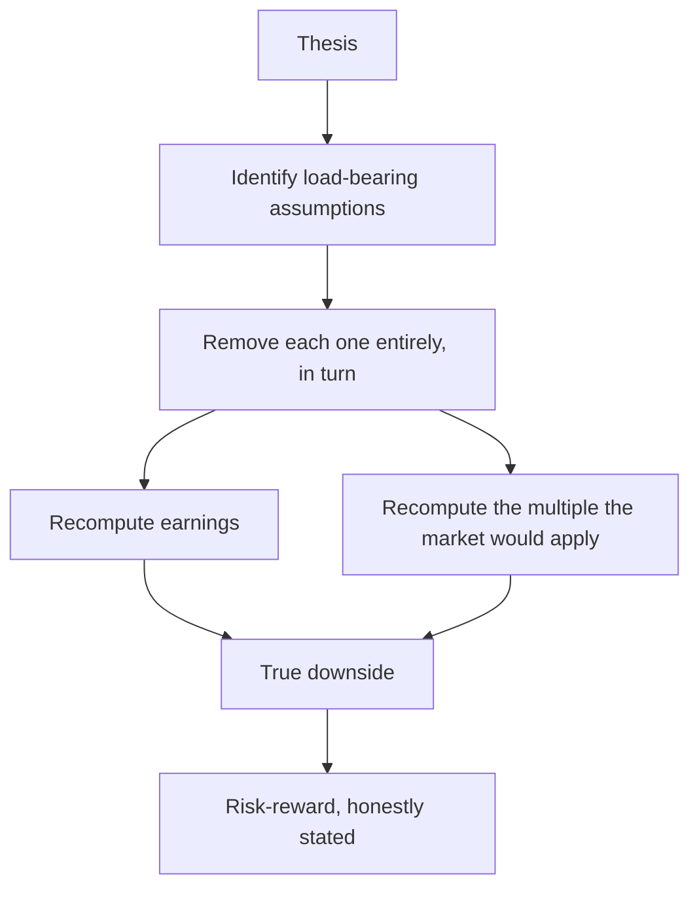

# Stress Testing a Thesis

## The Problem / Why this matters
Most bear cases are constructed by flexing the base case downward — cutting growth a few points, trimming margins, applying a lower multiple — which produces a downside estimate that is systematically too shallow. A real stress test asks what happens under conditions that break the thesis rather than merely dampen it, and the difference determines whether the stated risk-reward is a genuine assessment or an arithmetic exercise.

## Core Idea
Stress test by **identifying what the thesis depends on and removing it**, not by reducing every assumption proportionally — because real downside comes from a specific dependency failing, not from everything being slightly worse.

## Why it works this way
A thesis rests on a small number of load-bearing assumptions. Reality rarely delivers a uniform 10% deterioration; it delivers one assumption failing badly while others hold. And when the key assumption fails, both earnings and the multiple move together, which is why the naive bear case understates the outcome so severely.

## Full technical content

### Identifying the load-bearing assumptions

- **Sensitivity ranking.** Flex each assumption individually and rank by the effect on fair value. The top two or three are what the thesis rests on.
- **The reverse-DCF check** — which of the market-implied assumptions are you disagreeing with, and what if you are wrong about that specific one?
- **The narrative test.** State the thesis in one sentence; whatever appears in that sentence is load-bearing.

### The stress scenarios

Rather than a uniform haircut, construct specific failures:

| Scenario | Construction |
|---|---|
| **The key driver fails** | The margin expansion does not happen; the capacity does not fill; the contract is not renewed |
| **A competitor responds** | Pricing pressure the base case assumed away |
| **The cycle turns** | Mid-cycle rather than current conditions, per the cyclicals chapter |
| **Balance sheet stress** | Covenant test at stressed EBITDA, per the capital structure chapter |
| **Governance event** | Where the related-party analysis identified extraction potential |
| **Regulatory adverse case** | The policy chapter's worst plausible outcome |
| **Liquidity event** | Where the position cannot be exited at the modelled price |

### The multiple must move too

**The single most important correction to standard bear cases.** If earnings fall because the growth thesis failed, the market will not apply the same multiple to the lower earnings — it will apply a lower one, because the growth premium was the reason for the multiple.

**Worked illustration.** Base case: FY28 EPS ₹52 at 26× gives ₹1,350. A naive bear case cuts EPS to ₹44 and holds the multiple, giving ₹1,144 — a 15% decline. **But if the growth thesis failed, the multiple is not 26×.** At 17× on ₹44, the value is ₹748 — a 45% decline. The naive bear case understated the downside by a factor of three, and the risk-reward computed from it was meaningless.

### Compounding effects to include

- **Operating leverage** — lost volume strands fixed costs, so EBITDA falls more than revenue.
- **Financial leverage** — the combined-leverage effect, which in a levered cyclical produces covenant breach.
- **Working capital** — a demand slowdown builds inventory and stretches receivables, consuming cash exactly when it is scarce.
- **Refinancing** — a stressed company refinances at a much higher rate, per the credit chapter.
- **Liquidity** — the exit price in a stressed market is below the screen price, and for smaller names substantially so.

**These compound rather than add**, which is why real drawdowns exceed modelled ones so consistently.

### Using the output

- **State the bear-case value and the risk-reward ratio** in the note. A recommendation is a comparison of upside to downside, and without a credible downside there is no comparison.
- **Size for the bear case**, not the base case.
- **Set the falsification conditions** from the stress test — the scenarios that would break the thesis are exactly what to monitor.
- **Where the bear case is close to the current price**, say so: the asymmetry is unfavourable and the recommendation should reflect it regardless of how attractive the upside is.

## Common mistakes
- Building a bear case by **uniformly haircutting** the base case.
- **Holding the multiple constant** while cutting earnings — the dominant error.
- Ignoring **operating and financial leverage** compounding.
- Omitting **working capital** deterioration in a slowdown.
- Not modelling **refinancing** at stressed rates.
- Ignoring the **exit price** in a stressed market.
- Publishing a target with no bear case and therefore no risk-reward.
- Sizing for the base case.

## Interview angle
"How do you build a bear case?" Say that flexing every assumption down uniformly is the wrong method, because reality delivers one load-bearing assumption failing badly rather than everything being slightly worse — so identify what the thesis actually rests on by ranking sensitivities, then remove that assumption entirely rather than trimming it. Then give the correction that matters most: the multiple has to move with the earnings. If earnings fall because the growth thesis failed, the market will not apply the same multiple to the lower number, because the growth was the reason for the multiple — and a bear case that cuts EPS 15% while holding a 26× multiple can understate the real downside by a factor of three. Add the compounding effects that make actual drawdowns exceed modelled ones: operating leverage strands fixed costs, financial leverage amplifies it into covenant risk, working capital deteriorates exactly when cash is scarce, and refinancing happens at stressed rates. Finish on use — size for the bear case rather than the base case, and take the falsification conditions directly from the stress scenarios.
