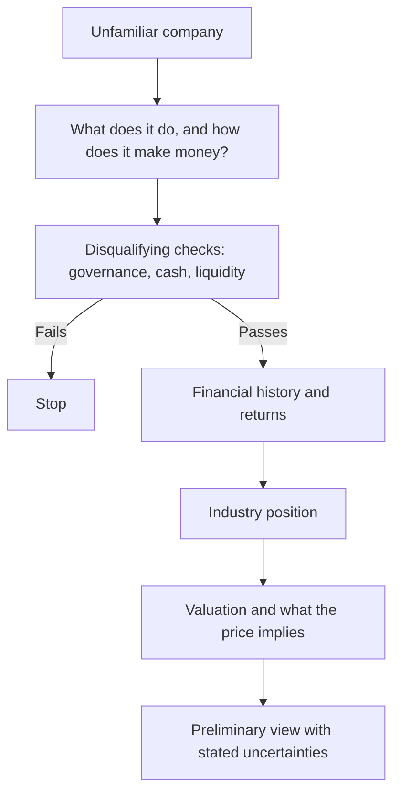

# Reading a Company You Have Never Seen

## The Problem / Why this matters
An analyst is periodically handed an unfamiliar company and asked for a view quickly — in an interview, in a screening exercise, or when a name surfaces unexpectedly. There is an efficient order for this, and following it produces a defensible preliminary view in a couple of hours rather than a vague impression after a day.

## Core Idea
Work from **structure to numbers to view**, in that order, and eliminate the disqualifying issues first — because most companies fail an early check, and discovering that after building a model is wasted effort.

## Why it works this way
Some findings terminate the analysis. Governance failure, unreadable disclosure, or liquidity too thin to deploy against make everything downstream irrelevant. Checking those first costs minutes and saves hours, and the checks that are cheapest are also the ones with the highest hit rate.

## Full technical content

### Step 1 — What is the business? (15 minutes)

- **How does it make money** — product, customer, pricing, and where in the value chain it sits.
- **Revenue split** by segment, geography and product.
- **Who are the competitors.**
- **What drives demand and supply** in this industry.

Sources: the annual report's business section, the latest investor presentation, and the offer document if recently listed.

### Step 2 — The disqualifying checks (20 minutes)

Run these before anything else, because a failure ends the exercise:

| Check | Where | Fails if |
|---|---|---|
| **Cumulative CFO vs cumulative PAT**, 5 years | Cash flow statements | Persistent large gap unexplained by growth |
| **Auditor's report** | Annual report | Qualification, adverse opinion, going-concern emphasis, recent resignation |
| **Promoter pledge** | Shareholding pattern | High and rising, expressed against total equity |
| **Related-party transactions** | Notes | Large, growing, net cash outflow to promoter entities |
| **Contingent liabilities** | Notes | Large relative to net worth, especially group guarantees |
| **Liquidity** | Traded value | Below deployable size |
| **Dilution history** | Share count over 5 years | Persistent issuance without corresponding growth |

**These take twenty minutes together and eliminate a large proportion of candidates.** The forensic and audit chapters describe each in detail; the point here is the sequence.

### Step 3 — The financial history (30 minutes)

- **Five to ten years** of revenue, EBITDA, PAT, and — most importantly — **RoCE**.
- **Returns through a downturn**, which is the durability evidence.
- **Working capital days** and their trend.
- **Debt and its maturity profile.**
- **Capex versus depreciation**, indicating whether the asset base is growing or shrinking.
- **Share count trend**, per the ESOP chapter.

**Look for the shape, not the detail:** is this a business that earns above its cost of capital consistently, occasionally, or not at all? That single question determines what kind of analysis is appropriate.

### Step 4 — Industry position (30 minutes)

- **Market share** and its direction, computed from listed peers where possible.
- **Cost position** relative to competitors.
- **What protects the returns**, per the franchise chapter — and whether it is strengthening.
- **Industry capacity additions**, which determine the next few years.

### Step 5 — Valuation and implied assumptions (30 minutes)

- **Current multiples** against the company's own history and against peers.
- **A reverse-DCF** — what growth and margins does the current price imply, and are they plausible?
- **Which method is appropriate**, per the triangulation chapter: normalised earnings for a cyclical, P/B for a lender, EV/EBITDA where leases and depreciation policies differ.

### Step 6 — The preliminary view

State it with its uncertainties:
- What the business is and whether it earns its cost of capital.
- What the price implies and whether that is plausible.
- What would need to be true for the stock to work.
- **What you have not yet checked** and would before committing.

**Being explicit about the last item is what makes a two-hour view professional rather than superficial.**

### The interview version

Given a company and thirty minutes, the compressed order is: business model, cash versus profit, RoCE history, promoter and governance flags, what the price implies, and a stated view with its uncertainties. **Announcing the order before starting demonstrates process**, which is what is actually being assessed.

## Common mistakes
- Building a **model** before running the disqualifying checks.
- Reading the **P&L** without the cash flow statement.
- Skipping the **auditor's report** and shareholding pattern.
- Assessing valuation before establishing whether the business earns its **cost of capital**.
- Producing a view without stating **what remains unchecked**.
- Applying the wrong **valuation method** for the business type.

## Interview angle
"Here's a company you've never seen. What do you do first?" State the order, because the order is the answer: understand what the business does and how it makes money, then run the disqualifying checks before anything else — cumulative operating cash flow against cumulative profit over five years, the auditor's report for qualifications or a recent resignation, promoter pledging expressed against total equity, the related-party note for net outflows to promoter entities, and contingent liabilities against net worth. Those take about twenty minutes and eliminate a large share of candidates, and discovering a problem there after building a model is wasted work. Only then look at ten years of RoCE to establish whether this business earns its cost of capital consistently, occasionally or never — which determines what valuation method is even appropriate. Finish with a reverse-DCF to establish what the current price implies and whether those assumptions are plausible, and state your preliminary view alongside what you have not yet checked, because being explicit about that is what makes a fast view professional rather than superficial.
