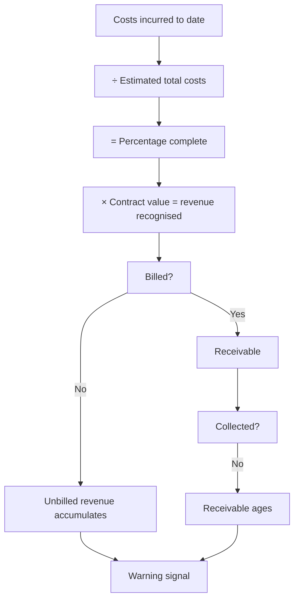

# Percentage-of-Completion and Revenue Recognition Risk

## The Problem / Why this matters
Where revenue is recognised over time rather than at a point in time, the amount recognised depends on management's estimate of progress and of total expected costs. Both are judgements, both are revised, and a revision restates profit already reported. This is the accounting area where the largest Indian corporate failures have originated, and the disclosures that reveal stress are available well before the failure.

## Core Idea
Over-time revenue recognition converts **estimates into reported profit**, so the analysis is about the reliability of those estimates — tested principally by whether the recognised revenue turns into billings and then into cash.

## Why it works this way
Under the percentage-of-completion approach, revenue recognised equals total contract value times the proportion of estimated total cost incurred. If total estimated cost is understated, progress appears greater than it is and revenue is pulled forward. The correction arrives when the estimate is revised — which reverses previously recognised profit, sometimes years later and in a large amount.

## Full technical content

### Where it applies

- **Construction and EPC**, the classic case.
- **Capital goods** with long-cycle orders.
- **Real estate**, depending on the recognition basis applied.
- **Software and services** with long implementation contracts.
- **Defence and shipbuilding**, with very long cycles.

### The chain to test

Revenue recognised → billed → collected. **Each break in that chain is a warning, and each is visible on the balance sheet:**

| Stage | Balance sheet item | What a build means |
|---|---|---|
| Recognised but not billed | **Unbilled revenue / contract assets** | Milestones not certified, specifications disputed, customer not ready |
| Billed but not collected | **Receivables**, with ageing | Customer payment difficulty or dispute |
| Held pending completion | **Retention money** | Normal, but the quantum and ageing matter |

**Track each as a proportion of revenue over several years.** Rising unbilled revenue relative to revenue is the earliest signal available in these sectors, and it is disclosed quarterly by many companies.

### The cost estimate

The input that drives everything:
- **Understating total estimated cost** accelerates revenue recognition, and it can be done without any intent to deceive — optimism is sufficient.
- **Revisions restate past profit.** A large upward revision to estimated costs reduces the percentage complete and reverses previously recognised revenue.
- **Disclosure of changes in estimates** is required, and reading it is the direct check.
- **Loss-making contracts** must be provided for in full once identified, so an onerous contract provision is an admission that a project will lose money over its life.

**A company that repeatedly revises cost estimates upward has an estimation problem**, which is either capability or discipline — and either way the reported margins on ongoing projects should be discounted.

### The claims and variations question

Contractors frequently perform work outside the original scope and claim additional payment. Recognising revenue on unsettled claims is aggressive because settlement is uncertain and often takes years or arbitration.

- **Check the quantum** of revenue recognised on claims.
- **Check the historical settlement rate** — what proportion of past claims were recovered, and at what discount?
- **Check the ageing** of claim-related balances.

**Where claim recoveries are a material share of profit and the settlement record is poor, the earnings are substantially estimates**, and that should be said plainly.

### The forensic checks

Applying the general framework to this specific area:
1. **Cumulative CFO versus cumulative PAT** over five years — in these sectors the gap is expected during growth, so the question is the trend and the degree.
2. **Unbilled revenue days** and their trend.
3. **Receivable days and ageing**, including the proportion beyond one year.
4. **Provisions for doubtful receivables** relative to aged balances.
5. **Changes in cost estimates** disclosed in the notes.
6. **Onerous contract provisions**, which signal identified losses.
7. **Auditor's Key Audit Matters** — revenue recognition on long-term contracts is a standard KAM in these sectors, and the description tells you where the auditor focused.

**The audit report's KAM on this topic is genuinely informative** and, per that chapter, sends you directly to the note worth reading.

### Modelling it

- **Do not forecast revenue independently of the order book** and the execution rate.
- **Model unbilled and receivables explicitly**, since they determine the cash outcome.
- **Assume some slippage** relative to guided completion timelines, per the capex chapter's evidence on schedules.
- **Treat claim-based revenue separately** and probability-weight it.
- **Model the working capital funding requirement**, which for a growing contractor is the binding constraint and frequently requires debt or equity that must appear in the model.

## Common mistakes
- Accepting recognised revenue without tracing it to **billing and collection**.
- Ignoring **unbilled revenue** as the earliest warning signal.
- Missing **changes in cost estimates**, which restate past profit.
- Treating **claim-based revenue** as equivalent to contracted revenue.
- Overlooking **onerous contract provisions** as an admission of project losses.
- Not reading the **KAM** on revenue recognition, which is standard in these sectors.
- Forecasting revenue independently of the order book and execution rate.
- Ignoring the working-capital funding requirement of growth.

## Interview angle
"What worries you about percentage-of-completion accounting?" Explain the mechanism first: revenue recognised is contract value times costs incurred over *estimated* total costs, so understating the cost estimate accelerates revenue — and no intent to deceive is required, optimism is sufficient. The correction comes when estimates are revised, which reverses profit already reported, sometimes years later. Then give the checks: trace recognised revenue through to billing and collection, because unbilled revenue rising faster than revenue is the earliest available warning and means work is recognised but not billable, followed by receivable ageing if it does get billed. Read the disclosed changes in cost estimates and any onerous contract provisions, which are an admission that a project will lose money over its life. And treat claim-based revenue separately, checking the company's historical settlement rate on claims — because where claim recoveries are a material share of profit and the recovery record is poor, the earnings are substantially estimates. Add that revenue recognition on long-term contracts is a standard Key Audit Matter in these sectors, and the KAM description tells you exactly where the auditor concentrated.
