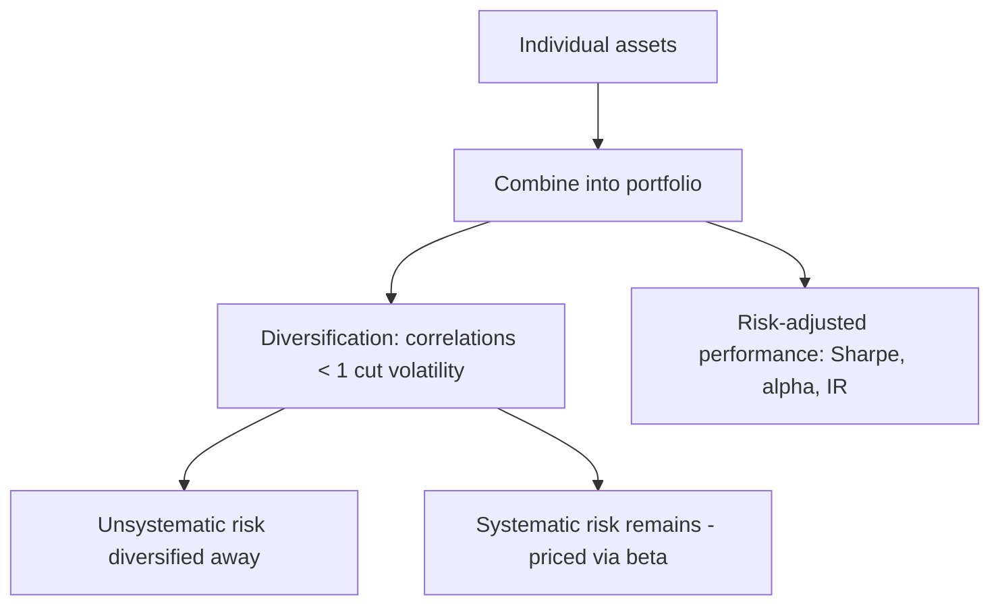

# Portfolio Construction & Risk

## The Problem / Why this matters
Owning a single great stock is risky; investing is really about building a **portfolio** — combining positions so the whole is better (higher return per unit of risk) than the parts. How you size positions, diversify, benchmark, and measure risk-adjusted performance is the core of asset management and any investing role. Interviewers test diversification, systematic vs unsystematic risk, beta, and the performance ratios.

## Core Idea
Portfolio construction combines assets to maximize expected return for a given level of risk, exploiting **diversification** (imperfectly correlated assets reduce portfolio volatility). Risk splits into **systematic** (market, undiversifiable) and **unsystematic** (specific, diversifiable), and performance is judged on a **risk-adjusted** basis (Sharpe, alpha, information ratio), not raw return.

## Why it works this way
Because asset returns aren't perfectly correlated, combining them means their ups and downs partly offset, lowering portfolio volatility without proportionally lowering return — the "only free lunch in finance." But the shared exposure to the economy (systematic risk) can't be diversified away, so it's what investors are ultimately compensated for (via beta and the risk premium).

## Full technical content

**Risk decomposition:**
- **Unsystematic (specific/idiosyncratic) risk** — company/sector-specific; **diversifiable** by holding many uncorrelated names.
- **Systematic (market) risk** — common exposure to the economy; **not diversifiable**; measured by **beta**; it's what earns the risk premium.

**Diversification.** Combining assets with correlation < 1 reduces portfolio standard deviation for a given return. The benefit is largest when correlations are low/negative; most idiosyncratic risk is removed with ~20–30 well-chosen names, leaving mainly systematic risk.

**Modern Portfolio Theory (Markowitz).** For a given return, there's a minimum-variance portfolio; the set of best risk-return combinations is the **efficient frontier**. Adding a risk-free asset gives the **Capital Market Line**; the best risky portfolio is the market portfolio (→ CAPM).

**Position sizing & construction approaches:**
- **Concentration vs diversification** — high-conviction concentrated books (fewer, larger positions) vs broadly diversified books; a trade-off between idiosyncratic risk and edge.
- **Active vs passive** — active tries to beat a benchmark (higher fees, tracking error); passive replicates it cheaply.
- **Benchmark-relative** — most funds are measured vs an index; **active weights** (overweight/underweight vs the benchmark) express views; **tracking error** measures deviation.
- **Constraints** — position limits, sector caps, liquidity, mandate.

**Risk-adjusted performance metrics:**
| Metric | Formula | Measures |
|---|---|---|
| **Sharpe ratio** | (Rp − Rf) / σp | Excess return per unit of total risk |
| **Treynor ratio** | (Rp − Rf) / βp | Excess return per unit of market risk |
| **Alpha (Jensen's)** | Rp − [Rf + β(Rm − Rf)] | Return above CAPM (skill) |
| **Information ratio** | Active return / tracking error | Consistency of outperformance vs benchmark |
| **Beta** | Cov(Rp,Rm)/Var(Rm) | Sensitivity to the market |

Sharpe uses **total** risk (σ), Treynor uses **systematic** risk (β) — use Treynor when the portfolio is one part of a diversified whole. **Alpha** is the holy grail: return not explained by market exposure.

**Rebalancing.** Periodically returning to target weights (as prices drift) enforces "sell high, buy low" and controls risk.

## Worked examples

**Example 1 — diversification cuts risk.** Two stocks each with 20% volatility and a correlation of 0.3. A 50/50 portfolio has volatility = √(0.5²·0.2² + 0.5²·0.2² + 2·0.5·0.5·0.3·0.2·0.2) = √(0.01 + 0.006) ≈ √0.016 ≈ **12.6%** — well below the 20% of either stock alone, for the average return. That's the diversification benefit from correlation < 1.

**Example 2 — Sharpe ratio comparison.** Portfolio A returns 15% with 10% volatility; Portfolio B returns 20% with 25% volatility; risk-free 5%. Sharpe A = (15−5)/10 = **1.0**; Sharpe B = (20−5)/25 = **0.6**. B has the higher return but A is the better *risk-adjusted* performer — you'd prefer A (and could lever it to match B's return at lower risk).

**Example 3 — alpha vs beta.** A fund returned 18% when the market (beta 1.2 exposure) returned 12%, risk-free 5%. CAPM-expected = 5 + 1.2(12−5) = 13.4%. **Alpha = 18 − 13.4 = +4.6%** — genuine outperformance beyond what its market exposure explains. Distinguishing this skill (alpha) from just taking market risk (beta) is the whole game.

**Example 4 — building a 4-stock portfolio from scratch, with a concentration/diversification trade-off.** A PM has ₹10 cr to deploy across a high-conviction book. Four candidate holdings have expected returns and volatilities of: Stock A (18%, 22%), Stock B (14%, 15%), Stock C (22%, 30%), Stock D (11%, 12%), with an average pairwise correlation of 0.35 among them (a realistic same-market, imperfectly correlated basket). An equal-weight (25% each) portfolio's expected return is simply the weighted average: 0.25×(18+14+22+11) = **16.25%**. Portfolio volatility, using the full correlation structure, comes out meaningfully below the weighted-average volatility of 19.75% — illustrating the same diversification math as Example 1, but now across four holdings instead of two, where the benefit compounds as more imperfectly-correlated positions are added. **The concentration trade-off**: if the PM instead conviction-weights toward the highest-expected-return, highest-volatility names (say 40% A, 10% B, 40% C, 10% D), expected return rises to 0.4×18+0.1×14+0.4×22+0.1×11 = **18.5%**, but so does portfolio volatility, since the weight is now concentrated in the two highest-volatility, still-correlated names — a direct, numeric illustration of Part 18's "concentration vs diversification" trade-off (7.1's position-sizing discussion generalised to a full portfolio): more conviction-weighting raises both expected return *and* risk, and the PM must judge whether the extra ~2.25 points of expected return justifies the higher realised volatility and larger single-name drawdown exposure, given the fund's actual risk mandate and client risk tolerance.

**Example 5 — factor investing in practice.** A fund constructs a "value + momentum" combined strategy: it ranks its investable universe by a value score (low P/B, low P/E) and a momentum score (12-month trailing return, per Part 14's anomaly discussion), buying stocks that rank favourably on *both* factors simultaneously rather than either alone. The logic: value and momentum have historically shown low or even negative correlation as standalone factors (value tends to do best when momentum struggles, and vice versa, since they capture different market inefficiencies — value bets on mean-reversion in cheap stocks, momentum bets on trend continuation in recent winners) — combining them in a single portfolio can produce a smoother overall return stream than either factor run alone, the same diversification logic from Example 1 and Example 4, applied across *factors* rather than across individual stock-specific risk. This is why many quantitative equity strategies deliberately blend multiple, historically-uncorrelated factors (value, momentum, quality, low-volatility) rather than betting on a single factor.

## How it is tested in interviews
- **"Why diversify?"** — "Because assets aren't perfectly correlated, combining them lowers portfolio volatility for a given return — it removes diversifiable, idiosyncratic risk, leaving mostly systematic risk."
- **"Systematic vs unsystematic risk?"** — "Unsystematic is company-specific and diversifiable; systematic is market-wide, undiversifiable, and measured by beta — it's what earns the risk premium."
- **"What does the Sharpe ratio measure?"** — "Excess return per unit of total risk (volatility) — a risk-adjusted performance measure; higher is better."
- **"Sharpe vs Treynor?"** — "Sharpe uses total risk (σ); Treynor uses systematic risk (β). Use Treynor when the portfolio is part of a broader diversified portfolio."
- **"What is alpha?"** — "Return above what CAPM/beta predicts — the manager's skill, not explained by market exposure."

## Traps & common mistakes
- Judging on **raw return** instead of **risk-adjusted** return.
- Thinking diversification removes **all** risk — systematic risk remains.
- Confusing **Sharpe (total risk)** and **Treynor (systematic risk)**.
- Confusing **alpha** (skill) with **beta** (market exposure) — high returns from leverage/beta aren't alpha.
- Over-diversifying to closet-indexing (paying active fees for index-like returns).

## First-principles recap
- Portfolios exploit **diversification** (correlations < 1) to raise return per unit of risk.
- Risk = **systematic** (market, priced via beta) + **unsystematic** (specific, diversifiable).
- Judge performance **risk-adjusted**: Sharpe, Treynor, alpha, information ratio.
- **Alpha** = skill beyond market exposure; **beta** = market exposure.
- Rebalance to targets; manage tracking error vs the benchmark.

## Quick-reference
| Metric | Formula |
|---|---|
| Beta | Cov(Rp,Rm)/Var(Rm) |
| Sharpe | (Rp − Rf)/σp |
| Treynor | (Rp − Rf)/βp |
| Alpha | Rp − [Rf + β(Rm − Rf)] |
| Information ratio | Active return / tracking error |
| Diversifiable | Unsystematic only |
