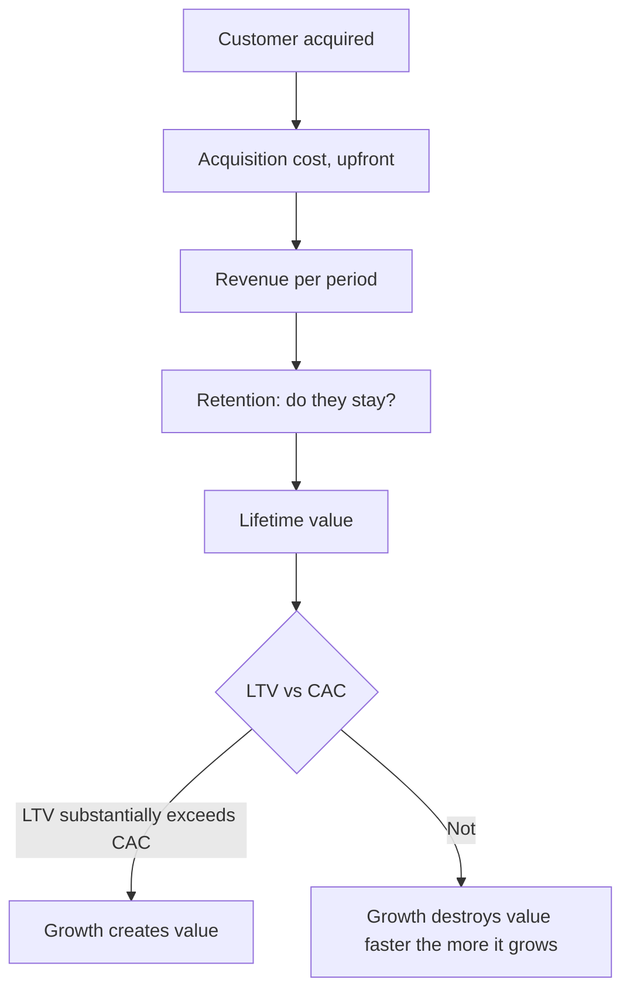

# Subscription and Recurring Revenue Metrics

## The Problem / Why this matters
Subscription businesses report metrics that traditional financial statements do not capture — recurring revenue, churn, cohort retention, lifetime value against acquisition cost. These are genuinely informative, and they are also company-defined, inconsistently computed and easily flattered. An analyst covering any subscription-model business needs to know which metrics carry information and how each can be manipulated.

## Core Idea
Subscription economics reduce to **whether a customer generates more value over their life than they cost to acquire, and whether they stay** — and cohort data is the only evidence that settles it, because aggregate metrics can improve while every cohort deteriorates.

## Why it works this way
A subscription business spends upfront to acquire a customer and recovers it over time. Growth therefore consumes cash while creating value, and reported losses are consistent with an excellent business or a terrible one. Only the unit economics distinguish them, and only cohort data shows whether those economics are improving or deteriorating.

## Full technical content

### The metrics and their weaknesses

| Metric | What it should show | How it gets flattered |
|---|---|---|
| **Recurring revenue (ARR/MRR)** | Contracted, repeatable revenue | Including non-recurring items; annualising a good month |
| **Gross churn** | Customers or revenue lost | Measured on customers rather than revenue, hiding loss of large accounts |
| **Net revenue retention** | Expansion within retained customers net of churn | Can exceed 100% while customer count falls |
| **CAC** | Fully loaded cost to acquire | Excluding parts of sales and marketing spend |
| **LTV** | Gross-margin value over the customer's life | Assuming an unrealistically long life or ignoring servicing cost |
| **Payback period** | Months to recover CAC | Computed on revenue rather than gross profit |

**Two specific corrections matter most:**
- **Churn should be measured on revenue, not customers.** Losing 5% of customers who represent 20% of revenue is a very different event from losing 5% of revenue.
- **Payback should be computed on gross profit, not revenue**, since servicing the customer costs money.

### Cohort analysis — the evidence that settles it

Aggregate metrics can improve while the business deteriorates, because rapid growth means new customers dominate the average. **Cohort data — tracking each acquisition period separately — is the only way to see the truth:**

- **Are later cohorts retaining as well as earlier ones?** Deteriorating retention in newer cohorts means the company is acquiring worse customers as it scales, which is the most common failure in subscription businesses and is invisible in aggregate metrics.
- **Is revenue per customer expanding within a cohort?** Genuine expansion is the strongest signal available.
- **Is CAC rising by cohort?** Rising acquisition cost with flat retention means unit economics are deteriorating.

**Where a company does not disclose cohort data, the claim of good unit economics is unverified**, and that should be stated plainly.

### The growth-versus-profitability question

- **Losses from customer acquisition are investment**, provided the acquired customers are profitable over their life.
- **Losses from negative contribution margin are not.** A business losing money on each customer's ongoing service does not improve with scale.
- **The distinction is contribution margin per customer after servicing**, before acquisition spend. Positive means growth is investment; negative means growth accelerates the loss.
- **Test what happens if growth stops:** at zero new acquisition, does the business generate cash? If yes, the loss is discretionary investment. If no, it is structural.

**That last test is the clearest single question to ask about any loss-making subscription business**, and it is answerable from disclosed unit economics.

### Valuation approaches

- **Revenue multiples** are standard and crude; they must be adjusted for growth, gross margin and retention, since a business with 130% net revenue retention deserves a very different multiple from one at 85%.
- **DCF on cohort economics** — model the existing customer base's value separately from new acquisition, which distinguishes what the company already has from what it must still win.
- **Rule-of-thumb combinations** of growth and margin are widely used and weakly grounded; treat them as screening heuristics.
- **The reverse-DCF check** applies with full force: what customer count, retention and pricing does the current price imply, and are those figures plausible against the addressable market?

### Where the model applies in Indian markets

- **Enterprise software and SaaS**, including India-based companies selling globally.
- **Telecom and broadband**, the original subscription businesses, where ARPU and churn are long-established metrics.
- **Media and streaming.**
- **Insurance**, where persistency is the equivalent of retention, per that chapter.
- **Asset management**, where AUM retention and flows perform the same role.
- **Consumer subscription** models in health, education and commerce.

## Common mistakes
- Measuring churn on **customers** rather than revenue.
- Computing payback on **revenue** rather than gross profit.
- Accepting **LTV** built on an assumed customer life with no cohort evidence.
- Relying on **aggregate** metrics that improve while cohorts deteriorate.
- Excluding parts of sales and marketing from **CAC**.
- Treating all losses as investment without checking **contribution margin**.
- Applying a revenue multiple without adjusting for **retention**.
- Accepting unit-economics claims where **no cohort data** is disclosed.

## Interview angle
"A subscription company is loss-making but growing 60%. How do you assess it?" Separate acquisition investment from structural loss: compute contribution margin per customer after servicing costs but before acquisition spend, and ask what the business would generate if it stopped acquiring entirely — if it turns cash-generative, the loss is discretionary investment, and if not, growth is accelerating a structural problem. Then go to cohort data, because aggregate metrics improve automatically when new customers dominate the base, and the real question is whether later cohorts retain as well as earlier ones — deteriorating retention in newer cohorts means the company is buying worse customers as it scales, which is the most common failure mode and is invisible in the aggregate. Add the two measurement corrections that catch people out: churn should be measured on revenue rather than customer count, since losing a few large accounts is very different from losing many small ones, and CAC payback should be computed on gross profit rather than revenue. And note plainly that where cohort data is not disclosed, the unit-economics claim is unverified.
