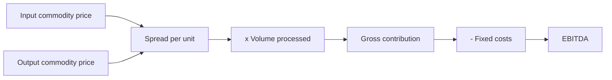

# Commodity Linkage and Spread Analysis

## The Problem / Why this matters
For refiners, petrochemical producers, fertiliser makers, smelters and many chemical companies, profitability is determined by the spread between an output price and an input price, both of which are globally traded and publicly quoted. This means earnings are substantially computable in real time from public data — a rare situation — and analysts who track the spreads can forecast quarters with precision while those modelling revenue growth cannot.

## Core Idea
Where a business converts one commodity into another, model the **spread per unit times volume**, not revenue times a margin — because the spread is observable and the margin is not.

## Why it works this way
The company is a converter. Its revenue and costs both move with commodity prices, often together, so the margin percentage is unstable and uninformative while the absolute spread per tonne or per barrel is the actual economics. A revenue-growth model conflates a price move that passes straight through with a genuine change in profitability.

## Full technical content

### The spread businesses

| Sector | The spread |
|---|---|
| **Refining** | Gross refining margin — product slate value less crude cost |
| **Petrochemicals** | Polymer or intermediate price less feedstock (naphtha, ethane, gas) |
| **Fertilisers** | Product price less gas or phosphate rock, adjusted for subsidy |
| **Aluminium and zinc** | Metal price less power, alumina and conversion cost |
| **Steel** | Steel price less iron ore and coking coal |
| **Sugar** | Sugar price less cane cost, plus ethanol and power |
| **Paper** | Paper price less pulp or waste paper |
| **Commodity chemicals** | Product less feedstock, per product chain |

### Modelling the spread

1. **Identify the exact input and output specifications** — the crude grade, the polymer grade, the ore quality. Generic benchmarks may not match what the company actually buys and sells.
2. **Find the published price series** for each. Most are available from exchanges, price reporting agencies or industry sources, many free.
3. **Construct the spread** and compare to the company's realised spread over history to establish the relationship — companies rarely realise the benchmark exactly, and the discount or premium is itself informative and usually stable.
4. **Apply volume**, which is capacity times utilisation.
5. **Deduct fixed costs**, which are relatively stable and estimable from history.
6. **Sense-check** against reported results for past quarters.

**Once calibrated, this model forecasts quarters with real precision**, because most of the inputs are observable during the quarter rather than after it. It is one of the few places in equity research where the result is substantially computable in advance.

### What determines the spread

- **Global supply and demand** for both the input and the output, which move independently.
- **Capacity additions globally** — the single most important medium-term driver, and public, per the capex chapter's discipline applied worldwide.
- **Feedstock advantage** — a producer with access to cheap gas or captive ore has a structural spread advantage that persists.
- **Product slate flexibility** — the ability to shift output toward whichever product carries the best spread is genuine optionality, per that chapter.
- **Freight and logistics**, which determine landed economics and regional differentials.
- **Trade policy** — duties and anti-dumping actions change regional spreads materially and are dated events.

### Company-specific factors

The spread is the industry variable; these determine the company's realisation of it:
- **Complexity and conversion efficiency** — a more complex refinery captures more value from the same crude.
- **Integration** — captive feedstock or captive power converts a purchased input into an internal transfer, per the metals chapter.
- **Cost position** on the global curve, which determines survival at trough spreads.
- **Contract structure** — formula-linked contracts pass the spread through; fixed contracts do not.
- **Inventory effects**, which can dominate a quarter, per the inventory chapter — separate inventory gains from operating spread.

### Valuation implications

- **Spread cyclicality means P/E is inverted**, per the cyclicals chapter. Peak spreads produce peak earnings and a low P/E that signals danger, not opportunity.
- **Value on mid-cycle spreads**, computed over a full cycle.
- **EV per tonne of capacity** against replacement cost is the cycle-independent anchor.
- **Trough spread survival** is the balance sheet question that determines whether a company reaches the recovery.
- **Structural spread advantage** — feedstock access, integration, complexity — deserves a genuine premium, since it persists through the cycle rather than reflecting current conditions.

## Common mistakes
- Modelling **revenue growth and a margin percentage** rather than spread times volume.
- Using a **generic benchmark spread** that does not match the company's actual slate.
- Not calibrating the company's realised spread against the benchmark.
- Ignoring **global capacity additions**, which determine the medium-term spread.
- Mistaking **inventory gains** for operating performance.
- Applying **P/E at peak spreads**.
- Treating a temporary spread advantage as structural.

## Interview angle
"How do you forecast a petrochemical company's quarter?" Say the business is a converter, so model the spread per tonne times volume rather than revenue times a margin — because when both input and output prices move together the margin percentage is unstable and uninformative while the absolute spread is the actual economics. Then be specific about construction: identify the exact feedstock and product grades rather than using a generic benchmark, take the published price series, and calibrate the company's realised spread against the benchmark over history, since the discount or premium is usually stable and is itself informative. Apply capacity times utilisation for volume and deduct a fixed-cost base estimated from history. Note what makes this unusual — most of the inputs are observable during the quarter, so the result is substantially computable in advance rather than forecast. Finish with the valuation discipline: spread cyclicality means P/E is inverted, so value on mid-cycle spreads computed over a full cycle and use EV per tonne against replacement cost as the cycle-independent anchor, while separating inventory gains from the operating spread.
