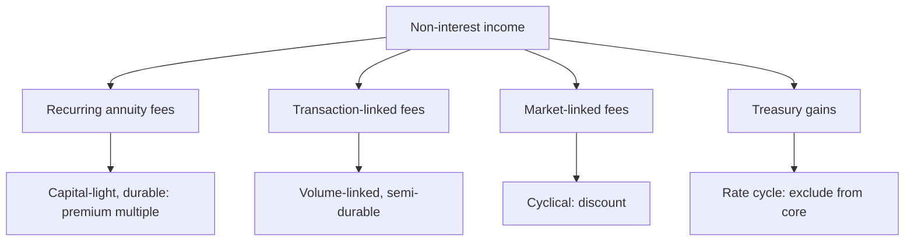

# Fee Income and Non-Interest Revenue in Financials

## The Problem / Why this matters
Analysts covering banks concentrate on net interest margin and asset quality, and treat fee income as a residual line. But fee income is capital-light, is not exposed to credit risk, and in several Indian banks is a substantial and growing share of operating revenue. It also varies enormously in quality — some fee streams are annuity-like and some are entirely cyclical — and the mix determines how much of it deserves a premium multiple.

## Core Idea
Fee income should be **decomposed by type and assessed for recurrence**, because capital-light annuity fees and market-linked transaction fees have completely different value despite appearing on the same line.

## Why it works this way
Fee income requires little or no capital, so a rupee of fee profit generates a much higher return on equity than a rupee of lending profit. That justifies a higher multiple — but only for the portion that recurs. A fee stream driven by capital-market activity disappears in a downturn precisely when the lending book is also under pressure.

## Full technical content

### The categories

| Type | Examples | Durability |
|---|---|---|
| **Annuity fees** | Account maintenance, custody, trusteeship, asset management fees on AUM | High — recurring while the relationship lasts |
| **Transaction fees** | Payments, remittances, trade finance, card interchange | Moderate — volume-linked but structurally growing |
| **Lending-linked fees** | Processing, documentation, syndication | Tied to loan growth; falls with disbursement |
| **Distribution commissions** | Insurance, mutual funds sold through the branch network | Market-sensitive and regulation-sensitive |
| **Capital market fees** | Broking, investment banking, wealth transaction fees | Highly cyclical |
| **Treasury gains** | Bond and forex trading | Rate-cycle driven; not core, per the treasury chapter |

**The distribution-commission line deserves particular attention** because it is subject to regulatory change — commission structures on insurance and mutual fund distribution have been altered by regulators before, and a bank earning a large share of fees this way carries a policy exposure that the credit analysis does not capture.

### The analysis

1. **Decompose the line** from the disclosure, which most banks provide in some detail.
2. **Compute each as a share** of operating revenue and track the trend.
3. **Classify by durability** and assess whether the mix is improving or deteriorating.
4. **Compute core fee income** excluding treasury and capital-market items, which is the figure that should be capitalised at a premium.
5. **Check the correlation with lending** — fees tied to disbursement fall exactly when credit costs rise, so they compound the cycle rather than diversifying it.
6. **Assess regulatory exposure** on distribution and interchange income.

**Point 5 is the one most often missed.** Fee income is frequently described as diversification, but lending-linked and market-linked fees are positively correlated with credit stress, so they amplify rather than dampen the cycle. **Genuine diversification comes only from the annuity portion.**

### Valuation treatment

- **Value the fee business separately** where it is large — a capital-light annuity stream deserves a higher multiple than the lending book, and a sum-of-the-parts makes that explicit.
- **Return on equity decomposition** — separating the return generated by fee activities from that generated by lending shows where the franchise's value actually sits.
- **Where a bank owns asset management, insurance or broking subsidiaries**, these are separately valuable and are frequently under-recognised inside a consolidated bank valuation. Valuing them on their own peer multiples in an SOTP is standard practice and often reveals substantial value.
- **Discount the cyclical portion** rather than capitalising a peak year.

### For NBFCs and other financials

- **Fee income is generally smaller** and more lending-linked, so the diversification argument is weaker still.
- **Asset managers** are almost entirely fee businesses, and the analysis there is AUM, yield and flows, per that chapter.
- **Insurers** earn through underwriting and investment rather than fees, and the framework differs.
- **Exchanges and depositories** are transaction-fee businesses with high operating leverage and regulated pricing.

## Common mistakes
- Treating **fee income as a single line** rather than decomposing it.
- Describing fee income as **diversification** when much of it is positively correlated with credit stress.
- Capitalising a **peak-cycle** capital-market fee year.
- Including **treasury gains** in core fee income.
- Ignoring **regulatory exposure** on distribution commissions.
- Missing separately valuable **subsidiaries** inside a consolidated bank.
- Applying the lending multiple to a capital-light annuity stream.

## Interview angle
"A bank says a third of its revenue is fee income, so it is diversified. Do you agree?" Only partly, and the decomposition is the answer: annuity fees such as account maintenance, custody and asset management on AUM are capital-light, recurring and genuinely deserving of a higher multiple, but lending-linked processing fees fall exactly when disbursement slows, and capital-market and distribution fees fall in a downturn too — so those are positively correlated with credit stress and amplify the cycle rather than diversifying it. Say that you would compute core fee income excluding treasury gains and capital-market items and capitalise only that at a premium, while discounting the cyclical portion rather than extrapolating a peak year. Add the regulatory point, since commission structures on insurance and mutual fund distribution have been changed by regulators before and a bank earning heavily from that channel carries a policy exposure the credit analysis does not capture. And note that where the bank owns asset management, insurance or broking subsidiaries, those are separately valuable on their own peer multiples and are frequently under-recognised inside a consolidated valuation.
