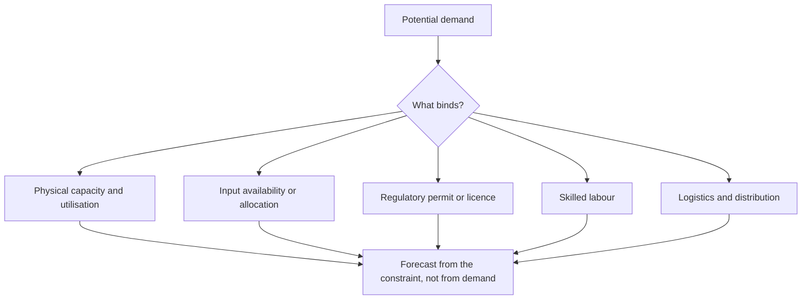

# Capacity Constraints and Supply Bottlenecks

## The Problem / Why this matters
Demand forecasts dominate equity analysis, but revenue cannot exceed what a company can produce and deliver. Where a binding constraint exists — physical capacity, a scarce input, a regulatory permit, skilled labour, or logistics — the growth forecast is determined by supply rather than by demand, and a model built from a market-growth assumption will simply be wrong.

## Core Idea
Identify the **binding constraint** and forecast from it, because in a supply-constrained business the demand outlook is irrelevant to near-term revenue.

## Why it works this way
Output is limited by the tightest link in the chain. A company at 94% utilisation cannot grow 20% next year however strong demand is, and a company whose scarce input is allocated cannot process more than its allocation. Recognising which constraint binds converts an uncertain demand forecast into a much more reliable supply calculation.

## Full technical content

### Identifying the binding constraint

| Constraint | Evidence |
|---|---|
| **Physical capacity** | Utilisation approaching practical maximum; disclosed capacity and production |
| **Input availability** | Long-term supply agreements, allocation systems, import dependence |
| **Regulatory** | Licence conditions, quotas, environmental consent limits on output |
| **Labour** | Skilled-worker shortage, attrition, wage inflation above sector |
| **Logistics** | Port, rail or warehouse capacity; freight availability |
| **Working capital** | Inability to fund the inventory and receivables that growth requires |

**The working-capital constraint is the most overlooked.** A profitable, growing company can be unable to grow further because it cannot fund the working capital, which is a supply constraint expressed financially — and the capital-structure chapter's point that unfunded growth plans are model inconsistencies applies directly.

### Effective versus nameplate capacity

- **Nameplate is a design figure.** Practical maximum utilisation is lower after planned maintenance, changeovers, product-mix constraints and quality requirements.
- **Utilisation above historical peaks** is unlikely to persist and often comes with cost or quality penalties.
- **Debottlenecking** — incremental investment to raise output from existing assets — is far cheaper per unit than greenfield capacity and is frequently the highest-return capex a company can do. **Ask about debottlenecking potential**, which companies disclose when asked and which is often ignored in models.

### Forecasting when supply binds

1. **Establish practical capacity**, not nameplate.
2. **Establish current utilisation** from disclosed production and capacity.
3. **Identify the headroom**, which is the maximum near-term volume growth without capex.
4. **Check the capacity addition pipeline** — commissioning dates, with a slippage haircut per the capex chapter.
5. **Model volume as constrained** until the new capacity ramps.
6. **Model pricing separately**, because a supply-constrained producer in a demand-strong market has pricing power — **the constraint that limits volume growth simultaneously supports margin**, which is why constrained periods are often highly profitable ones.

**Point 6 is the analytical payoff.** Recognising a binding capacity constraint tells you volume growth is capped *and* that realisations should rise, which is a more useful and more specific forecast than a demand-based growth rate.

### Industry-level constraints

The same analysis at industry level determines the pricing environment:
- **Industry utilisation** above a threshold produces sharp pricing improvement, per the cement and cyclicals chapters.
- **Announced industry capacity** determines when the constraint relaxes, and it is public two to four years ahead.
- **Import capacity** can relieve a domestic constraint quickly where logistics permit, capping the pricing benefit.
- **Regulatory constraints on the whole industry** — environmental limits, permitting delays — can sustain a favourable pricing environment for years and are among the more durable sources of returns.

### Where constraints create opportunity

- **A company adding capacity into a constrained market** captures both volume and price, which is the most favourable configuration available and justifies capex that would otherwise look aggressive.
- **A company with idle capacity in a recovering market** grows at contribution margin with no incremental fixed cost — the cheapest growth there is, per the operating leverage chapter.
- **Debottlenecking** at low capital cost.
- **The constraint holder** — where a scarce input, permit or logistics asset is controlled by one participant, that position is worth more than the processing capacity around it.

## Common mistakes
- Forecasting from **demand** where supply binds.
- Using **nameplate** rather than practical capacity.
- Ignoring the **working-capital constraint** on growth.
- Missing **debottlenecking** potential, which is cheap capacity.
- Forecasting volume growth without checking **utilisation headroom**.
- Failing to raise the **price** assumption when volume is constrained.
- Ignoring **import availability**, which can relieve a domestic constraint and cap pricing.

## Interview angle
"The market is expected to grow 15%. What do you forecast for the company?" Ask what binds first — if the company is at 93% utilisation, it cannot grow 15% regardless of demand, so the forecast comes from capacity headroom, the commissioning schedule for new capacity with a slippage haircut, and practical rather than nameplate capacity. Then make the point that turns the constraint into a better forecast rather than just a lower one: a supply-constrained producer in a strong demand market has pricing power, so volume is capped *and* realisations should rise, which is more specific than any demand-derived growth rate. Add the constraints people miss — input allocation, regulatory output limits, skilled labour, and above all working capital, since a profitable company can be unable to grow because it cannot fund the inventory and receivables, which is a supply constraint expressed financially. And ask about debottlenecking, which raises output from existing assets at a fraction of greenfield cost and is frequently the highest-return capex available and absent from most models.
