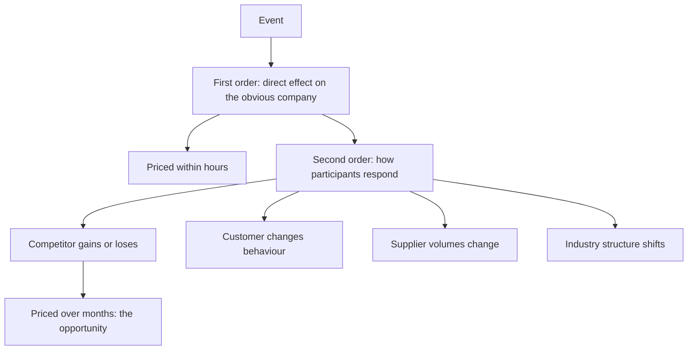

# The Second-Order Question

## The Problem / Why this matters
Markets price obvious consequences quickly. When a tariff is announced, the affected companies move within minutes. What takes longer to price — and where differentiated research earns its return — is the consequence of the consequence: who benefits from the affected company's response, which competitor gains, what the customer does next. Training the habit of asking "and then what?" is one of the more transferable skills in the job.

## Core Idea
The first-order effect is priced immediately; the **second-order effect** — how participants respond and what that does to others — takes months and is where the analytical opportunity sits.

## Why it works this way
First-order effects are visible in the announcement itself and require no analysis. Second-order effects require knowing the industry structure well enough to predict responses, which is exactly the knowledge an analyst covering a sector accumulates and a generalist reading the headline does not have.

## Full technical content

### The pattern, with examples of the reasoning

**A regulation raises compliance costs for an industry.**
- First order: costs rise, margins fall for everyone.
- Second order: smaller players cannot afford compliance and exit or sell; the industry consolidates; **the largest compliant player ends up with better pricing and higher share than before the regulation**. The policy chapter's reframing — who survives it best — is exactly this.

**A large competitor announces aggressive capacity expansion.**
- First order: future oversupply, negative for everyone.
- Second order: other players defer their own expansions; the competitor's balance sheet is stretched; if demand disappoints, the expanding player is most exposed and may become a distressed seller.

**An input cost spikes.**
- First order: margins compress across the industry.
- Second order: the integrated producer with captive supply gains relative advantage; unintegrated marginal players may exit; industry capacity falls; the survivors' pricing improves.

**A customer industry consolidates.**
- First order: supplier faces a larger, tougher buyer.
- Second order: the buyer rationalises its supplier list, which is catastrophic for those dropped and transformative for those retained. **The dispersion of outcomes among suppliers widens sharply**, which is precisely the dispersion the stock-selection chapter identifies as where selection pays.

**A subsidy is withdrawn.**
- First order: demand for the subsidised product falls.
- Second order: the lowest-cost producer can still price attractively without the subsidy and gains share as competitors withdraw.

### How to apply it systematically

For any material event, work through:
1. **Who is directly affected, and how much?** The first-order calculation.
2. **How will they respond?** Price, capacity, capital allocation, exit.
3. **Who benefits or loses from that response?** Competitors, suppliers, customers, substitutes.
4. **What does the industry look like afterwards?** Structure, concentration, pricing environment.
5. **Which of those effects is not yet priced?**

**Step 5 is the discipline that keeps it useful.** Second-order reasoning is only valuable where the conclusion differs from what is already in the price, and the reverse-DCF or peer-relative check establishes that.

### Where it applies most

- **Regulatory change**, per the policy chapter.
- **Capacity announcements**, per the capex and cyclicals chapters.
- **Competitor distress**, where a weakened competitor's retreat benefits the survivors.
- **Consolidation**, where industry structure improves for everyone remaining.
- **Technology shifts**, where the beneficiaries are frequently suppliers to the transition rather than the obvious disruptors.
- **Input shocks**, where relative cost position determines who gains.

### The cautions

- **Second-order effects take longer and are less certain.** A thesis resting on them needs a longer horizon and honest acknowledgement of the wider range of outcomes.
- **The chain can be extended indefinitely** — third and fourth order reasoning becomes speculation with a confident tone. **Stop where the evidence stops.**
- **Test the response assumption.** Predicting how a competitor will react requires knowing them, and where you do not, say so.
- **Check it is not already priced.** Sophisticated participants also think this way, and the second-order view is only differentiated if the price does not reflect it.

## Common mistakes
- Stopping at the **first-order** effect, which is already priced.
- Extending the chain into **speculation** dressed as analysis.
- Assuming a competitor's response without **evidence** about how they behave.
- Failing to check whether the second-order view is **already in the price**.
- Ignoring that second-order theses need a **longer horizon** and wider uncertainty.
- Missing that regulation which hurts an industry often **helps its strongest participant**.

## Interview angle
"A new regulation raises compliance costs across a sector you cover. What's the trade?" Resist the first-order answer, which is that margins fall and everyone is worse off, because that is priced within hours. Work the second order: compliance costs are largely fixed, so they fall hardest on smaller players who may exit or sell, the industry consolidates, and the largest compliant participant emerges with better pricing power and higher share than before — so the regulation that hurts the sector helps its strongest member. Say how you would test that rather than assert it: check the cost per unit of compliance against the smaller players' margins to see whether exit is plausible, check whether capacity actually leaves or is bought, and check whether the price already reflects it using a peer-relative or reverse-DCF comparison, because the second-order view is only differentiated if the market has not got there. Add the honest caveat — second-order effects take longer and carry wider uncertainty, so the horizon has to be longer, and the chain should stop where the evidence stops rather than extending into confident speculation.
