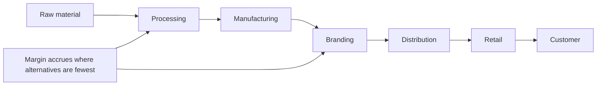

# Position in the Value Chain and Margin Pools

## The Problem / Why this matters
Two companies in the same industry can earn very different returns because they occupy different positions in the value chain, and margin accrues to the stage where scarcity sits rather than to the stage that adds the most visible value. Understanding where the profit pool is — and whether it is moving — explains most of the return differences within an industry and predicts where they will be in five years.

## Core Idea
Profit accrues to the **scarce stage** of a value chain, so map where the margin sits, why it sits there, and whether the scarcity is shifting.

## Why it works this way
Every stage in a chain competes for the total margin the end customer pays. The stage with the fewest credible alternatives — because of scale, technology, regulation, brand or resource access — captures a disproportionate share. Stages with many interchangeable participants capture little, however essential their function.

## Full technical content

### Mapping the pool

1. **Identify each stage** from raw material to end customer.
2. **Estimate the margin at each stage** — from listed participants' disclosures at each level, and from the difference between successive price points.
3. **Count the credible participants** at each stage; fewer means more pricing power.
4. **Identify what creates the scarcity** — scale, technology, regulation, brand, resource access, or distribution reach.
5. **Assess whether it is shifting**, which is the forward-looking question.

**The comparison across listed participants at different stages is directly available.** Where an industry has listed companies at raw material, manufacturing and retail levels, comparing their RoCE shows exactly where the profit sits — and this is a straightforward, under-used piece of analysis.

### What shifts the pool

| Shift | Effect |
|---|---|
| **Consolidation at one stage** | That stage gains pricing power over adjacent stages |
| **Technology removing a stage** | The disintermediated stage's margin is redistributed |
| **New channels** | E-commerce moving margin from distribution to brand or to platform, per the distribution chapter |
| **Regulation** | Can create or destroy scarcity at a stage, e.g. licensing |
| **Vertical integration** | Participants capturing adjacent margin directly |
| **Commoditisation** | A differentiated stage becoming interchangeable loses its pool |

**Disintermediation is the most consequential shift** and is the mechanism behind most technology-driven industry changes: when a stage can be bypassed, its entire margin is redistributed to whoever captures the customer relationship.

### The strategic questions for a company

- **Which stage does it occupy**, and is that the profitable one?
- **Is it integrating** into a more profitable stage, and can it succeed there?
- **Is its stage being squeezed** by consolidation on either side?
- **Does it control a genuine bottleneck**, which is the most defensible position available?

**Vertical integration is only value-creating if the company can actually compete at the stage it enters.** Buying into a higher-margin stage does not confer the capability that made that stage profitable, and integrated players frequently earn the commodity return at both stages — the capital allocation question the ROIIC chapter answers.

### Where the bottleneck sits

The most durable positions are bottlenecks — stages that cannot be bypassed and have few participants:
- **Regulatory bottlenecks** — licences, approvals, spectrum, mining leases.
- **Physical bottlenecks** — ports, pipelines, transmission, prime retail locations.
- **Technology bottlenecks** — a component with no qualified alternative.
- **Distribution bottlenecks** — reach that cannot be replicated quickly, though these erode as channels change.

**A bottleneck holder earns more than the processing capacity around it**, which is why control of the constraint is worth more than scale at an unconstrained stage.

### Applying it to stock selection

- **Prefer the stage with the pool**, other things equal — within an industry, the company at the profitable stage will out-earn the one at the commodity stage regardless of execution quality.
- **Watch for a pool shifting**, which is a structural re-rating or de-rating that plays out over years and is visible in advance.
- **Be sceptical of integration** unless the company can demonstrate capability at the new stage.
- **Identify the bottleneck holder** in any chain you cover; it is frequently the best business and is not always the largest company.

## Common mistakes
- Comparing companies within an industry without noting they occupy **different stages**.
- Assuming margin accrues to the stage adding the most **visible value**.
- Missing a **pool shift**, which is a multi-year structural change visible in advance.
- Crediting **vertical integration** without asking whether the company can compete at the new stage.
- Overlooking the **bottleneck holder**, often the best business in the chain.
- Ignoring **disintermediation** risk to a stage that can be bypassed.

## Interview angle
"Why do companies in the same industry earn such different returns?" Position in the value chain usually explains more than execution quality: margin accrues to the stage where credible alternatives are fewest, not to the stage adding the most visible value, so a component supplier with a qualified position can out-earn the assembler it sells to. Say how you would map it — take the listed participants at each stage of the chain and compare their RoCE directly, which shows where the profit pool actually sits, then identify what creates the scarcity at that stage: scale, technology, regulation, brand or resource access. Then move to the forward-looking question, which is whether the pool is shifting: consolidation at one stage gains pricing power over its neighbours, new channels move margin from distribution toward brands or platforms, and disintermediation redistributes an entire stage's margin to whoever captures the customer. Add two applications — prefer the stage with the pool, and be sceptical of vertical integration, because buying into a high-margin stage does not confer the capability that made it profitable.
