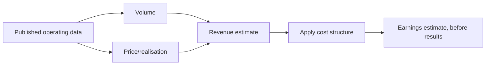

# Operating Metrics That Lead the Financials

## The Problem / Why this matters
Financial statements report what has already happened, with a lag of weeks after the period closes. Operating metrics — many published monthly or continuously, by companies, regulators and industry bodies — describe the same business in near real time. An analyst who tracks the right ones knows most of a quarter's outcome before it is reported, while one who waits for results is permanently behind.

## Core Idea
For most sectors a small number of **published operating metrics determine the financial outcome**, and they are available weeks or months earlier — so identify them, track them systematically, and forecast from them.

## Why it works this way
Revenue is volume times price, and both are frequently observable independently of the company's own reporting. Where a regulator, an exchange or an industry association publishes participant-level volume data, the analyst has the revenue driver directly, and only the price and cost assumptions remain.

## Full technical content

### The high-frequency series by sector

| Sector | Leading metric | Frequency |
|---|---|---|
| **Autos** | Dispatches by manufacturer; vehicle registrations | Monthly |
| **Cement** | Despatch and production data | Monthly |
| **Banks** | Aggregate credit and deposit growth; sectoral deployment | Fortnightly/monthly |
| **NBFC** | Disbursement disclosures; securitisation volumes | Quarterly, some monthly |
| **Telecom** | Subscriber and revenue market share data | Monthly/quarterly |
| **Insurance** | New business premium by insurer | Monthly |
| **Asset management** | AUM and net flows by fund house | Monthly |
| **Aviation** | Passenger traffic, load factor, market share | Monthly |
| **Hotels** | Occupancy and average rate data | Monthly, industry sources |
| **Power** | Generation, plant load factor, exchange prices | Daily |
| **Steel/metals** | Production data; global prices | Monthly/daily |
| **Exports** | Customs data by product category | Monthly |
| **Retail/consumer** | Some companies disclose monthly; channel checks otherwise | Varies |

**The regulator-published series are the most valuable** because they give participant-level data, which means market share is directly observable rather than estimated, per the market-share chapter.

### Building the tracking routine

1. **Identify the two or three metrics** that actually drive earnings in your sector — every sector has a small number.
2. **Find the publishing source and schedule**, and set the calendar.
3. **Build a historical series** relating the metric to reported financials, so you know the conversion.
4. **Update on release** and revise the estimate.
5. **Publish when the data materially changes the view**, which is a genuine service and is noticed.

**Step 3 is what turns data into a forecast.** Knowing that a manufacturer's dispatches translate to revenue at a certain realisation, with a certain lag, converts a monthly data point into an earnings estimate.

### The gaps between metric and financial

The adjustments that make the translation accurate:
- **Dispatches versus retails** in autos — the primary-versus-secondary distinction, per the distribution chapter. Dispatches are the company's revenue; retails are actual demand, and the gap is dealer inventory.
- **Volume versus realisation mix** — volume data alone misses premiumisation or down-trading.
- **Gross versus net** — insurance premium data, AUM figures and similar series may be gross of items the P&L nets out.
- **Consolidation scope** — published data may cover only part of what the company consolidates.
- **Timing differences** between the data period and the accounting period.

### Alternative and inferred data

Where official series do not exist:
- **Job postings**, per the employee-cost chapter, which lead hiring and therefore revenue in services.
- **App downloads and web traffic** for consumer platforms.
- **Satellite and shipping data** for commodity flows and construction progress.
- **Tender and procurement portals** for government-linked order flow.
- **Import/export data** at product level, which shows both company and competitor activity.
- **Electricity consumption** by industrial category, a general activity proxy.

**These are noisier and require validation against reported outcomes before being relied on** — the same calibration discipline as the read-across chapter: track, predict, check, and learn which sources actually predict.

### Using it well

- **Do not over-react to a single month.** Seasonality and timing dominate short periods, per that chapter.
- **Look at three-month rolling** figures for trend.
- **Compare to the same month last year**, not to last month.
- **Cross-check against peers' data** to separate company-specific from market-level movement.
- **Publish the implication**, not the data — clients can see the release; what they want is what it means for the estimate.

## Common mistakes
- Waiting for **results** when the drivers were published weeks earlier.
- Not building the **historical relationship** between metric and financial outcome.
- Confusing **dispatches with retails**, or gross with net.
- Over-reacting to a **single month**.
- Comparing **sequentially** rather than year-on-year.
- Using alternative data without **validating** it against reported outcomes.
- Publishing the data rather than its implication.

## Interview angle
"How do you know how a quarter is going before results?" Name the published series for the sector and be specific: monthly dispatches and registrations for autos, despatch data for cement, fortnightly aggregate credit data for banks, monthly premium data by insurer, monthly AUM and flows for asset managers — much of it published by regulators or industry bodies at participant level, which means market share is directly observable rather than estimated. Then explain the step that turns data into a forecast: build the historical relationship between the metric and reported financials, so you know what a given dispatch number converts to at what realisation and with what lag. Add the adjustments that keep the translation honest — dispatches are the company's revenue while registrations are actual demand, and the gap is dealer inventory, which is exactly the primary-versus-secondary problem. And note the discipline: use three-month rolling figures and year-on-year comparisons rather than reacting to a single month, and publish the implication for the estimate rather than the data itself, since clients can already see the release.
